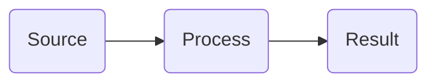

# Aidbox Documentation

This is a documentation repository for Aidbox. It uses Health Samurai's `docs-tools` for linting and image optimization.

All documentation is written in **English**.

## Structure

```
docs/           — markdown files (documentation pages)
assets/         — images and downloadable files
SUMMARY.md      — table of contents and navigation
docs-lint.yaml  — linter configuration
redirects.yaml  — URL redirects
```

## Writing Documentation

### Writing style (no slop)

Prose in `docs/` must read like a human wrote it, not a model. Apply these rules to every paragraph you draft or edit:

- **No em dashes.** Use a comma, colon, period, or parentheses instead. Reference lists use `term: description`, not `term — description`.
- **No adverbs.** Cut `-ly` words and the usual fillers: `just`, `really`, `actually`, `simply`, `automatically`, `programmatically`, `silently`, `continuously`, `immediately`, `frequently`, `entirely`, `fundamentally`, `inherently`.
- **Active voice with a named actor.** "Aidbox persists the message", not "the message is persisted". When the actor is the reader, use `you`. Avoid inanimate things doing human verbs ("the decision emerges", "the data tells us").
- **No throat-clearing openers.** Cut `Here's what…`, `It turns out`, `The truth is`, `At its core`, `It's worth noting`, `When it comes to`. State the point.
- **No "not X, it's Y" contrasts** or negative listings. State Y directly.
- **No vague declaratives.** Replace "the implications are significant" with the specific implication.
- **No meta-commentary.** Don't announce sections (`In this section we'll…`, `Let me walk you through…`); let the page move.
- **Vary rhythm.** Mix sentence lengths. Two items often beat three. Don't end every paragraph with a punchy fragment.
- **Trust the reader.** Skip softeners, restatements, and pull-quote lines.

Run `/stop-slop <file>` on a finished page (or section) to flush remaining patterns. The full rule set lives in `.claude/skills/stop-slop/` (`SKILL.md`, `references/phrases.md`, `references/structures.md`).

### Setup

Run `bun install` once after cloning — this installs docs-tools and sets up git hooks.

`docs-tools` is intentionally unpinned (`github:HealthSamurai/docs-tools`). `bun install` installs the version locked in `bun.lock` without modifying it. CI runs `bun update docs-tools` to pull the latest version and commits the updated `bun.lock` back to the repo.

### Creating a New Page

1. Create a `.md` file in `docs/` (or a subdirectory)
2. Start the file with a single `# Title` heading
3. Add the page to `SUMMARY.md` in the correct section
4. Run `bun lint` to verify everything is correct

### Frontmatter (optional)

Pages can have YAML frontmatter:

```markdown
---
hidden: true
description: Page description for SEO
---
# Page Title
```

- `hidden: true` — page is excluded from orphan-pages lint check

### SUMMARY.md Format

```markdown
# Table of contents

## Section Name

* [Page Title](page-file.md)
* [Another Page](subdir/page.md)
```

Rules:
- Page title in SUMMARY.md must match the `# H1` heading in the file
- Use "and" instead of "&" in titles
- Every `.md` file in `docs/` must be listed in SUMMARY.md

### Images

Place images in `assets/` directory (use subdirectories to organize, e.g. `assets/getting-started/`).

```markdown

```

- Always provide meaningful alt text — linter warns on empty ``
- Supported formats: PNG, JPG, JPEG, GIF, SVG, WebP, AVIF
- CI automatically converts images to AVIF and updates references — commit as PNG/JPG, optimization happens on push
- To optimize locally before pushing: `bun images:optimize`

### Mermaid Diagrams

Mermaid diagrams are supported via ` ```mermaid ` code blocks. They are rendered server-side to SVG (light + dark themes). Use round rectangles `(Node Name)` instead of `[Node Name]` for nodes. No custom CSS classes or inline styles — only the built-in color classes below.

#### Color Classes

Apply colors to nodes using `class NodeName color` or inline `:::color` syntax. The class name is `{color}{width}` where width is the border thickness in pixels (1, 2, or 3).

Available colors: `red`, `blue`, `violet`, `green`, `yellow`, `neutral`

Examples: `red1`, `blue2`, `green3`, `neutral1`



Class definitions are auto-injected — do not write `classDef` lines manually.

### Markdown Rules

- Exactly one `# H1` per file (the page title)
- Do not skip heading levels (H1 → H3 is wrong, use H1 → H2 → H3)
- No empty headings
- All internal links must point to existing files
- All referenced images must exist in `assets/`
- Images should have meaningful alt text
- ALWAYS use proper language in codeblocks.

### Redirects

When renaming or moving a page, add a redirect in `redirects.yaml` so old URLs keep working:

```yaml
redirects:
  old/path/slug: new/path/to/page.md
  another/old/slug: some/page.md#section-anchor
```

- **Keys** — old URL slugs (no leading `/`, no `.md` extension)
- **Values** — relative paths to `.md` files in `docs/` directory
- Section anchors are supported: `page.md#section` redirects to a specific section
- The linter checks that target `.md` files exist — missing targets cause an error

## Supported Widgets

Widgets can be nested inside each other (e.g. hints inside tabs, code blocks inside steps).

### Hint (callout box)

```markdown

Informational message.

```

Styles: `info`, `success`, `warning`, `danger`

### Tabs

`` must be inside ``.

```markdown


Content for tab 1.


Content for tab 2.


```

### Stepper (numbered steps)

`` must be inside ``.

```markdown


First step content.


Second step content.


```

### Code Block with Title

```markdown

```yaml
key: value
```

```

### Embed (YouTube or link card)

```markdown



```

### Content Reference (link card to another page)

```markdown

[Page Title](path/to/page.md)

```

### Cards (grid of link cards)

Use for index/overview pages where the content IS a list of links. Each card has an icon, title, description, and chevron. Adjacent cards auto-fit into a responsive grid.

```markdown


Create a free hosted FHIR server instance.


Stream FHIR resource events to Apache Kafka.


```

Attributes:
- `icon` (optional): a named icon from the registry (`cloud`, `database`, `code`, `book`, `download`, `upload`, `trash`, `terminal`, `shield`, `user`, `users`, `bolt`, `sparkles`, `plug`, `link`, `box`, `chart`, `hammer`, `branch`, `key`, `gear`, `sliders`, `globe`, `clock`, `rocket`, `layers`, `brain`, `check`, `doc`) OR a path like `assets/brand-icons/foo.svg` (resolved relative to the product). Brand logos live in `assets/brand-icons/` so they travel with the docs that reference them.
- `title` (required): card heading
- `href` (optional): relative `.md` path or absolute URL. Internal links get htmx SPA navigation. External links open in a new tab.
- Body: any markdown — rendered as the description.

`columns="1|2|3|4"` on the outer `` pins the column count; without it the grid auto-fits at ~240px per card.

For collapsible blocks (FAQ-style), use plain HTML `<details><summary>...</summary>...</details>` — there is no `` widget.

### File Download

```markdown



Download Archive

```

### Carousel (image slideshow)

```markdown




```

### Quote (testimonial)

```markdown

Quote text here.

```

## Available Commands

```
bun lint          — fix lint issues automatically
bun lint:check    — check for issues without fixing
bun images:check  — find unoptimized images
bun images:optimize — convert images to AVIF format
```

## Git Workflow

- Commit directly to `main` branch
- After committing, ask the user before pushing
- Before starting work and before pushing, always pull with rebase: `git pull --rebase`

### Pre-push Checks

A pre-push git hook runs `bun lint` automatically before every push. If lint fails, the push is blocked.

**Before pushing, always run `bun lint` yourself first.** If there are errors:
1. Show the user what failed
2. Fix the issues (most are auto-fixable by `bun lint` without `--check`)
3. Commit the fixes
4. Only then push

Common lint errors and how to fix them:
- **summary-sync** — file exists but not in SUMMARY.md (or vice versa). Add/remove the entry.
- **title-mismatch** — H1 in file differs from title in SUMMARY.md. Make them match.
- **broken-links** — internal link points to non-existent file. Fix the path.
- **missing-images** — referenced image not found in `assets/`. Add the image or fix the path.
- **h1-headers** — more than one `# H1` in a file. Keep only one.
- **empty-headers** — heading with no text (`## `). Add text or remove.
- **heading-order** — skipped heading level (e.g. H1 → H3). Add the missing level.
- **unparsed-widgets** — unclosed or mismatched widget tags. Close `` with ``, etc.
- **broken-references** — leftover GitBook `broken-reference` placeholder. Replace with real link.
- **image-alt** (warning) — image without alt text. Add ``.
- **deprecated-links** — link points to a page in a deprecated directory. Update to current page.
- **absolute-links** — hardcoded absolute URL to own docs domain. Use relative markdown links instead.

CI automatically optimizes images on push.
