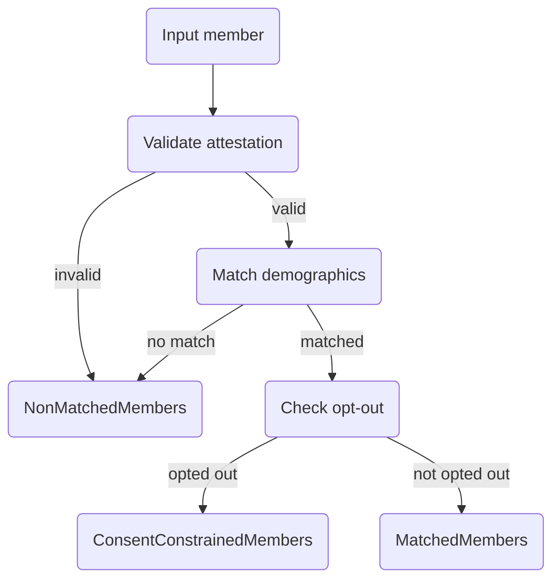

# $provider-member-match

The `$provider-member-match` operation implements the [Da Vinci PDex Provider Access API](http://hl7.org/fhir/us/davinci-pdex/STU2.1/). It lets a provider submit a batch of members (patient demographics, coverage, and a treatment-relationship attestation) and receive one or more `Group` resources whose IDs can then be used with `$davinci-data-export` to pull clinical data in bulk.

The operation follows the [FHIR Bulk Data async pattern](https://hl7.org/fhir/uv/bulkdata/export.html#bulk-data-kick-off-request): kick-off returns `202 Accepted` with a `Content-Location` header, the client polls the status URL, and once processing is complete downloads an ndjson file containing the output `Parameters` resource.


**Spec references** (pinned to PDex STU 2.1):

* [OperationDefinition-ProviderMemberMatch](http://hl7.org/fhir/us/davinci-pdex/STU2.1/OperationDefinition-ProviderMemberMatch.html)
* [Input profile: provider-parameters-multi-member-match-bundle-in](http://hl7.org/fhir/us/davinci-pdex/STU2.1/StructureDefinition-provider-parameters-multi-member-match-bundle-in.html)
* [Output profile: provider-parameters-multi-member-match-bundle-out](http://hl7.org/fhir/us/davinci-pdex/STU2.1/StructureDefinition-provider-parameters-multi-member-match-bundle-out.html)



`$provider-member-match` is **always asynchronous**. Clients must include the `Prefer: respond-async` header on the kick-off request. Requests without this header are rejected with `400 Bad Request`.


## How it works

Each submitted member goes through a deterministic evaluation pipeline and lands in exactly one of three output buckets:

| Bucket | Profile | Code | Meaning |
| --- | --- | --- | --- |
| `MatchedMembers` | `pdex-treatment-relationship` | `match` | Demographics matched a payer member, treatment attestation is valid, and the member has not opted out. The Group ID of this bucket is what the provider feeds into `$davinci-data-export`. |
| `NonMatchedMembers` | `pdex-member-no-match-group` | `nomatch` | No match was found, the match was ambiguous, or the treatment attestation was invalid. |
| `ConsentConstrainedMembers` | `pdex-member-opt-out` | `consentconstraint` | Demographics matched, but the member has an active opt-out `Consent` on file. |

Per-member failures do not fail the whole batch — problematic members are routed to `NonMatchedMembers`.



## Endpoint

```
POST [base]/fhir/Group/$provider-member-match
```

## Workflow



**Kick-off.** `POST` a `Parameters` resource listing one or more `MemberBundle` entries. Include `Prefer: respond-async`. The server responds with `202 Accepted` and a `Content-Location` header pointing at the status URL.



**Poll status.** `GET` the URL from `Content-Location`. While processing is running you get `202 Accepted` with a `Retry-After` header. Once complete you get `200 OK` with a Bulk Data manifest whose `output[].url` points to an ndjson file.



**Download output.** `GET` the ndjson URL from the manifest. The body is a single-line `Parameters` resource containing the output `Group` resources inline.



**(Optional) Cancel or delete.** `DELETE` the cancel URL to stop a running job or clean up a completed one.



## Input

A FHIR `Parameters` resource with one or more `MemberBundle` parameters. Each `MemberBundle` contains:

| Part | Card. | Type | Profile |
| --- | --- | --- | --- |
| `MemberPatient` | 1..1 | Patient | [HRex Patient Demographics](http://hl7.org/fhir/us/davinci-hrex/STU1/StructureDefinition-hrex-patient-demographics.html) |
| `CoverageToMatch` | 1..1 | Coverage | [HRex Coverage](http://hl7.org/fhir/us/davinci-hrex/STU1/StructureDefinition-hrex-coverage.html) |
| `Consent` | 1..1 | Consent | [Provider Treatment Relationship Consent](http://hl7.org/fhir/us/davinci-pdex/STU2.1/StructureDefinition-provider-treatment-relationship-consent.html) |
| `CoverageToLink` | 0..1 | Coverage | HRex Coverage |

The whole `Parameters` body is first validated with Aidbox `$validate` against the `provider-parameters-multi-member-match-bundle-in` profile. If validation fails, the server returns `422 Unprocessable Entity` with the `OperationOutcome` from `$validate` and no background job is created.

### Matching algorithm

Matching is deterministic and exact. The following demographic fields are **all required** on the submitted Patient and must all match a payer-side `Patient`:

| Field | Logic |
| --- | --- |
| `Patient.name[0].family` | Case-insensitive exact |
| `Patient.name[0].given[0]` | Case-insensitive exact |
| `Patient.birthDate` | Exact |
| `Patient.gender` | Exact |

When `CoverageToMatch.subscriberId` is present the matching query additionally requires `_has:Coverage:beneficiary:subscriber-id=<subscriberId>` so only Patients with a matching Coverage subscriber ID are considered.

A member is treated as **unmatched** when the demographic search returns zero entries **or** more than one entry (ambiguous matches are rejected conservatively).

### Treatment attestation

The `Consent` part is the provider's attestation that a treatment relationship exists with the member. The attestation is accepted when the `Consent` resource is present and `Consent.status = "active"`. There is no deeper verification of the attestation claim itself — the attestation **is** the declaration.

### Opt-out check

After a successful demographic match, the server searches for an active opt-out `Consent` on the matched payer-side Patient:

```
GET /fhir/Consent
  ?patient=<matched-patient-id>
  &status=active
  &category=http://hl7.org/fhir/us/davinci-pdex/CodeSystem/pdex-consent-api-purpose|provider-access
  &provision-type=deny
```

If at least one such `Consent` exists, the member is placed in `ConsentConstrainedMembers`. Revocations (`provision.type = "permit"`) are not returned by this query and therefore do not block the member.


All opt-out scopes (`global`, `provider-specific`, `purpose-specific`, `payer-specific`, `provider-category`) are currently treated the same — any active `deny` opts the member out. Scope-aware enforcement is not yet implemented.


### Kick-off example



```http
POST /fhir/Group/$provider-member-match
Content-Type: application/fhir+json
Prefer: respond-async
```

```json
{
  "resourceType": "Parameters",
  "parameter": [
    {
      "name": "MemberBundle",
      "part": [
        {
          "name": "MemberPatient",
          "resource": {
            "resourceType": "Patient",
            "name": [{"family": "Johnson", "given": ["Robert"]}],
            "gender": "male",
            "birthDate": "1952-07-25",
            "identifier": [
              {"system": "http://example.org/member-id", "value": "M12345"}
            ]
          }
        },
        {
          "name": "CoverageToMatch",
          "resource": {
            "resourceType": "Coverage",
            "status": "active",
            "subscriberId": "SUB-001",
            "beneficiary": {"reference": "Patient/test-member-001"},
            "payor": [{"reference": "Organization/test-payer-001"}]
          }
        },
        {
          "name": "Consent",
          "resource": {
            "resourceType": "Consent",
            "status": "active",
            "scope": {
              "coding": [{
                "system": "http://terminology.hl7.org/CodeSystem/consentscope",
                "code": "treatment"
              }]
            },
            "category": [
              {"coding": [{"system": "http://terminology.hl7.org/CodeSystem/v3-ActCode", "code": "IDSCL"}]},
              {"coding": [{"system": "http://loinc.org", "code": "64292-6"}]}
            ],
            "patient": {"reference": "Patient/test-member-001"},
            "dateTime": "2026-01-15T10:00:00Z",
            "performer": [
              {"identifier": {"system": "http://hl7.org/fhir/sid/us-npi", "value": "1982947230"}}
            ],
            "policyRule": {
              "coding": [{"system": "http://terminology.hl7.org/CodeSystem/v3-ActCode", "code": "OPTIN"}]
            }
          }
        }
      ]
    }
  ]
}
```



**Status**

202 Accepted

**Headers**

* `Content-Location` — status URL, e.g. `[base]/fhir/Group/$provider-member-match-status/<task-id>`



**Status**

422 Unprocessable Entity

**Body**

```json
{
  "resourceType": "OperationOutcome",
  "id": "validationfail",
  "issue": [
    {
      "severity": "error",
      "code": "invariant",
      "diagnostics": "..."
    }
  ]
}
```



**Status**

400 Bad Request

**Body**

```json
{
  "resourceType": "OperationOutcome",
  "issue": [
    {
      "severity": "error",
      "code": "processing",
      "diagnostics": "This operation requires Prefer: respond-async header"
    }
  ]
}
```



## Status polling

```
GET [base]/fhir/Group/$provider-member-match-status/<task-id>
```

The operation tracks progress with a standard FHIR `Task` resource. Responses map from the Task status as follows:

| Task status | HTTP | Headers | Body |
| --- | --- | --- | --- |
| `requested` | 202 | `Retry-After: 5` | (empty) |
| `in-progress` | 202 | `Retry-After: 5`, `X-Progress: Processing members` | (empty) |
| `completed` | 200 | `Content-Type: application/json` | Bulk Data manifest |
| `failed` | 500 | | `OperationOutcome` with failure diagnostics |
| not found | 404 | | `OperationOutcome` |



**Status**

202 Accepted

**Headers**

| Header         | Value                       |
| -------------- | --------------------------- |
| Retry-After    | `5`                         |
| X-Progress     | `Processing members`        |



**Status**

200 OK

**Body**

```json
{
  "transactionTime": "2026-04-20T12:34:56Z",
  "request": "[base]/fhir/Group/$provider-member-match",
  "requiresAccessToken": true,
  "output": [
    {
      "type": "Parameters",
      "url": "[base]/output/<task-id>.ndjson"
    }
  ],
  "error": []
}
```



**Status**

500 Internal Server Error

**Body**

```json
{
  "resourceType": "OperationOutcome",
  "issue": [
    {
      "severity": "error",
      "code": "exception",
      "diagnostics": "<reason from Task.statusReason>"
    }
  ]
}
```



## Output

The manifest's `output[0].url` points at an ndjson endpoint served by Aidbox:

```
GET [base]/output/<task-id>.ndjson
```

The body is a single line — a `Parameters` resource conforming to the `provider-parameters-multi-member-match-bundle-out` profile. Each non-empty output bucket appears as one parameter whose `resource` is the full inline `Group`. Empty buckets are omitted.



```http
GET /output/<task-id>.ndjson
```



**Status**

200 OK

**Headers**

| Header       | Value                       |
| ------------ | --------------------------- |
| Content-Type | `application/fhir+ndjson`   |

**Body** (single ndjson line, formatted for readability)

```json
{
  "resourceType": "Parameters",
  "meta": {
    "profile": [
      "http://hl7.org/fhir/us/davinci-pdex/StructureDefinition/provider-parameters-multi-member-match-bundle-out"
    ]
  },
  "parameter": [
    {
      "name": "MatchedMembers",
      "resource": {
        "resourceType": "Group",
        "id": "<task-id>-matched",
        "meta": {
          "profile": [
            "http://hl7.org/fhir/us/davinci-pdex/StructureDefinition/pdex-treatment-relationship"
          ]
        },
        "active": true,
        "type": "person",
        "actual": true,
        "code": {
          "coding": [{
            "system": "http://hl7.org/fhir/us/davinci-pdex/CodeSystem/PdexMultiMemberMatchResultCS",
            "code": "match"
          }]
        },
        "identifier": [
          {"system": "http://hl7.org/fhir/sid/us-npi", "value": "1982947230"}
        ],
        "managingEntity": {
          "identifier": {"system": "http://hl7.org/fhir/sid/us-npi", "value": "5555555555"},
          "display": "Payer Organization"
        },
        "characteristic": [{
          "code": {"coding": [{"system": "http://hl7.org/fhir/us/davinci-pdex/CodeSystem/PdexMultiMemberMatchResultCS", "code": "match"}]},
          "valueReference": {
            "identifier": {"system": "http://hl7.org/fhir/sid/us-npi", "value": "1982947230"},
            "display": "Provider Organization"
          },
          "exclude": false,
          "period": {"start": "2026-04-20", "end": "2026-05-20"}
        }],
        "quantity": 1,
        "member": [
          {"entity": {"reference": "Patient/test-member-001", "display": "Johnson, Robert"}, "inactive": false}
        ]
      }
    },
    {
      "name": "ConsentConstrainedMembers",
      "resource": {
        "resourceType": "Group",
        "id": "<task-id>-consent",
        "meta": {
          "profile": [
            "http://hl7.org/fhir/us/davinci-pdex/StructureDefinition/pdex-member-opt-out"
          ]
        },
        "active": true,
        "type": "person",
        "actual": true,
        "code": {
          "coding": [{
            "system": "http://hl7.org/fhir/us/davinci-pdex/CodeSystem/PdexMultiMemberMatchResultCS",
            "code": "consentconstraint"
          }]
        },
        "managingEntity": {
          "identifier": {"system": "http://hl7.org/fhir/sid/us-npi", "value": "5555555555"},
          "display": "Payer Organization"
        },
        "characteristic": [{
          "code": {"coding": [{"system": "http://hl7.org/fhir/us/davinci-pdex/CodeSystem/PdexMultiMemberMatchResultCS", "code": "consentconstraint"}]},
          "valueCodeableConcept": {
            "coding": [{"system": "http://hl7.org/fhir/us/davinci-pdex/CodeSystem/opt-out-scope", "code": "provider-specific"}]
          },
          "exclude": false,
          "period": {"start": "2026-04-20", "end": "2026-05-20"}
        }],
        "quantity": 1,
        "member": [
          {"entity": {"reference": "Patient/test-member-002", "display": "Williams, Sarah"}, "inactive": false}
        ]
      }
    },
    {
      "name": "NonMatchedMembers",
      "resource": {
        "resourceType": "Group",
        "id": "<task-id>-nomatch",
        "meta": {
          "profile": [
            "http://hl7.org/fhir/us/davinci-pdex/StructureDefinition/pdex-member-no-match-group"
          ]
        },
        "active": true,
        "type": "person",
        "actual": true,
        "code": {
          "coding": [{
            "system": "http://hl7.org/fhir/us/davinci-pdex/CodeSystem/PdexMultiMemberMatchResultCS",
            "code": "nomatch"
          }]
        },
        "contained": [
          {
            "resourceType": "Patient",
            "id": "1",
            "name": [{"family": "Unknown", "given": ["Nobody"]}],
            "gender": "male",
            "birthDate": "2000-01-01"
          }
        ],
        "characteristic": [{
          "code": {"coding": [{"system": "http://hl7.org/fhir/us/davinci-pdex/CodeSystem/PdexMultiMemberMatchResultCS", "code": "nomatch"}]},
          "valueBoolean": true,
          "exclude": false,
          "period": {"start": "2026-04-20", "end": "2026-05-20"}
        }],
        "quantity": 1,
        "member": [
          {
            "entity": {
              "reference": "#1",
              "extension": [{
                "url": "http://hl7.org/fhir/us/davinci-pdex/StructureDefinition/base-ext-match-parameters",
                "valueReference": {"reference": "#1"}
              }]
            },
            "inactive": false
          }
        ]
      }
    }
  ]
}
```



### Output Group fields

All output Groups share `type = "person"`, `actual = true`, and `active = true`. Additional fields depend on the bucket:

**MatchedMembers and ConsentConstrainedMembers**

* `managingEntity.identifier` — the **payer's** NPI, resolved from the first submitted member's `Coverage.payor[0].reference` (an Organization with an `identifier` of system `http://hl7.org/fhir/sid/us-npi`). If the Organization is missing or has no NPI, this falls back to `"unknown"`.
* `member[].entity.reference` — a literal reference to the payer-side `Patient` that was matched.
* `characteristic[].period` — 30-day validity window, `period.start` is today, `period.end` is 30 days out.

**MatchedMembers only**

* `identifier` — array containing the provider's NPI (derived from the authenticated OAuth client's `identifier` entry with system `http://hl7.org/fhir/sid/us-npi`).
* `characteristic[0].valueReference` — a logical reference by NPI to the provider Organization.

**NonMatchedMembers**

* The submitted Patient demographics are **not** persisted as standalone `Patient` resources. Instead, each submitted Patient is carried in `Group.contained[]` with a local id (`"1"`, `"2"`, …).
* `member[].entity.reference` is a fragment reference (`"#1"`, `"#2"`, …) into `contained`, plus a `base-ext-match-parameters` extension carrying the same fragment reference.
* `characteristic[0].valueBoolean = true`.

## Cancellation and deletion

```
DELETE [base]/fhir/Group/$provider-member-match-cancel/<task-id>
```

Cancellation is cooperative. The background worker checks the Task status before starting, after each evaluated member, and again before persisting results — so a cancelled job stops at the next checkpoint without ever writing Groups or the Binary.

| Task status | Action | Response |
| --- | --- | --- |
| `requested` / `in-progress` | Set Task to `cancelled`. The background processor stops at its next checkpoint. | 202 Accepted |
| `completed` / `failed` / `cancelled` | Delete the Task and every resource referenced from `Task.output` (Groups and the Binary). | 202 Accepted |
| not found | — | 404 `OperationOutcome` |


Cancellation uses a custom `$provider-member-match-cancel` URL rather than `DELETE` on the status URL, because Aidbox operation dispatch is keyed on HTTP method and distinct method/URL combinations must be registered separately.


## Group lifecycle and cleanup

Each output Group carries a 30-day validity window on `Group.characteristic[0].period`:

```json
"period": {"start": "2026-04-20", "end": "2026-05-20"}
```

A background job inside the interop app runs hourly and:

1. **Deactivates expired Groups** — Groups whose `characteristic.period.end` has passed and whose `active = true` are flipped to `active = false`.
2. **Hard-deletes old inactive Groups** — Groups with `active = false` whose `characteristic.period.end` is more than 90 days in the past are removed along with the Task and Binary they belong to.

Cleanup only touches PDex Groups — the scan filters on `_profile=<pdex-treatment-relationship,pdex-member-no-match-group,pdex-member-opt-out>`. Non-PDex Groups in the same Aidbox instance are left alone.

## Provider identity

The provider's NPI is extracted from the authenticated OAuth client's `identifier` array (entry with system `http://hl7.org/fhir/sid/us-npi`). The NPI is used to:

* Populate `Task.requester.identifier` on the kick-off Task.
* Populate the `identifier` array and the `characteristic[0].valueReference` on the `MatchedMembers` Group.

If the OAuth client has no NPI identifier, the provider NPI falls back to `"unknown"` in the output Groups.

## Error responses

| Status | Condition |
| --- | --- |
| 202 | Async request accepted (kick-off) or cancellation acknowledged. |
| 200 | Polling complete, manifest returned. |
| 400 | `Prefer: respond-async` header is missing. |
| 404 | Unknown `task-id` on status, cancel, or output. |
| 422 | Input `Parameters` failed profile validation. |
| 500 | Background processing failed; see `Task.statusReason`. |

Individual member failures (validation issues, exceptions while evaluating one member) do **not** fail the whole batch — the affected members are routed to `NonMatchedMembers` with a reason string.

## End-to-end example

The snippets below reproduce the three-bucket demo used in internal testing. They assume an Aidbox instance with the PDex STU 2.1 package loaded and an OAuth client authorized to call the interop app.



**Seed the payer-side test data.** Post this `Bundle` once to create the Organization, payer-side Patients, Coverages, and an opt-out `Consent` for member-002.

```http
POST /fhir
Content-Type: application/fhir+json
```

```json
{
  "resourceType": "Bundle",
  "type": "transaction",
  "entry": [
    {
      "request": {"method": "PUT", "url": "/Organization/test-payer-001"},
      "resource": {
        "resourceType": "Organization", "id": "test-payer-001",
        "name": "Test Payer Organization",
        "identifier": [{"system": "http://hl7.org/fhir/sid/us-npi", "value": "5555555555"}]
      }
    },
    {
      "request": {"method": "PUT", "url": "/Patient/test-member-001"},
      "resource": {
        "resourceType": "Patient", "id": "test-member-001",
        "name": [{"family": "Johnson", "given": ["Robert"]}],
        "gender": "male", "birthDate": "1952-07-25"
      }
    },
    {
      "request": {"method": "PUT", "url": "/Patient/test-member-002"},
      "resource": {
        "resourceType": "Patient", "id": "test-member-002",
        "name": [{"family": "Williams", "given": ["Sarah"]}],
        "gender": "female", "birthDate": "1985-03-12"
      }
    },
    {
      "request": {"method": "PUT", "url": "/Coverage/test-coverage-001"},
      "resource": {
        "resourceType": "Coverage", "id": "test-coverage-001", "status": "active",
        "subscriberId": "SUB-001",
        "beneficiary": {"reference": "Patient/test-member-001"},
        "payor": [{"reference": "Organization/test-payer-001"}]
      }
    },
    {
      "request": {"method": "PUT", "url": "/Coverage/test-coverage-002"},
      "resource": {
        "resourceType": "Coverage", "id": "test-coverage-002", "status": "active",
        "subscriberId": "SUB-002",
        "beneficiary": {"reference": "Patient/test-member-002"},
        "payor": [{"reference": "Organization/test-payer-001"}]
      }
    },
    {
      "request": {"method": "PUT", "url": "/Consent/test-optout-member-002"},
      "resource": {
        "resourceType": "Consent", "id": "test-optout-member-002", "status": "active",
        "scope": {"coding": [{"system": "http://terminology.hl7.org/CodeSystem/consentscope", "code": "patient-privacy"}]},
        "patient": {"reference": "Patient/test-member-002"},
        "category": [{"coding": [{"system": "http://hl7.org/fhir/us/davinci-pdex/CodeSystem/pdex-consent-api-purpose", "code": "provider-access"}]}],
        "provision": {"type": "deny"},
        "policyRule": {"coding": [{"system": "http://terminology.hl7.org/CodeSystem/v3-ActCode", "code": "OPTIN"}]}
      }
    }
  ]
}
```



**Kick off.** Submit three members: one will match, one will hit the opt-out, one has no match.

```http
POST /fhir/Group/$provider-member-match
Content-Type: application/fhir+json
Prefer: respond-async
```

```json
{
  "resourceType": "Parameters",
  "parameter": [
    {
      "name": "MemberBundle",
      "part": [
        {"name": "MemberPatient", "resource": {"resourceType": "Patient", "name": [{"family": "Johnson", "given": ["Robert"]}], "gender": "male", "birthDate": "1952-07-25"}},
        {"name": "CoverageToMatch", "resource": {"resourceType": "Coverage", "status": "active", "subscriberId": "SUB-001", "beneficiary": {"reference": "Patient/test-member-001"}, "payor": [{"reference": "Organization/test-payer-001"}]}},
        {"name": "Consent", "resource": {"resourceType": "Consent", "status": "active", "scope": {"coding": [{"system": "http://terminology.hl7.org/CodeSystem/consentscope", "code": "treatment"}]}, "category": [{"coding": [{"system": "http://terminology.hl7.org/CodeSystem/v3-ActCode", "code": "IDSCL"}]}, {"coding": [{"system": "http://loinc.org", "code": "64292-6"}]}], "patient": {"reference": "Patient/test-member-001"}, "dateTime": "2026-01-15T10:00:00Z", "performer": [{"identifier": {"system": "http://hl7.org/fhir/sid/us-npi", "value": "1982947230"}}], "policyRule": {"coding": [{"system": "http://terminology.hl7.org/CodeSystem/v3-ActCode", "code": "OPTIN"}]}}}
      ]
    },
    {
      "name": "MemberBundle",
      "part": [
        {"name": "MemberPatient", "resource": {"resourceType": "Patient", "name": [{"family": "Williams", "given": ["Sarah"]}], "gender": "female", "birthDate": "1985-03-12"}},
        {"name": "CoverageToMatch", "resource": {"resourceType": "Coverage", "status": "active", "subscriberId": "SUB-002", "beneficiary": {"reference": "Patient/test-member-002"}, "payor": [{"reference": "Organization/test-payer-001"}]}},
        {"name": "Consent", "resource": {"resourceType": "Consent", "status": "active", "scope": {"coding": [{"system": "http://terminology.hl7.org/CodeSystem/consentscope", "code": "treatment"}]}, "category": [{"coding": [{"system": "http://terminology.hl7.org/CodeSystem/v3-ActCode", "code": "IDSCL"}]}, {"coding": [{"system": "http://loinc.org", "code": "64292-6"}]}], "patient": {"reference": "Patient/test-member-002"}, "dateTime": "2026-01-15T10:00:00Z", "performer": [{"identifier": {"system": "http://hl7.org/fhir/sid/us-npi", "value": "1982947230"}}], "policyRule": {"coding": [{"system": "http://terminology.hl7.org/CodeSystem/v3-ActCode", "code": "OPTIN"}]}}}
      ]
    },
    {
      "name": "MemberBundle",
      "part": [
        {"name": "MemberPatient", "resource": {"resourceType": "Patient", "name": [{"family": "Unknown", "given": ["Nobody"]}], "gender": "male", "birthDate": "2000-01-01"}},
        {"name": "CoverageToMatch", "resource": {"resourceType": "Coverage", "status": "active", "subscriberId": "SUB-999", "beneficiary": {"reference": "Patient/test-member-001"}, "payor": [{"reference": "Organization/test-payer-001"}]}},
        {"name": "Consent", "resource": {"resourceType": "Consent", "status": "active", "scope": {"coding": [{"system": "http://terminology.hl7.org/CodeSystem/consentscope", "code": "treatment"}]}, "category": [{"coding": [{"system": "http://terminology.hl7.org/CodeSystem/v3-ActCode", "code": "IDSCL"}]}, {"coding": [{"system": "http://loinc.org", "code": "64292-6"}]}], "patient": {"reference": "Patient/test-member-001"}, "dateTime": "2026-01-15T10:00:00Z", "performer": [{"identifier": {"system": "http://hl7.org/fhir/sid/us-npi", "value": "1982947230"}}], "policyRule": {"coding": [{"system": "http://terminology.hl7.org/CodeSystem/v3-ActCode", "code": "OPTIN"}]}}}
      ]
    }
  ]
}
```

Response: `202 Accepted`, `Content-Location: [base]/fhir/Group/$provider-member-match-status/<task-id>`.



**Poll.** Call the status URL until it returns `200 OK`.

```http
GET /fhir/Group/$provider-member-match-status/<task-id>
```



**Download.** Use the `output[0].url` from the manifest to fetch the ndjson.

```http
GET /output/<task-id>.ndjson
```

Expected result distribution:

| Member | Match | Opt-out | Bucket |
| --- | --- | --- | --- |
| Johnson, Robert | Yes (`test-member-001`) | No | `MatchedMembers` |
| Williams, Sarah | Yes (`test-member-002`) | Yes | `ConsentConstrainedMembers` |
| Unknown, Nobody | No | — | `NonMatchedMembers` |


