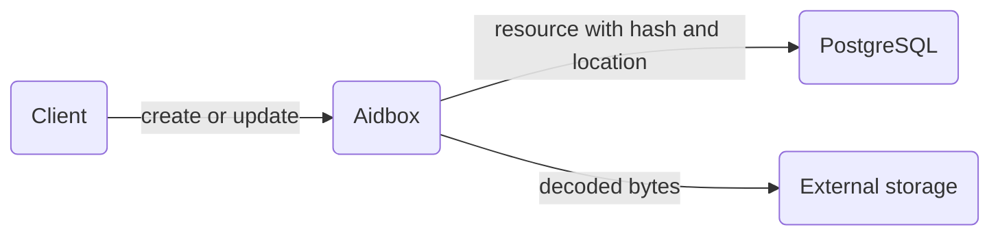

# Offload base64Binary data to external storage


This functionality is available starting from Aidbox version **2607**.


FHIR resources carry binary payloads in `base64Binary` elements. `Binary.data`, `DocumentReference.content.attachment.data`, and `Patient.photo.data` are common examples, many other resource types have such elements, and extensions with a `valueBase64Binary` value can appear on any element. Stored inline, these payloads grow the resource tables and everything built on top of them: history, backups, replication.

Data offload moves the payloads out of the database. On create and update, Aidbox uploads the decoded bytes to external blob storage and stores the resource with a pointer to the blob in place of the data. On read, Aidbox downloads the bytes and returns the resource with the data inlined, so API clients work with the resource as if nothing was offloaded.

Offload is a property of an [API](README.md#apis). You configure it with the `dataOffloadToExternalStorage` parameter of [`$create-api`](README.md#usdcreate-api) or [`$configure-api`](README.md#usdconfigure-api). [Azure Blob Storage](#azure-blob-storage) is the storage provider supported today.

## How it works



On create (`POST`) and update (`PUT`), Aidbox finds the configured `base64Binary` elements in the incoming resource. For each element that has a value, Aidbox:

1. Decodes the base64 value and uploads the bytes to the configured storage as a blob named by a random UUID.
2. Removes the element value from the resource.
3. Adds an extension on the element (a primitive extension, in the `_data` form) that records the blob location and the hash of the data.

The blob holds the raw decoded bytes, not the base64 string. Downloading it with the provider's own tooling yields the original file.

Aidbox commits the blob after the resource write succeeds. If the write fails, Aidbox abandons the upload and no blob appears in the storage.

The stored extension looks like this:

```json
{
  "resourceType": "Binary",
  "id": "b9f7a86e-16a5-45f5-8b1c-3e2a90c31c02",
  "contentType": "application/octet-stream",
  "_data": {
    "extension": [
      {
        "url": "http://health-samurai.io/fhir/core/data-offloaded-to-external-storage",
        "extension": [
          { "url": "hash", "valueString": "Kq5sNclPz7QV2+lfQIuc6R7oRu0=" },
          { "url": "location", "valueString": "azure://my-container/mystorageaccount/4f1f61a2-9e3b-4b0e-bb1d-6a1a1c2f7e58" }
        ]
      }
    ]
  }
}
```

| Sub-extension | Description                                                                                                        |
|---------------|--------------------------------------------------------------------------------------------------------------------|
| `hash`        | Base64-encoded SHA-1 digest of the decoded data, the same convention as [`Attachment.hash`](https://build.fhir.org/datatypes-definitions.html#Attachment.hash). |
| `location`    | Blob address in a provider-specific form. See [Storage providers](#storage-providers).                              |

On instance read (`GET /fhir/{resourceType}/{id}`), Aidbox downloads the blob, restores the element value, and removes the offload extension from the response. Other extensions on the same element stay in place, both in storage and in responses.

## Configuration

Pass the `dataOffloadToExternalStorage` parameter to `$create-api` or `$configure-api`. Its parts:

| Part                            | Type                        | Required                            | Description                                                                 |
|---------------------------------|-----------------------------|-------------------------------------|-----------------------------------------------------------------------------|
| `fhirpathToBase64BinaryElement` | string                      | yes, repeatable                     | Path to a `base64Binary` element to offload. See the expression rules below. |
| `storageProvider`               | code                        | yes                                 | Storage provider that receives the data. See [Storage providers](#storage-providers). |
| `azureContainer`                | Reference(`AzureContainer`) | when `storageProvider` is `azure`   | Container that receives the blobs.                                           |

### Element path expressions

`fhirpathToBase64BinaryElement` accepts a restricted FHIRPath subset: element names separated by dots, with an optional `[n]` index on array elements. Functions and filters are not supported.

| Expression                | Effect                                                                     |
|---------------------------|-----------------------------------------------------------------------------|
| `data`                    | `Binary.data`.                                                              |
| `photo.data`              | `data` of every `Patient.photo` item.                                       |
| `photo[0].data`           | `data` of the first `Patient.photo` item.                                   |
| `content.attachment.data` | `data` of every `DocumentReference.content` item.                           |
| `extension.valueBase64Binary` | `base64Binary` values of top-level extensions.                          |

When a path segment names an array and carries no index, the expression matches every item. Elements missing from the resource are skipped.

## Storage providers

`storageProvider` selects where the blobs go, and each provider brings its own configuration parts and prerequisites. `azure` is the provider available today. Future releases add more.

### Azure Blob Storage

Set `storageProvider` to `azure` and reference an [AzureContainer](../../reference/system-resources-reference/core-module-resources.md#azurecontainer) resource in the `azureContainer` part. Blobs land in that container, and the `location` sub-extension records them as `azure://{container-name}/{storage-account}/{blob-name}`.

Offload uses the same [AzureAccount](../../reference/system-resources-reference/core-module-resources.md#azureaccount) and [AzureContainer](../../reference/system-resources-reference/core-module-resources.md#azurecontainer) resources as the [Azure Blob Storage](../../file-storage/azure-blob-storage.md) file storage integration.

Create an `AzureAccount` with one of the supported credential sets:

* `key`: a storage account access key.
* `tenantId`, `clientId`, and `clientSecret`: Azure AD application credentials.
* No credentials: Aidbox falls back to [DefaultAzureCredential](https://learn.microsoft.com/en-us/dotnet/api/azure.identity.defaultazurecredential), which picks up workload identity in environments configured for it.

For the Azure AD methods, the identity needs a role that grants blob read and write access on the container, such as `Storage Blob Data Contributor`.

```http
PUT /fhir/AzureAccount/my-account
Content-Type: application/json

{
  "key": "<storage-account-key>"
}
```

Create an `AzureContainer` that points to the storage account and container:

```http
PUT /fhir/AzureContainer/my-container
Content-Type: application/json

{
  "account": { "id": "my-account", "resourceType": "AzureAccount" },
  "storage": "mystorageaccount",
  "container": "my-container"
}
```

## Example: offload Binary.data

Create a storage for `Binary` and connect it to an API with offload enabled. See [Storages](README.md#storages) for the `$create-storage` step; the example below uses the `storageId` it returned.



```http
POST /fhir/$create-api
Content-Type: application/json

{
  "resourceType": "Parameters",
  "parameter": [
    { "name": "resourceType", "valueString": "Binary" },
    { "name": "storageId", "valueString": "2791c25a-c28d-47ea-ab96-3e13162a5b58" },
    { "name": "apiTemplate", "valueString": "pre-2604" },
    {
      "name": "dataOffloadToExternalStorage",
      "part": [
        { "name": "fhirpathToBase64BinaryElement", "valueString": "data" },
        { "name": "storageProvider", "valueCode": "azure" },
        { "name": "azureContainer", "valueReference": { "reference": "AzureContainer/my-container" } }
      ]
    }
  ]
}
```



```json
{
  "resourceType": "Parameters",
  "parameter": [
    { "name": "apiId", "valueString": "39473529-a37e-4b98-afc2-bea014bbe68e" },
    { "name": "apiTemplate", "valueString": "pre-2604" },
    { "name": "resourceType", "valueString": "Binary" },
    { "name": "storageId", "valueString": "2791c25a-c28d-47ea-ab96-3e13162a5b58" }
  ]
}
```



Create a Binary with raw content. The response returns the resource as stored: `data` is absent and the offload extension holds the hash and the blob location.



```http
POST /fhir/Binary
Content-Type: application/octet-stream

hello world
```



```json
{
  "resourceType": "Binary",
  "id": "b9f7a86e-16a5-45f5-8b1c-3e2a90c31c02",
  "contentType": "application/octet-stream",
  "_data": {
    "extension": [
      {
        "url": "http://health-samurai.io/fhir/core/data-offloaded-to-external-storage",
        "extension": [
          { "url": "hash", "valueString": "Kq5sNclPz7QV2+lfQIuc6R7oRu0=" },
          { "url": "location", "valueString": "azure://my-container/mystorageaccount/4f1f61a2-9e3b-4b0e-bb1d-6a1a1c2f7e58" }
        ]
      }
    ]
  }
}
```



Read the resource. Aidbox fetches the blob and returns the data inlined, without the offload extension:



```http
GET /fhir/Binary/b9f7a86e-16a5-45f5-8b1c-3e2a90c31c02
Accept: application/fhir+json
```



```json
{
  "resourceType": "Binary",
  "id": "b9f7a86e-16a5-45f5-8b1c-3e2a90c31c02",
  "contentType": "application/octet-stream",
  "data": "aGVsbG8gd29ybGQ="
}
```



Raw reads work the same way. When the `Accept` header contains the type stored in `Binary.contentType`, Aidbox serves the decoded bytes:



```http
GET /fhir/Binary/b9f7a86e-16a5-45f5-8b1c-3e2a90c31c02
Accept: application/octet-stream
```



```
hello world
```



## Example: offload Patient.photo.data

Offload works for any resource type and any `base64Binary` element. This configuration offloads every `Patient.photo.data` value:

```json
{
  "name": "dataOffloadToExternalStorage",
  "part": [
    { "name": "fhirpathToBase64BinaryElement", "valueString": "photo.data" },
    { "name": "storageProvider", "valueCode": "azure" },
    { "name": "azureContainer", "valueReference": { "reference": "AzureContainer/my-container" } }
  ]
}
```

Create a Patient with a photo. The response returns each photo's `data` replaced by the extension:



```http
POST /fhir/Patient
Content-Type: application/json

{
  "resourceType": "Patient",
  "name": [{ "given": ["Amy"] }],
  "photo": [
    {
      "contentType": "image/png",
      "data": "iVBORw0KGgoAAAANSUhEUgAA..."
    }
  ]
}
```



```json
{
  "resourceType": "Patient",
  "id": "5f0c7e2a-8d31-4f5e-9b1a-2c3d4e5f6a7b",
  "name": [{ "given": ["Amy"] }],
  "photo": [
    {
      "contentType": "image/png",
      "_data": {
        "extension": [
          {
            "url": "http://health-samurai.io/fhir/core/data-offloaded-to-external-storage",
            "extension": [
              { "url": "hash", "valueString": "L4pJTPTGwsyBb1TgAAmVGmPKmoc=" },
              { "url": "location", "valueString": "azure://my-container/mystorageaccount/9d2c5a11-7b4f-4e0a-8f26-3c1d9e0b5a44" }
            ]
          }
        ]
      }
    }
  ]
}
```



`GET /fhir/Patient/5f0c7e2a-8d31-4f5e-9b1a-2c3d4e5f6a7b` returns the Patient with `photo[0].data` restored.

## Behavior and limitations

* Offload runs on the FHIR REST create (`POST`) and update (`PUT`) interactions. Transaction bundle entries, conditional update, and PATCH store the data inline.
* Aidbox restores data on instance read. Search, history, and version read responses return the stored form: the element is absent and the extension holds the location.
* When the upload to the external storage fails, the request fails with a `500` `OperationOutcome` and the resource is not written.
* Aidbox does not delete blobs. Deleting a resource leaves its blob in the storage, and updating a resource uploads a new blob while the old one stays.
* On read, Aidbox resolves the storage from the current API configuration, and the blob name comes from the stored `location`. Repointing the API at a different container makes data offloaded through the old one unreadable.

## See also

* [Storage and API configuration](README.md)
* [Binary resource](../../api/rest-api/other/binary.md)
* [Azure Blob Storage](../../file-storage/azure-blob-storage.md)
