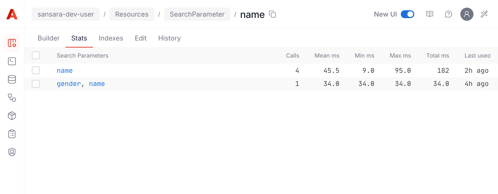
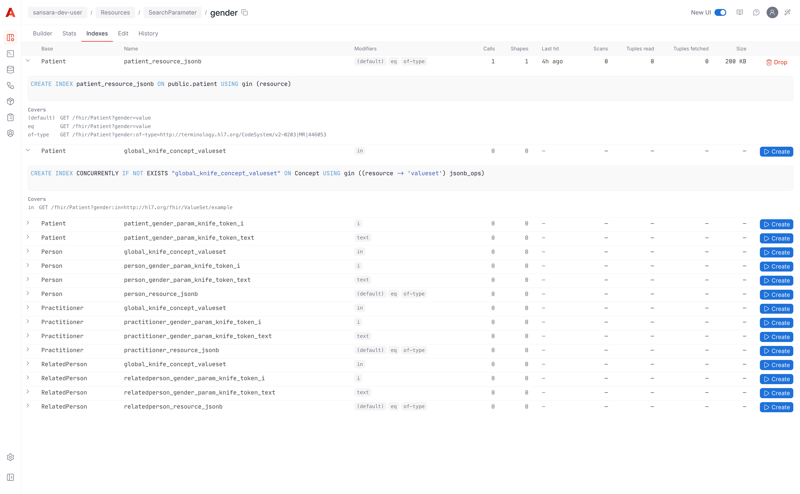

# Search Parameters Usage Statistics


**Just use the UI.** In the Aidbox console, open any SearchParameter and switch to the **Stats** or **Indexes** tab. Both tabs cover the workflow described on this page — sort hot parameters, see candidate indexes with real-traffic numbers, and create or drop indexes with one click. The RPCs documented below are the same ones the UI calls; reach for them only when scripting or building tooling.


Aidbox records every [FHIR search](https://hl7.org/fhir/search.html) request into the `aidbox_stat.search_param_stats` Postgres table and exposes the rows via RPCs. The six counter columns (`calls`, `total_time_ms`, `min_time_ms`, `max_time_ms`, `mean_time_ms`, `last_used_at`) let you rank "hot" search parameters, decide which [suggested indexes](get-suggested-indexes.md) are worth creating, and verify after the fact that the right index ended up doing the work.

Available since Aidbox 2605.

## What is collected

Every successful FHIR search call is bucketed by `(resource_type, search_params)` — what we call a **shape** — and one row is upserted into `aidbox_stat.search_param_stats` per shape. The `search_params` column is a `text[]` of `<sp-name>[:modifier]` keys (sorted, deduplicated), so:

- `GET /fhir/Patient?name=John&gender=male` → shape `["gender", "name"]`
- `GET /fhir/Patient?gender:in=…` → shape `["gender:in"]` (a different row from `gender`)
- `GET /fhir/Patient?name=X&name=Y` → same row as one `name=X` (per-key dedupe)

Chained and `_has` queries are stored as a single shape — `GET /fhir/Observation?subject:Patient.name=John` becomes the shape `["subject:Patient.name"]` against `Observation`. `by: param` aggregation peels the chain suffix off to roll usage up to the base SP `subject`.


[Search prefixes](https://hl7.org/fhir/search.html#prefix) (`lt`, `ge`, `eq`, …) attach to the *value*, not the parameter name, so they don't appear in `search_params` — `date=gt2025-01-01` and `date=2025-01-01` both record under the key `date`.


Each row stores:

| Column | Meaning |
|---|---|
| `calls` | Number of successful searches that touched this shape. Failures (validation errors, timeouts) are not recorded. |
| `total_time_ms` | Sum of measured response durations |
| `min_time_ms` | Fastest observed response for this shape |
| `max_time_ms` | Slowest observed response for this shape |
| `mean_time_ms` | Running average, `total_time_ms / calls` |
| `last_used_at` | `timestamptz` of the most recent matching request |

Recording is non-blocking: each search appends to an in-memory buffer; a background worker UPSERTs the buffer into Postgres every 60 seconds. Failed searches (validation errors, query timeouts, errors raised mid-execution) are not counted — only completed responses land in the table. Use `flush-first: true` on a read to force a synchronous drain when you need the latest samples immediately.

## Reading the stats: `aidbox.index/get-search-param-stats`

The read RPC backing the **Stats** tab. Returns rows from `aidbox_stat.search_param_stats` filtered by your scope, sorted by the column you specify. Use it to find which SearchParameters are queried most, which take the longest, and which lack a backing index.

<figure><figcaption><p>SearchParameter → Stats tab. One row per (resource type, shape); sortable by calls / mean / total / last-used.</p></figcaption></figure>

```yaml
POST /rpc

method: aidbox.index/get-search-param-stats
params:
  resource-type: Patient
  search-param: name
  by: shape
  order-by: calls
  limit: 100
  offset: 0
  flush-first: true
```

Parameter reference:

| Parameter | Behavior |
|---|---|
| `resource-type` | Single base. Optional. |
| `resource-types` | Array — for multi-base SearchParameters. Optional. |
| `search-param` | Limit to shapes containing this SP under any modifier. Optional. |
| `by` | `shape` (default) — one row per `(resource_type, search_params)`. |
| | `param` — one row per `(resource_type, single SP)`, modifiers rolled up. |
| `order-by` | `calls` (default). |
| | `mean-time-ms`. |
| | `total-time-ms`. |
| | `last-used`. |
| `limit` | Max rows. Default 100. |
| `offset` | Pagination offset. Default 0. |
| `flush-first` | Force a synchronous drain of the in-memory buffer before reading. |

With `by: shape` (the default), one row per `(resource_type, search_params)`:

```yaml
result:
  - resource_type: Patient
    search_params: [gender, name]
    calls: 423
    total_time_ms: 12480.0
    min_time_ms: 4.2
    max_time_ms: 287.6
    mean_time_ms: 29.5
    last_used_at: 2026-05-13T12:04:18.227Z
```

With `by: param`, one row per `(resource_type, single SP)` — modifiers roll up under the bare SP (`name:contains` adds to `name`'s totals). The result also gets a `has_index` boolean from `pg_indexes`:

```yaml
result:
  - resource_type: Patient
    search_param: name
    calls: 781
    total_time_ms: 19_200.4
    mean_time_ms: 24.6
    last_used_at: 2026-05-13T12:04:18.227Z
    has_index: true
```

## Resetting the stats: `aidbox.index/reset-search-param-stats`

Deletes rows from `aidbox_stat.search_param_stats` and drops matching entries from the in-memory buffer. Use it after running synthetic load you don't want to count, or to clear a stale baseline before a fresh measurement window.

The scope mirrors `get-search-param-stats`:

```yaml
POST /rpc

method: aidbox.index/reset-search-param-stats
params:
  # All four params are optional. Combinations:
  #
  #   {}                                            -> wipe everything
  #   {resource-type: Patient}                      -> wipe one rt
  #   {resource-type: Patient, search-param: name}  -> wipe any shape on Patient containing 'name'
  #                                                    (including :contains, :exact, etc)
  #   {resource-type: Patient, search-params: [gender, name]}
  #                                                 -> wipe exactly that one shape
  resource-type: Patient
  search-param: name
```

A scoped reset preserves the in-memory buffer for any resource type, search parameter, or shape outside the scope — unflushed samples for other entities survive.

## Listing indexes for a SearchParameter: `aidbox.index/list-search-param-indexes`

The read RPC backing the **Indexes** tab. Ties together three sources: the [index-suggestion engine](get-suggested-indexes.md) (what indexes *should* exist), `pg_indexes` (what *does* exist), and `aidbox_stat.search_param_stats` (what callers are actually doing). One row per candidate index; the row carries both Postgres-side counters (scans, size) and Aidbox-side usage stats (`hit_calls`, `hit_shapes`).

<figure><figcaption><p>SearchParameter → Indexes tab. One row per candidate index per base; <code>hit_calls</code> shows how much real traffic would benefit from each.</p></figcaption></figure>

```yaml
POST /rpc

method: aidbox.index/list-search-param-indexes
params:
  resource-types: [Patient]    # or resource-type: Patient for single-base SPs
  search-param: name
  flush-first: true            # so hit_calls reflects the latest samples
```

Each result row covers one `(base, candidate-index)` pair. Multi-base SPs return one row per base.

```yaml
result:
  - base: Patient
    name: patient_name_param_knife_string
    definition: >-
      CREATE INDEX CONCURRENTLY IF NOT EXISTS
      "patient_name_param_knife_string" ON "patient" USING gin
      ((aidbox_text_search(knife_extract_text(...))) gin_trgm_ops)
    subtypes: [null, contains, ew, starts, sw, ends, otherwise, co]
    exists: true
    building: false
    scans: 4221
    tuples_read: 17_330
    tuples_fetched: 1_287
    size_bytes: 327_680
    hit_calls: 781
    hit_shapes: 3
    hit_last_used_at: 2026-05-13T12:04:18.227Z
```

| Field | Source | Meaning |
|---|---|---|
| `name` | suggest-index | Candidate index name |
| `definition` | suggest-index | The `CREATE INDEX CONCURRENTLY` statement |
| `subtypes` | suggest-index | Which modifiers this index covers (`null` = default, the rest are FHIR modifier codes) |
| `exists` | `pg_indexes` | The index already exists |
| `building` | `pg_stat_progress_create_index` | A `CREATE INDEX` is in flight against this name |
| `scans` | `pg_stat_user_indexes` | Number of times Postgres used this index. `0` for non-existing indexes. |
| `tuples_read` | `pg_stat_user_indexes` | Tuples returned from index entries. `0` for non-existing indexes. |
| `tuples_fetched` | `pg_stat_user_indexes` | Tuples fetched from the heap via the index. `0` for non-existing indexes. |
| `size_bytes` | `pg_relation_size` | On-disk size in bytes. `0` for non-existing indexes. |
| `hit_calls` | `aidbox_stat.search_param_stats` | Number of recorded calls that would have used this index |
| `hit_shapes` | `aidbox_stat.search_param_stats` | Number of distinct shapes contributing to `hit_calls` |
| `hit_last_used_at` | `aidbox_stat.search_param_stats` | Most recent matching call |

Rows are sorted by `hit_calls` descending. The strongest signal that an index is worth creating is a row with high `hit_calls` and `exists: false` — recorded traffic that would benefit, no index in place yet.

## Dropping an index: `aidbox.index/drop-search-param-index`

Issues `DROP INDEX CONCURRENTLY` against a single index. Refuses to drop anything outside the suggester's candidate set for the given `(resource-type, search-param)` pair — so the RPC can't be misused to drop unrelated indexes. Use it to roll back a suggestion that didn't help in practice, or to free space for a different candidate.

```yaml
POST /rpc

method: aidbox.index/drop-search-param-index
params:
  resource-type: Patient
  search-param: name
  index-name: patient_name_param_knife_string
```

A successful response is `{result: {dropped: "<index-name>"}}`. The index name must be one of those returned by `aidbox.index/list-search-param-indexes` for the same `(resource-type, search-param)`.

## Workflow: deciding which indexes to create



**Let the box serve real traffic.** Stats only accumulate on completed searches; nothing useful comes from an empty `aidbox_stat.search_param_stats`. Generate synthetic load if needed.



**Find the slowest unindexed parameters.** Call `aidbox.index/get-search-param-stats` with `by: param`, sort by `mean_time_ms` desc, filter to `has_index: false`. The top of the list is the worst offender.



**Inspect the candidates.** Call `aidbox.index/list-search-param-indexes` for that `(resource-type, search-param)` pair. Find the row with the highest `hit_calls` where `exists: false`.



**Create the index in the background.** Issue `POST /$psql` with the row's `definition` (the `CREATE INDEX CONCURRENTLY …` statement). Send two headers:

* `Aidbox-Sql-Autocommit: true` — `CREATE INDEX CONCURRENTLY` cannot run inside a transaction.
* `Aidbox-Sql-Async: true` — the HTTP request returns `202` immediately while Postgres keeps building in the background.



**Watch for completion.** Refresh `aidbox.index/list-search-param-indexes` periodically. The row's `building` flag stays `true` until Postgres finishes, then flips to `exists: true`. After a few subsequent searches the `scans` column climbs — confirmation that Postgres actually used the new index.



## See also

* [Get Suggested Indexes](get-suggested-indexes.md) — `aidbox.index/suggest-index` and `aidbox.index/suggest-index-query` RPCs that produce the candidate index set this page joins against.
* [Create Indexes Manually](create-indexes-manually.md) — DDL recipes for raw `CREATE INDEX` statements.
