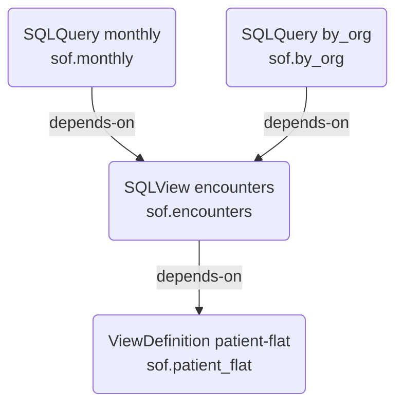

# AidboxMaterialization


`AidboxMaterialization` and its `$materialize` operation are not part of the official FHIR or SQL on FHIR specifications. These are custom Aidbox resources and operations, and their API may be subject to changes in future versions.



Requires **fhir-schema mode**.



This functionality is available in Aidbox versions 2609 and later.


Aidbox provides the `$materialize` operation on `AidboxMaterialization` to build a ViewDefinition or a SQL Library ([SQLView or SQLQuery](operation-sqlquery-run.md)) as a PostgreSQL object. The operation walks the `relatedArtifact` dependency graph around the target, plans every object the run has to build, validates each one against the database, rebuilds those whose SQL changed, and records the outcome as an `AidboxMaterializationStatus`.

Two things follow from declaring a materialization:

- Dependents read the object. A SQLView that depends on a materialized ViewDefinition compiles to `SELECT * FROM sof.patient_flat` instead of carrying a copy of the ViewDefinition's SQL.
- A rebuild covers the whole dependency graph. When you narrow a ViewDefinition, Aidbox drops the views standing on it and builds them back in the same run.

The [`$materialize` operation on ViewDefinition](operation-materialize.md) remains available and unchanged: it takes one ViewDefinition and creates one table, view, or materialized view, with no dependency tracking.

## AidboxMaterialization resource

`AidboxMaterialization` is a specialization of `Parameters` that declares where and how Aidbox stores one ViewDefinition or Library. `meta.profile` names the kind of storage, the way `AidboxTopicDestination` kinds do, and the kind profile decides which entries `parameter` accepts. Its key elements are:

- **`meta.profile`**: the kind profile. Aidbox ships `http://health-samurai.io/fhir/core/StructureDefinition/aidboxmaterialization-pgProfile`. `$materialize` reads the first entry to pick the kind, so the resource needs one.
- **`type`**: `ViewDefinition` or `Library`. Must agree with what `target` resolves to.
- **`target`**: canonical URL of the ViewDefinition or Library to materialize. The source resource needs a `url`, and Aidbox cannot materialize one without it.
- **`parameter`**: kind-specific settings. The pg profile closes this slicing to the three parameters below.

At most one AidboxMaterialization per profile may target a given canonical URL. A second one makes the plan ambiguous and `$materialize` returns 422.

A minimal AidboxMaterialization looks like this:

```json
{
  "resourceType": "AidboxMaterialization",
  "id": "patient-flat-pg",
  "meta": {
    "profile": ["http://health-samurai.io/fhir/core/StructureDefinition/aidboxmaterialization-pgProfile"]
  },
  "type": "ViewDefinition",
  "target": "https://example.org/ViewDefinition/patient-flat",
  "parameter": [
    {"name": "schema", "valueString": "sof"},
    {"name": "name", "valueString": "patient_flat"},
    {"name": "materializationType", "valueCode": "view"}
  ]
}
```

### PostgreSQL profile

`aidboxmaterialization-pgProfile` accepts three parameters and rejects everything else.

| Parameter           | Type   | Required | Description                                                                                                           |
|---------------------|--------|----------|-----------------------------------------------------------------------------------------------------------------------|
| schema              | string | yes      | PostgreSQL schema holding the object. Aidbox creates it when it does not exist. Must match `^[A-Za-z_][A-Za-z0-9_]*$` |
| name                | string | yes      | Object name. Must match `^[A-Za-z_][A-Za-z0-9_]*$`                                                                    |
| materializationType | code   | no       | `view` or `materialized-view`. Default: `view`                                                                        |

Aidbox splices `schema` and `name` into generated DDL unquoted, which is why both carry the identifier constraint. A value outside that shape fails profile validation on write, and `$materialize` returns 422 if one reaches a run another way.

The pg profile builds views and materialized views. A table would hold a snapshot that nothing keeps current; [`ViewDefinition/$materialize`](operation-materialize.md) covers that case.

## AidboxMaterializationStatus resource

Each run writes an `AidboxMaterializationStatus` sharing the id of its AidboxMaterialization. Its elements are:

- **`status`**: `in-progress`, `done`, `error` or `canceled`.
- **`target`**: reference to the AidboxMaterialization this status belongs to.
- **`targetVersion`**: `AidboxMaterialization.meta.versionId` at the time of the run.
- **`sqlHash`**: SHA-256 of the SQL the target compiled to during that run.
- **`duration`**: milliseconds the run took, from the `in-progress` write to `done` or `error`. Absent while a run is in progress.
- **`error`**: the message of the failure that ended the run. Present only on a status of `error`.

```json
{
  "resourceType": "AidboxMaterializationStatus",
  "id": "patient-flat-pg",
  "status": "done",
  "target": {"resourceType": "AidboxMaterialization", "id": "patient-flat-pg"},
  "targetVersion": "4",
  "sqlHash": "9f2c...c41a",
  "duration": 1284
}
```

Aidbox keeps one status resource per materialization and updates it in place, so `GET /fhir/AidboxMaterializationStatus/<id>/_history` is the run log.

Both resources carry search parameters:

```http
GET /fhir/AidboxMaterialization?target=https://example.org/ViewDefinition/patient-flat
GET /fhir/AidboxMaterializationStatus?status=error
GET /fhir/AidboxMaterializationStatus?target=AidboxMaterialization/patient-flat-pg
```

## General syntax

The operation runs at the instance level:

```http
POST /fhir/AidboxMaterialization/<resource-id>/$materialize
Content-Type: application/json
Prefer: respond-async

{
  "resourceType": "Parameters",
  "parameter": [
    {"name": "refresh", "valueBoolean": true}
  ]
}
```

The body is optional. When present, it must be a `Parameters` resource.

`$materialize` requires `Prefer: respond-async` and returns 422 without it, since a rebuild spanning a graph of views can run long.

Aidbox plans and validates the whole run before it answers 202, so a 202 means the plan compiles:

```http
202 Accepted
Content-Location: /fhir/$async/<operation-id>

{
  "resourceType": "Parameters",
  "parameter": [
    {"name": "operationId", "valueString": "<operation-id>"},
    {"name": "status", "valueCode": "in-progress"}
  ]
}
```

Poll the status URL and cancel the same way as other [async operations](../../api/bulk-api/purge.md#check-async-status):

```http
GET /fhir/$async/<operation-id>
DELETE /fhir/$async/<operation-id>
```

A cancelled run finishes the object in flight and starts no further ones. Objects built before the cancellation stay.

## Parameters

* **refresh**: repopulate objects that are already current.

    Aidbox skips a node whose object is current, and rebuilds one whose SQL changed. With `refresh` set, a current node holding a materialized view runs `REFRESH MATERIALIZED VIEW` instead. Nodes built as plain views need no refresh, and Aidbox skips them.

    Example:

    ```json
    {
      "name": "refresh",
      "valueBoolean": true
    }
    ```

## How a run works

Take a ViewDefinition, a SQLView over it, and two SQLQueries, each with an AidboxMaterialization:



Running `$materialize` on any one of the four covers all four.

1. **Build the graph.** Aidbox walks `relatedArtifact[depends-on]` down from the target and, through the `depends-on` search parameter on Library, back up to everything that stands on it. A dependency canonical that resolves to nothing fails the request with 422.
2. **Group into levels.** Aidbox orders nodes leaves first, so a node always follows what it depends on. A node with no AidboxMaterialization drops out of the plan, and Aidbox inlines its SQL into the dependents that have one.
3. **Validate with EXPLAIN.** Aidbox compiles each planned node with every dependency inlined and runs `EXPLAIN` on it. A ViewDefinition edit that leaves a dependent unable to compile, a dropped column a SQLQuery still selects, fails here with 422, and Aidbox touches nothing.
4. **Build level by level.** Each level runs as a background task that schedules the next one. Within a level, Aidbox skips nodes that are current and rebuilds the rest.
5. **Force the levels above.** Once a level rebuilds something, everything above it rebuilds too, since a dependent materialized view holds a snapshot of what sits below it.

### When Aidbox skips a node

Aidbox rebuilds a node unless all of these hold:

- its status is `done`,
- `targetVersion` matches the AidboxMaterialization's current `meta.versionId`,
- `sqlHash` matches the SQL the source compiles to now,
- the object exists in PostgreSQL.

A ViewDefinition and a Library carry no version that moves when you edit them, so the SQL hash is what catches an edit. The last check covers an object dropped outside Aidbox: a status on its own is not evidence that the view is there.

### How Aidbox replaces an object

For `materializationType: view`, Aidbox issues `CREATE OR REPLACE VIEW` and keeps the dependents in place. PostgreSQL refuses that when the column list changes (SQLSTATE 42P16), and Aidbox then drops the dependents its plan named, drops the view, and creates the new one; the dropped dependents rebuild at their own levels later in the run.

For `materializationType: materialized-view`, PostgreSQL has no in-place replacement, so every run drops and recreates.

Drops and creates for one node run in a single transaction, without `CASCADE`. An object outside the plan that depends on one being dropped blocks the drop, the transaction rolls back, and the run fails with the dependents intact. Aidbox drops what its plan accounts for and rebuilds every one of them.

### How dependents read a materialized object

A dependency that has a built pg materialization compiles to a read of the object. Given `sof.patient_flat` built from the ViewDefinition, a SQLView over it compiles to:

```sql
WITH "patient_flat" AS (
  SELECT * FROM sof.patient_flat
)
SELECT ... FROM "patient_flat"
```

Without the materialization, the same SQLView inlines the ViewDefinition's generated SQL into that CTE. The switch is per dependency. A graph materialized at the top alone inlines everything beneath it; give an intermediate node its own AidboxMaterialization and its dependents read that object instead.

This applies to [`$sqlquery-run`](operation-sqlquery-run.md) and to the SQL that `$materialize` itself builds.

## Limitations

- **No tables.** The pg profile builds `view` and `materialized-view`. Use [`ViewDefinition/$materialize`](operation-materialize.md) for a table.
- **No parameterised SQLQuery.** A Library whose SQL declares parameters has no fixed text to store as a view. `$materialize` returns 422; run it through [`$sqlquery-run`](operation-sqlquery-run.md).
- **No de-identified ViewDefinition.** A view and a materialized view both expose the cryptographic keys through `pg_views.definition` and `pg_matviews.definition`, and this profile has no table option. `$materialize` on a [de-identified](de-identification.md) ViewDefinition answers 202, and the run then fails at that node before writing a status; the `$async` URL reports the failure. The check covers the materialized node alone: Aidbox inlines a de-identified ViewDefinition without an AidboxMaterialization of its own into the object of any dependent that has one, keys included. Keep de-identified ViewDefinitions out of dependency graphs you materialize.
- **Refreshing is yours to schedule.** `$materialize` with `refresh` runs `REFRESH MATERIALIZED VIEW` when you call it. Aidbox runs no schedule of its own.
- **Deleting an AidboxMaterialization leaves the object.** Drop it with SQL.

## Errors

Aidbox refuses every condition below before it touches an object, and answers 422 with an OperationOutcome.

| Condition | Diagnostics |
| --- | --- |
| `Prefer: respond-async` missing | `Synchronous $materialize is not supported, send Prefer: respond-async` |
| Body is not a `Parameters` resource | `Request body must be a Parameters resource` |
| `target` resolves to nothing | `Cannot resolve AidboxMaterialization.target ...` |
| A `depends-on` canonical in the graph resolves to nothing | `Cannot resolve dependency canonical(s): ...` |
| `target` does not hold the canonical URL of its own resource | `No AidboxMaterialization with profile ... is indexed for ...` |
| `type` disagrees with what `target` resolves to | `... declares type "Library" but ... is a "ViewDefinition"` |
| Two AidboxMaterializations of one profile target the same canonical | `More than one AidboxMaterialization with profile ... targets ...` |
| A planned node no longer compiles | `... does not compile: ...` |
| `schema` or `name` is not a plain SQL identifier | `... has an invalid schema parameter: ...` |
| `materializationType` outside `view` and `materialized-view` | `... has an invalid materializationType: ...` |
| The Library declares SQL parameters | reported by the SQLQuery compiler |
| A dependency cycle | `Dependency cycle` |

`POST /fhir/AidboxMaterialization/<id>/$materialize` on an id that does not exist returns 404.

A node that fails to build gets an `error` status with the run's `sqlHash`; the run aborts and leaves later levels untouched.

## Examples

For example, with the given saved ViewDefinition:

```json
{
  "resourceType": "ViewDefinition",
  "id": "patient-flat",
  "url": "https://example.org/ViewDefinition/patient-flat",
  "name": "patient_flat",
  "status": "active",
  "resource": "Patient",
  "select": [{
    "column": [
      {"name": "id", "path": "getResourceKey()", "type": "string"},
      {"name": "gender", "path": "gender", "type": "code"}
    ]
  }]
}
```

And a SQLView over it, where the `depends-on` label is the CTE name the SQL reads:

```json
{
  "resourceType": "Library",
  "id": "patient-counts",
  "url": "https://example.org/Library/patient-counts",
  "status": "active",
  "type": {"coding": [{
    "system": "https://sql-on-fhir.org/ig/CodeSystem/LibraryTypesCodes",
    "code": "sql-view"
  }]},
  "relatedArtifact": [{
    "type": "depends-on",
    "label": "patient_flat",
    "resource": "https://example.org/ViewDefinition/patient-flat"
  }],
  "content": [{
    "contentType": "application/sql",
    "extension": [{
      "url": "https://sql-on-fhir.org/ig/StructureDefinition/sql-text",
      "valueString": "select gender, count(*) as n from patient_flat group by gender"
    }],
    "data": "c2VsZWN0IGdlbmRlciwgY291bnQoKikgYXMgbiBmcm9tIHBhdGllbnRfZmxhdCBncm91cCBieSBnZW5kZXI="
  }]
}
```

Declare a materialization for each:

```http
PUT /fhir/AidboxMaterialization/patient-flat-pg
Content-Type: application/json

{
  "resourceType": "AidboxMaterialization",
  "id": "patient-flat-pg",
  "meta": {"profile": ["http://health-samurai.io/fhir/core/StructureDefinition/aidboxmaterialization-pgProfile"]},
  "type": "ViewDefinition",
  "target": "https://example.org/ViewDefinition/patient-flat",
  "parameter": [
    {"name": "schema", "valueString": "sof"},
    {"name": "name", "valueString": "patient_flat"}
  ]
}
```

```http
PUT /fhir/AidboxMaterialization/patient-counts-pg
Content-Type: application/json

{
  "resourceType": "AidboxMaterialization",
  "id": "patient-counts-pg",
  "meta": {"profile": ["http://health-samurai.io/fhir/core/StructureDefinition/aidboxmaterialization-pgProfile"]},
  "type": "Library",
  "target": "https://example.org/Library/patient-counts",
  "parameter": [
    {"name": "schema", "valueString": "sof"},
    {"name": "name", "valueString": "patient_counts"},
    {"name": "materializationType", "valueCode": "materialized-view"}
  ]
}
```

Materialize both with one request, on either id:

```http
POST /fhir/AidboxMaterialization/patient-counts-pg/$materialize
Content-Type: application/json
Prefer: respond-async
```

### Checking the result in the DB Console

`sof.patient_flat` is a view over `Patient`, and `sof.patient_counts` is a materialized view that reads it:

```sql
SELECT * FROM sof.patient_counts;
```

Adding a column to the ViewDefinition and running `$materialize` again replaces the view in place and rebuilds the materialized view above it.
