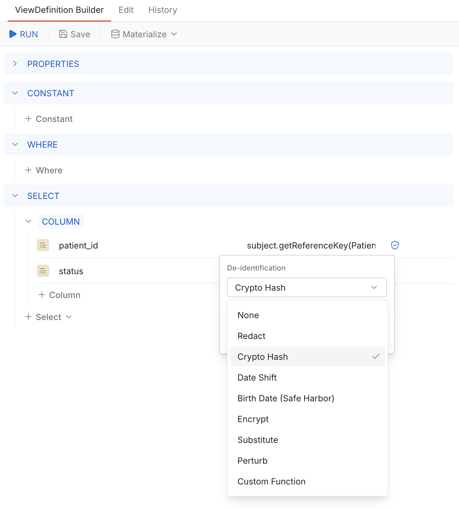

# De-identification

Starting from version **2604**, Aidbox supports per-column de-identification in ViewDefinitions via a FHIR extension. When a column has a de-identification extension, the SQL compiler wraps the column expression with a PostgreSQL function that transforms the value before it reaches the output.

This works with all ViewDefinition operations: `$run`, `$sql`, and `$materialize`.


Requires **fhir-schema mode**. See [SQL on FHIR prerequisites](./README.md).


## Extension format

Add the de-identification extension to any column in the `select` array:

```json
{
  "name": "birth_date",
  "path": "birthDate",
  "extension": [
    {
      "url": "http://health-samurai.io/fhir/core/StructureDefinition/de-identification",
      "extension": [
        {"url": "method", "valueCode": "dateshift"},
        {"url": "dateShiftKey", "valueString": "my-secret-key"}
      ]
    }
  ]
}
```

The extension uses sub-extensions for the method and its parameters. The `method` sub-extension is required and specifies which de-identification method to apply.

## Methods

### redact

Replaces the value with NULL. No parameters.

```json
{"url": "method", "valueCode": "redact"}
```

### cryptoHash

Replaces the value with its HMAC-SHA256 hash (hex-encoded). Deterministic — same input always produces the same hash. One-way, cannot be reversed.

| Parameter | Type | Required | Description |
|-----------|------|----------|-------------|
| cryptoHashKey | string | yes | HMAC secret key |

```json
[
  {"url": "method", "valueCode": "cryptoHash"},
  {"url": "cryptoHashKey", "valueString": "my-hash-key"}
]
```

### dateshift

Shifts date and dateTime values by a deterministic offset derived from the resource id. All dates within the same resource shift by the same number of days, preserving temporal relationships. The offset range is -50 to +50 days.

Year-only values (`"2000"`) and year-month values (`"2000-06"`) cannot be shifted meaningfully and are replaced with NULL.

| Parameter | Type | Required | Description |
|-----------|------|----------|-------------|
| dateShiftKey | string | yes | HMAC key used to compute the per-resource offset |

```json
[
  {"url": "method", "valueCode": "dateshift"},
  {"url": "dateShiftKey", "valueString": "my-shift-key"}
]
```

### birthDateSafeHarbor

Intended **only for `Patient.birthDate`**. Behaves like `dateshift` but returns NULL when the birth date implies the patient is over 89 years old, per HIPAA Safe Harbor rule [45 CFR 164.514(b)(2)(i)(C)](https://www.ecfr.gov/current/title-45/subtitle-A/subchapter-C/part-164/subpart-E/section-164.514).

Applying this method to any other date column is semantically incorrect — the function computes `age(current_date, input)` and treats the input as a birth date. Use plain `dateshift` for non-birth-date fields.

Because the function depends on `current_date`, it is marked [`STABLE`](https://www.postgresql.org/docs/current/xfunc-volatility.html) rather than `IMMUTABLE` — PostgreSQL guarantees it returns the same result within a single transaction, but the result may differ between transactions as the current date changes. This means the age cutoff re-evaluates on every query.

| Parameter | Type | Required | Description |
|-----------|------|----------|-------------|
| dateShiftKey | string | yes | HMAC key used to compute the per-resource offset |

```json
[
  {"url": "method", "valueCode": "birthDateSafeHarbor"},
  {"url": "dateShiftKey", "valueString": "my-shift-key"}
]
```

### encrypt

AES-128-CBC encrypts the value and returns a base64-encoded string. Reversible with the key. Uses a zero initialization vector for deterministic output — same plaintext always produces the same ciphertext.

| Parameter | Type | Required | Description |
|-----------|------|----------|-------------|
| encryptKey | string | yes | Hex-encoded AES-128 key (32 hex characters = 16 bytes) |

```json
[
  {"url": "method", "valueCode": "encrypt"},
  {"url": "encryptKey", "valueString": "0123456789abcdef0123456789abcdef"}
]
```

### substitute

Replaces the value with a fixed string.

| Parameter | Type | Required | Description |
|-----------|------|----------|-------------|
| replaceWith | string | yes | Replacement value |

```json
[
  {"url": "method", "valueCode": "substitute"},
  {"url": "replaceWith", "valueString": "REDACTED"}
]
```

### perturb

Adds random noise to numeric values. The result is non-deterministic — each query produces different output.

| Parameter | Type | Required | Description |
|-----------|------|----------|-------------|
| span | decimal | no | Noise magnitude. Default: 1.0 |
| rangeType | code | no | `fixed` (absolute noise) or `proportional` (relative to value). Default: `fixed` |
| roundTo | integer | no | Decimal places to round to. 0 means integer. Default: 0 |

With `fixed` range type, noise is in the range `±span/2`. With `proportional`, noise is `±(span × value)/2`. Any other `rangeType` value raises a SQL error.

```json
[
  {"url": "method", "valueCode": "perturb"},
  {"url": "span", "valueDecimal": 10},
  {"url": "rangeType", "valueCode": "fixed"},
  {"url": "roundTo", "valueInteger": 0}
]
```

### custom_function

Applies a user-provided PostgreSQL function. The function must already exist in the database. Its first argument is the column value cast to text. An optional second argument can be passed via `custom_arg`.

| Parameter | Type | Required | Description |
|-----------|------|----------|-------------|
| custom_function | string | yes | PostgreSQL function name. Must match `^[a-zA-Z][a-zA-Z0-9_.]*$` |
| custom_arg | any primitive | no | Optional second argument, passed as a FHIR sub-extension using the appropriate `value[x]` type: `valueString`, `valueInteger`, `valueDecimal`, `valueBoolean`, or `valueCode` |

```json
[
  {"url": "method", "valueCode": "custom_function"},
  {"url": "custom_function", "valueString": "left"},
  {"url": "custom_arg", "valueInteger": 4}
]
```

This example uses the built-in PostgreSQL `left` function to keep only the first 4 characters (e.g. extracting just the year from a date string).

## Example ViewDefinition

A complete ViewDefinition that de-identifies Patient data:

```json
{
  "resourceType": "ViewDefinition",
  "id": "deident-patients",
  "name": "deident_patients",
  "status": "active",
  "resource": "Patient",
  "select": [{
    "column": [{
      "name": "id",
      "path": "id",
      "extension": [{
        "url": "http://health-samurai.io/fhir/core/StructureDefinition/de-identification",
        "extension": [{
          "url": "method",
          "valueCode": "cryptoHash"
        }, {
          "url": "cryptoHashKey",
          "valueString": "patient-hash-key"
        }]
      }]
    }, {
      "name": "gender",
      "path": "gender"
    }, {
      "name": "birth_date",
      "path": "birthDate",
      "extension": [{
        "url": "http://health-samurai.io/fhir/core/StructureDefinition/de-identification",
        "extension": [{
          "url": "method",
          "valueCode": "dateshift"
        }, {
          "url": "dateShiftKey",
          "valueString": "date-shift-key"
        }]
      }]
    }]
  }, {
    "forEach": "name",
    "select": [{
      "column": [{
        "name": "use",
        "path": "use"
      }, {
        "name": "family",
        "path": "family",
        "extension": [{
          "url": "http://health-samurai.io/fhir/core/StructureDefinition/de-identification",
          "extension": [{
            "url": "method",
            "valueCode": "redact"
          }]
        }]
      }]
    }]
  }, {
    "forEach": "address",
    "select": [{
      "column": [{
        "name": "state",
        "path": "state"
      }, {
        "name": "postal_code",
        "path": "postalCode",
        "extension": [{
          "url": "http://health-samurai.io/fhir/core/StructureDefinition/de-identification",
          "extension": [{
            "url": "method",
            "valueCode": "substitute"
          }, {
            "url": "replaceWith",
            "valueString": "000"
          }]
        }]
      }]
    }]
  }]
}
```

In this example:

- `id` is replaced with a consistent hash
- `gender` passes through unchanged (no extension)
- `birthDate` is shifted by a deterministic offset per patient
- `name.family` is redacted (NULL)
- `name.use` passes through (code values are not PHI)
- `address.state` passes through (safe at state level)
- `address.postalCode` is replaced with "000"

## Materialization restriction

A ViewDefinition that contains any de-identification extension can only be materialized as a `table`. Attempting to materialize as `view` or `materialized-view` returns HTTP 422 with an OperationOutcome:

> ViewDefinitions with de-identification extensions can only be materialized as 'table'. Views and materialized views expose cryptographic keys in PostgreSQL system catalogs.

This restriction exists because PostgreSQL stores the full view definition (including the compiled SQL with embedded keys) in `pg_views.definition` and `pg_matviews.definition`. Any user with `SELECT` on those catalogs would see the `cryptoHashKey`, `dateShiftKey`, or `encryptKey` values in plaintext. Tables materialize the transformed data only, leaving the keys inside the ViewDefinition resource itself (which is access-controlled).

`$run` and `$sql` are unaffected — they return data or SQL strings directly without storing anything in system catalogs.

## Pre-built ViewDefinitions

The IG package `io.health-samurai.de-identification.r4` provides ready-made Safe Harbor ViewDefinitions for common FHIR R4 resource types. Install it via FAR (Aidbox's artifact registry):

| Resource | Use |
|----------|-----|
| Patient | Uses `birthDateSafeHarbor` on `birthDate`, cryptoHash on `id`, redact on name/address identifiers |
| Encounter, Condition, Observation | `dateshift` on clinical dates, cryptoHash on references |
| Claim, ExplanationOfBenefit | `dateshift` on billable periods |
| AllergyIntolerance, DiagnosticReport, MedicationRequest, MedicationDispense, MedicationAdministration, Immunization, Procedure, Specimen, DocumentReference | Same general approach |
| Practitioner, Location | Identifier redaction |

Install the package via FHIR package management and use these ViewDefinitions directly, or copy and customize them. Every cryptographic key parameter in the pre-built VDs is blank (`""`) — you must set real keys before using them for actual de-identification.

## Using the UI

The ViewDefinition builder in Aidbox UI includes a de-identification picker on each column. Click the shield icon next to a column's path to open the configuration popover.



When a de-identification method is configured, the shield icon turns blue. Hovering shows the current method name.

## Writing custom PostgreSQL functions

Custom functions referenced via `custom_function` must:

- Accept `text` as the first argument (the column value)
- Optionally accept a second argument of any type (passed via `custom_arg`)
- Already exist in the database before the ViewDefinition is executed

Example:

```sql
CREATE OR REPLACE FUNCTION my_mask(value text)
RETURNS text LANGUAGE sql IMMUTABLE PARALLEL SAFE AS $$
  SELECT CASE
    WHEN value IS NULL THEN NULL
    ELSE left(value, 1) || repeat('*', greatest(length(value) - 1, 0))
  END;
$$;
```

Then reference it in a column:

```json
{
  "url": "http://health-samurai.io/fhir/core/StructureDefinition/de-identification",
  "extension": [
    {"url": "method", "valueCode": "custom_function"},
    {"url": "custom_function", "valueString": "my_mask"}
  ]
}
```

## Security considerations

### Key management

Cryptographic keys (`cryptoHashKey`, `dateShiftKey`, `encryptKey`) are stored as plaintext strings inside the ViewDefinition resource. Anyone with read access to the ViewDefinition can see the keys.

Restrict access to ViewDefinition resources using [AccessPolicy](../../access-control/authorization/README.md) to ensure only authorized users can view or modify de-identification configurations.

### SQL injection prevention

The `custom_function` parameter is validated against `^[a-zA-Z][a-zA-Z0-9_.]*$` — only letters, digits, underscores, and dots are allowed. This validation happens both in the Aidbox UI and in the SQL compiler. String arguments passed via `custom_arg` are safely escaped by the SQL generator.

### Encryption limitations

The `encrypt` method uses AES-128-CBC with a zero initialization vector. This makes encryption deterministic — the same plaintext always produces the same ciphertext, which is useful for consistent de-identification but leaks frequency information. This is not suitable for general-purpose encryption.

See also:

- [Defining flat views with view definitions](./defining-flat-views-with-view-definitions.md)
- [$run operation](./operation-run.md)
- [$materialize operation](./operation-materialize.md)
