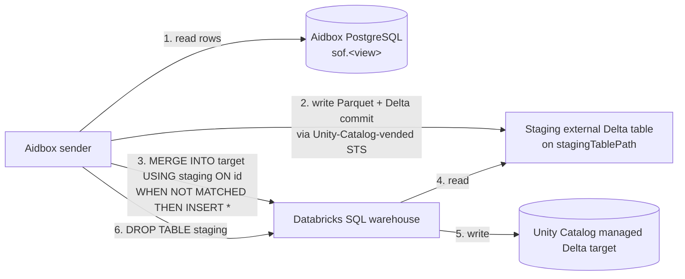
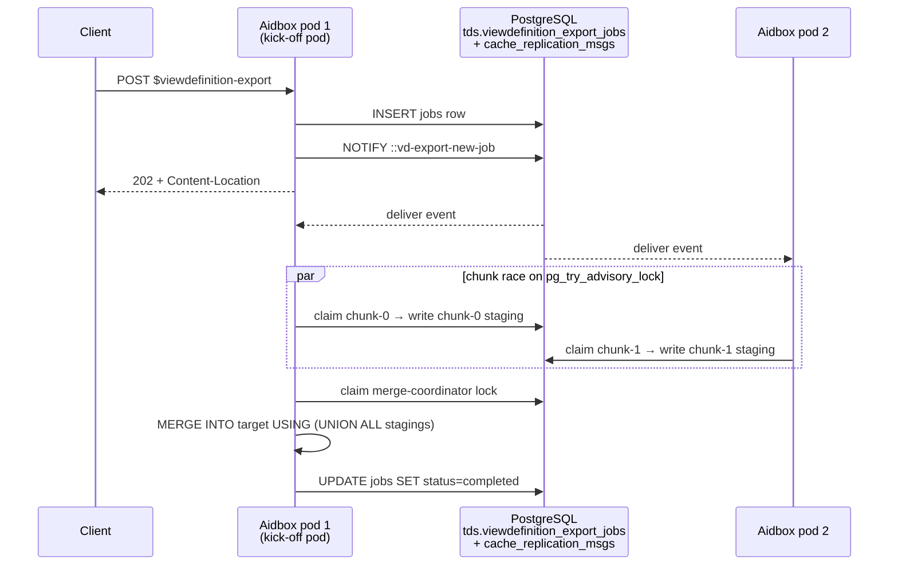

# `$viewdefinition-export` operation


Available in Aidbox versions **2605** and later. Requires **fhir-schema mode**. Implements [SQL-on-FHIR v2 `$viewdefinition-export`](https://build.fhir.org/ig/FHIR/sql-on-fhir-v2/OperationDefinition-ViewDefinitionExport.html) — the FHIR async-request pattern (HTTP `202` + `Content-Location` → polling URL).


A one-shot ad-hoc export of a ViewDefinition's materialized rows into a backend-provided sink. Aidbox owns the FHIR-side wiring (route, Parameters parsing, async kick-off, status polling); the sink is contributed by an external Aidbox module that registers itself as a **backend** keyed by the `kind` input parameter.

Use this when you need a periodic snapshot / backfill / ad-hoc dump and don't want to stand up an `AidboxTopicDestination` with its continuous-streaming worker.

## Registered backends

| `kind` | Sink | Module |
|---|---|---|
| `data-lakehouse` | Databricks Unity Catalog managed Delta table | [`topic-destination-deltalake`](../../tutorials/subscriptions-tutorials/data-lakehouse-aidboxtopicdestination.md) |

Future BigQuery / ClickHouse backends would plug in with their own `kind`. An unsupported `kind` is reported as `status=failed` in the poll response with the error `"No backend registered for $viewdefinition-export kind=X"` — see [Failure model](#failure-model) below.

## Kick-off

```http
POST /fhir/ViewDefinition/$viewdefinition-export
Content-Type: application/fhir+json
Prefer: respond-async

{
  "resourceType": "Parameters",
  "parameter": [
    {"name": "view",
     "part": [{"name": "name",          "valueString": "patient_flat"},
              {"name": "viewReference", "valueReference": {"reference": "ViewDefinition/patient_flat"}}]},
    {"name": "kind",      "valueString": "data-lakehouse"},

    {"name": "writeMode",              "valueString": "managed-zerobus"},
    {"name": "databricksWorkspaceUrl", "valueString": "https://workspace.cloud.databricks.com"},
    {"name": "databricksWorkspaceId",  "valueString": "1234567890123456"},
    {"name": "databricksRegion",       "valueString": "us-east-1"},
    {"name": "tableName",              "valueString": "catalog.schema.patient_flat"},
    {"name": "databricksWarehouseId",  "valueString": "wh-abc"},
    {"name": "awsRegion",              "valueString": "us-east-1"},
    {"name": "stagingTablePath",       "valueString": "s3://bucket/staging/patient_flat/"}
  ]
}
```

Response:

```
202 Accepted
Content-Location: /fhir/ViewDefinition/$viewdefinition-export/status/<export-id>

{
  "resourceType": "Parameters",
  "parameter": [
    {"name": "exportId", "valueString": "<uuid>"},
    {"name": "status",   "valueCode":   "in-progress"},
    {"name": "location", "valueUri":    "/fhir/ViewDefinition/$viewdefinition-export/status/<uuid>"}
  ]
}
```

## Spec-defined parameters

| Parameter | Required | Notes |
|---|---|---|
| `view` | yes | Exactly one entry. `viewReference` must point at a server-stored ViewDefinition. Inline `viewResource` is not yet supported. |
| `kind` | yes | Selects the backend (e.g. `data-lakehouse`). |
| `clientTrackingId` | no | Echoed back in the status response. |
| `_format` | no | `ndjson`, `parquet`, `json`, or omitted. Functionally ignored — the sink format is determined by the backend (Delta for `kind=data-lakehouse`). |
| `header` | no | Echoed; not meaningful for non-CSV sinks. |
| `patient` (0..\*) | no | List of Patient references. Currently accepted but **not yet applied** to the underlying SQL — the full view is exported. |
| `group` (0..\*) | no | List of Group references. Same status as `patient` — accepted, not yet applied. |
| `_since` | no | Same — accepted, not yet applied. |
| `source` | no | External data source URI. **Not supported** — rejected. |

Backend-specific parameters live alongside the spec ones in the same `Parameters` body. See the backend's docs for the full list. For `kind=data-lakehouse` see the [Data Lakehouse Topic Destination tutorial](../../tutorials/subscriptions-tutorials/data-lakehouse-aidboxtopicdestination.md).

## Status polling

```http
GET /fhir/ViewDefinition/$viewdefinition-export/status/<export-id>
```

Response codes:

- `202 Accepted` — still in progress. The same `Content-Location` is returned so the client can keep polling.
- `200 OK` — terminal. Body is a `Parameters` resource with the final shape (`status=completed` or `status=failed`, plus `output[].location` on success).
- `404 Not Found` — unknown `export-id`.

Completed output for `kind=data-lakehouse`:

```json
{
  "resourceType": "Parameters",
  "parameter": [
    {"name": "exportId", "valueString": "<uuid>"},
    {"name": "status",   "valueCode":   "completed"},
    {"name": "clientTrackingId", "valueString": "..."},
    {"name": "exportStartTime", "valueInstant": "2026-05-22T00:00:00Z"},
    {"name": "exportEndTime",   "valueInstant": "2026-05-22T00:01:30Z"},
    {"name": "output",
     "part": [{"name": "name",     "valueString": "patient_flat"},
              {"name": "location", "valueUri":    "databricks-uc:catalog.schema.patient_flat"}]}
  ]
}
```

The `output[].location` URI scheme is backend-specific (`databricks-uc:` for the data-lakehouse backend).

## Failure model

- **Input validation failures** (missing `view`, missing `kind`, multiple views, `source` set, etc.) — synchronous `400 OperationOutcome` returned from the kick-off `POST`. No `export-id` is allocated.
- **Backend-side failures** — async. The kick-off returns `202` with an `export-id`; status polling later reports `status=failed` with the error in the `error` parameter. Includes:
  - **No backend registered for `kind`** (e.g., typo, module not deployed) — the polling response's `error` field reads `"No backend registered for $viewdefinition-export kind=..."`.
  - **Databricks auth** (bad `client-id` / `client-secret`).
  - **Missing target table** / **missing required Databricks parameter** (e.g., no `tableName`).
  - **Schema mismatch** the module can't auto-`ALTER`.

## How it works (`kind=data-lakehouse`)

The first-party backend uses a **staging Delta table** as a relay: it writes the `sof.<view>` rows to an external Delta table at a customer-provided `stagingTablePath` (via Unity Catalog credential vending), then `MERGE INTO`s the managed target, then drops the staging table. Same flow for `writeMode=managed-zerobus` and `writeMode=managed-sql`.



Steps in detail:

1. Register a temporary external Delta table at `stagingTablePath` with the same schema as the SQL-on-FHIR materialized view (`sof.<view>` in Aidbox's PostgreSQL).
2. Unity Catalog vends short-lived STS credentials for the staging path.
3. The module writes all `sof.<view>` rows to the staging path as one Delta commit.
4. The module issues `MERGE INTO {managed_target} USING {staging} ON t.id = s.id WHEN NOT MATCHED THEN INSERT *` against the SQL warehouse. The MERGE reads the staging Delta snapshot through the Delta protocol and inserts any rows whose `id` is not yet present in the target.
5. The module drops the staging table.

On failure the staging table is best-effort dropped, then the export retries up to 3 times with exponential backoff (1s → 2s → 4s).


The `MERGE` is idempotent on `id` — a retried export after a lost response inserts nothing instead of duplicating. Your ViewDefinition must have an `id` column.


For large views, set the backend-specific `initialExportParallelism > 1` parameter (default `1`, sequential): the backend hash-partitions `sof.<view>` into `N` chunks, writes them in parallel into per-chunk staging tables (`<base>/chunk-0/`, `<base>/chunk-1/`, …), then materializes the union into the target via one `MERGE INTO target USING (SELECT * FROM staging_0 UNION ALL …)`. In a multi-pod Aidbox cluster the workload is shared across pods — see [Multi-pod execution](#multi-pod-execution) below. Sizing guidance lives in the tutorial's [Large-scale initial export](../../tutorials/subscriptions-tutorials/data-lakehouse-aidboxtopicdestination.md#large-scale-initial-export) section.

The Databricks-side setup (catalog, schema, target table, staging schema, service principal, grants, warehouse) is documented in the [Data Lakehouse Topic Destination tutorial](../../tutorials/subscriptions-tutorials/data-lakehouse-aidboxtopicdestination.md) — the same setup is reused here.

## Multi-pod execution

Every Aidbox pod sharing the same PostgreSQL metastore participates in any in-flight export automatically — there's no leader election, no service-discovery, no external coordinator.

Canonical state for an export lives in a backend-owned PostgreSQL table (`tds.viewdefinition_export_jobs` for `kind=data-lakehouse`, created lazily on first kick-off, sitting alongside the existing `tds.event_storage` that AidboxTopicDestinations use). The pod that received the `POST` inserts the jobs row and broadcasts a `::vd-export-new-job` event on the `cache_replication_msgs` PG NOTIFY channel — the same fan-out infrastructure Aidbox already uses to replicate `AidboxTopicDestination` create/delete across the cluster. Every pod's cache-listener thread picks the event up and spawns local worker threads.

Workers on every pod then race for chunks via `pg_try_advisory_lock(export-id-hash, chunk-id)`. First worker to claim a given chunk-id runs that chunk; the others see `false` and move on to the next. The lock mechanism is identical to the one `AidboxTopicDestination`'s distributed initial-sync uses; the [tutorial's Large-scale initial export](../../tutorials/subscriptions-tutorials/data-lakehouse-aidboxtopicdestination.md#large-scale-initial-export) section has the sizing formula.

Crash recovery is implicit: PG session-level advisory locks auto-release on connection drop, so when a worker (or its whole pod) dies mid-chunk, a sibling worker on any surviving pod re-claims that chunk on its next loop iteration.



## Cloud support

The Aidbox-side wiring is cloud-agnostic, but **the first-party backend (`kind=data-lakehouse`, [`topic-destination-deltalake`](../../tutorials/subscriptions-tutorials/data-lakehouse-aidboxtopicdestination.md)) currently supports AWS S3 only** for the staging Delta path. **Google Cloud Storage** (`gs://...`) and **Azure ADLS Gen2** (`abfss://...`) are not yet supported — adding them is tracked as a follow-up. The Databricks Unity Catalog managed target table is unaffected (UC manages target storage internally).

## Troubleshooting

**Status poll returns `404` on a multi-pod cluster.** The canonical jobs row is shared across pods (see [Multi-pod execution](#multi-pod-execution)), but Aidbox additionally keeps a small per-pod in-memory cache of the echo-only spec fields (`clientTrackingId`, `_format`, the registered `kind` needed to route the status dispatch). That cache only lives on the pod that received the original `POST`. A `GET .../status/<export-id>` arriving on any other pod returns `404`.

Configure your load balancer with session affinity on the `/fhir/ViewDefinition/$viewdefinition-export/status/` path so clients keep hitting the same pod for the lifetime of the export. The kick-off response's `Content-Location` header already names the hostname the client should stick to — most LBs can be told to honour it (cookie-based affinity in nginx-ingress, source-IP hash, etc.). A FHIR-resource-backed status (so any pod can answer any poll) is tracked as a follow-up.

## Limitations (current)

- One `view` per request (spec allows `1..*`).
- `patient` / `group` / `_since` filters extracted but not yet applied to the SQL.
- Status polling requires LB session affinity on the `Content-Location` hostname — see [Troubleshooting](#troubleshooting).
- Cancellation (`cancelUrl`) and `estimatedTimeRemaining` are not implemented.
