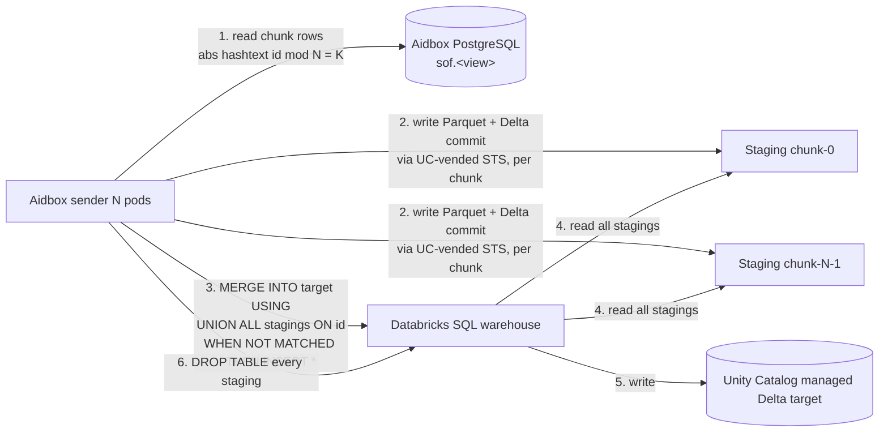

# `$viewdefinition-export` operation


Available in Aidbox versions **2605** and later. Requires **fhir-schema mode**. Implements [SQL-on-FHIR v2 `$viewdefinition-export`](https://build.fhir.org/ig/FHIR/sql-on-fhir-v2/OperationDefinition-ViewDefinitionExport.html) — the FHIR async-request pattern (HTTP `202` + `Content-Location` → polling URL).


A one-shot ad-hoc export of a ViewDefinition's materialized rows into a backend-provided sink. Aidbox owns the FHIR-side wiring (route, Parameters parsing, async kick-off, status polling); the sink is contributed by an external Aidbox module that registers itself as a **backend** keyed by the `kind` input parameter.

Use this when you need a periodic snapshot / backfill / ad-hoc dump and don't want to stand up an `AidboxTopicDestination` with its continuous-streaming worker.

## Registered backends

| `kind` | Sink | Module |
|---|---|---|
| `data-lakehouse` | Databricks Unity Catalog managed Delta table | [`topic-destination-deltalake`](../../tutorials/subscriptions-tutorials/data-lakehouse-aidboxtopicdestination.md) |

Future BigQuery / ClickHouse backends would plug in with their own `kind`. An unsupported `kind` is reported as `status=failed` in the poll response with the error `"No backend registered for $viewdefinition-export kind=X"` — see [Failure model](#failure-model) below.

## Kick-off

```http
POST /fhir/ViewDefinition/$viewdefinition-export
Content-Type: application/fhir+json
Prefer: respond-async

{
  "resourceType": "Parameters",
  "parameter": [
    {"name": "view",
     "part": [{"name": "name",          "valueString": "patient_flat"},
              {"name": "viewReference", "valueReference": {"reference": "ViewDefinition/patient_flat"}}]},
    {"name": "kind",      "valueString": "data-lakehouse"},

    {"name": "writeMode",              "valueString": "managed-zerobus"},
    {"name": "databricksWorkspaceUrl", "valueString": "https://workspace.cloud.databricks.com"},
    {"name": "databricksWorkspaceId",  "valueString": "1234567890123456"},
    {"name": "databricksRegion",       "valueString": "us-east-1"},
    {"name": "tableName",              "valueString": "catalog.schema.patient_flat"},
    {"name": "databricksWarehouseId",  "valueString": "wh-abc"},
    {"name": "awsRegion",              "valueString": "us-east-1"},
    {"name": "stagingTablePath",       "valueString": "s3://bucket/staging/patient_flat/"}
  ]
}
```

Response:

```
202 Accepted
Content-Location: /fhir/ViewDefinition/$viewdefinition-export/status/<export-id>

{
  "resourceType": "Parameters",
  "parameter": [
    {"name": "exportId", "valueString": "<uuid>"},
    {"name": "status",   "valueCode":   "in-progress"},
    {"name": "location", "valueUri":    "/fhir/ViewDefinition/$viewdefinition-export/status/<uuid>"}
  ]
}
```

## Spec-defined parameters

| Parameter | Required | Notes |
|---|---|---|
| `view` | yes | Exactly one entry. `viewReference` must point at a server-stored ViewDefinition. Inline `viewResource` is not yet supported. |
| `kind` | yes | Selects the backend (e.g. `data-lakehouse`). |
| `clientTrackingId` | no | Echoed back in the status response. |
| `_format` | no | `ndjson`, `parquet`, `json`, or omitted. Functionally ignored — the sink format is determined by the backend (Delta for `kind=data-lakehouse`). |
| `header` | no | Echoed; not meaningful for non-CSV sinks. |
| `patient` (0..\*) | no | List of Patient references. Currently accepted but **not yet applied** to the underlying SQL — the full view is exported. |
| `group` (0..\*) | no | List of Group references. Same status as `patient` — accepted, not yet applied. |
| `_since` | no | Same — accepted, not yet applied. |
| `source` | no | External data source URI. **Not supported** — rejected. |

Backend-specific parameters live alongside the spec ones in the same `Parameters` body. See the backend's docs for the full list. For `kind=data-lakehouse` see the [Data Lakehouse Topic Destination tutorial](../../tutorials/subscriptions-tutorials/data-lakehouse-aidboxtopicdestination.md).

## Status polling

```http
GET /fhir/ViewDefinition/$viewdefinition-export/status/<export-id>
```

Response codes:

- `202 Accepted` — still in progress. The same `Content-Location` is returned so the client can keep polling.
- `200 OK` — terminal. Body is a `Parameters` resource with the final shape (`status=completed` or `status=failed`, plus `output[].location` on success).
- `404 Not Found` — unknown `export-id`.

Completed output for `kind=data-lakehouse`:

```json
{
  "resourceType": "Parameters",
  "parameter": [
    {"name": "exportId", "valueString": "<uuid>"},
    {"name": "status",   "valueCode":   "completed"},
    {"name": "clientTrackingId", "valueString": "..."},
    {"name": "exportStartTime", "valueInstant": "2026-05-22T00:00:00Z"},
    {"name": "exportEndTime",   "valueInstant": "2026-05-22T00:01:30Z"},
    {"name": "output",
     "part": [{"name": "name",     "valueString": "patient_flat"},
              {"name": "location", "valueUri":    "databricks-uc:catalog.schema.patient_flat"}]}
  ]
}
```

The `output[].location` URI scheme is backend-specific (`databricks-uc:` for the data-lakehouse backend).

## Cancellation

```http
DELETE /fhir/ViewDefinition/$viewdefinition-export/status/<export-id>
```

Stops an in-flight export and triggers backend cleanup (the data-lakehouse backend drops per-chunk staging tables it created). Response codes:

- `202 Accepted` — cancel acknowledged, async cleanup running. Body reports `status=canceling`; poll the same status URL to see when chunks finish dropping out of `db_scheduler.scheduled_tasks` and the operation reaches a terminal state.
- `200 OK` — operation already terminal (`completed` / `failed`). DELETE is idempotent; the response is the same as a GET on the status URL.
- `404 Not Found` — unknown `export-id` (no tasks in `db_scheduler.scheduled_tasks{,_history}` for that id).

What cancellation does **not** do:

- It does not roll back rows already merged into the target managed table. The merge is the last step of finalize-export — if cancel arrives before finalize, no rows have landed; if after finalize, the operation is already terminal and cancel is a no-op.
- It does not delete history rows of chunks that already completed. The audit trail of partial work survives in `db_scheduler.scheduled_tasks_history` (cleaned up by db-scheduler's regular sweep).

## Failure model

- **Input validation failures** (missing `view`, missing `kind`, multiple views, `source` set, etc.) — synchronous `400 OperationOutcome` returned from the kick-off `POST`. No `export-id` is allocated.
- **Backend-side failures** — async. The kick-off returns `202` with an `export-id`; status polling later reports `status=failed` with the error in the `error` parameter. Includes:
  - **No backend registered for `kind`** (e.g., typo, module not deployed) — the polling response's `error` field reads `"No backend registered for $viewdefinition-export kind=..."`.
  - **Databricks auth** (bad `client-id` / `client-secret`).
  - **Missing target table** / **missing required Databricks parameter** (e.g., no `tableName`).
  - **Schema mismatch** the module can't auto-`ALTER`.

## How it works (`kind=data-lakehouse`)

The first-party backend uses **per-chunk staging Delta tables** as a relay. With `initialExportParallelism = N` (default `N=1`), the backend hash-partitions `sof.<view>` into `N` chunks, writes each chunk into its own external Delta table under `<stagingTablePath>/chunk-K/`, then materializes the union into the managed target with one `MERGE INTO target USING (SELECT * FROM staging_0 UNION ALL …)` against the SQL warehouse and drops every staging. The `N=1` case is just the degenerate path of that flow — one chunk, no `UNION ALL` source — so a single architecture covers both modes. Same flow for `writeMode=managed-zerobus` and `writeMode=managed-sql`.



Steps in detail:

1. `plan-export` decides the chunk count from `initialExportParallelism`. `setup-export` syncs the target schema against `sof.<view>` (auto-`ALTER ADD COLUMNS` if Aidbox added columns) and pre-computes the staging-column spec so chunks don't re-describe `sof.<view>`.
2. Each chunk task (one of `N`, possibly on different Aidbox pods) creates its own external Delta table at `<stagingTablePath>/chunk-K/`, vends short-lived STS credentials from Unity Catalog for that prefix, and streams its hash-partition of `sof.<view>` (`abs(hashtext(id::text)) % N = K`) as one Delta commit.
3. Once all `N` chunks complete, the supervisor task invokes `finalize-export`. The module issues a single `MERGE INTO target USING (SELECT * FROM staging_0 UNION ALL …) ON t.id = s.id WHEN NOT MATCHED THEN INSERT *` to the SQL warehouse — Databricks `UNION ALL` planning is effectively free, so cost scales with row count, not chunk count.
4. The module drops every staging table.

On failure the per-chunk stagings are best-effort dropped via `cancel-export`, then the chunk's async-task retries up to 2 times with a 30-second backoff. The supervisor task itself doesn't retry — a chunk-failure cascade is surfaced as `failed` status, with the failing task's error message echoed back to the caller.


The `MERGE` is idempotent on `id` — a retried export after a lost response inserts nothing instead of duplicating. Your ViewDefinition must have an `id` column.


Why per-chunk staging even at `N=1`? Delta-on-S3 has no atomic put-if-absent on `_delta_log/N.json` without an S3DynamoDBLogStore, so two writers committing to one staging Delta race and lose commits silently ([Delta #1830](https://github.com/delta-io/delta/issues/1830), [#1410](https://github.com/delta-io/delta/issues/1410)). Per-chunk staging = exactly one writer per Delta table = no race. The MERGE source picks up where Delta left off via the standard snapshot read. Sizing guidance lives in the tutorial's [Large-scale initial export](../../tutorials/subscriptions-tutorials/data-lakehouse-aidboxtopicdestination.md#large-scale-initial-export) section. The per-chunk Aidbox PG load scales with `N` — request more than your HikariCP pool can spare and `plan-export` returns a `400` with `parallelism-exceeds-pool` before scheduling any work.

The Databricks-side setup (catalog, schema, target table, staging schema, service principal, grants, warehouse) is documented in the [Data Lakehouse Topic Destination tutorial](../../tutorials/subscriptions-tutorials/data-lakehouse-aidboxtopicdestination.md) — the same setup is reused here.

## Multi-pod execution

Workflow orchestration runs on Aidbox's standard async-task engine — the same one that powers [`$purge`](../../api/bulk-api/purge.md) and other long-running operations. Job state lives in shared PostgreSQL tables (`db_scheduler.scheduled_tasks` + history), so every pod connected to the same metastore can pick up work and answer status polls.

On kick-off:

1. The receiving pod synchronously validates inputs and calls the backend's `plan-export` (chunk discovery) and `setup-export` (e.g. allocate per-chunk staging tables) hooks. Config errors surface as `400` here, before any task is scheduled.
2. The pod schedules `N` chunk tasks + 1 supervisor task on the async-task engine and returns `202` to the client.
3. Chunk tasks run concurrently on any pod with a free async-task worker — chunks naturally spread across the cluster. The supervisor task polls chunk completion and dispatches the backend's `finalize-export` hook (for `kind=data-lakehouse`: the final `MERGE INTO target USING (UNION ALL stagings)` + staging drop).

Crash recovery is inherited from the async-task engine: tasks heartbeat into PostgreSQL, and a task whose worker dies is re-leased to another pod after the heartbeat timeout. No bespoke advisory-lock juggling, no `NOTIFY` fan-out, no kick-off-pod affinity.

```mermaid
sequenceDiagram
    participant C as Client
    participant P1 as Aidbox pod 1<br/>(kick-off)
    participant PG as PostgreSQL<br/>(db_scheduler.scheduled_tasks)
    participant P2 as Aidbox pod 2

    C->>P1: POST $viewdefinition-export
    P1->>P1: plan-export + setup-export (sync)
    P1->>PG: schedule N chunk tasks + 1 supervisor
    P1-->>C: 202 + Content-Location
    par chunks lease from PG
        P1->>PG: lease chunk-0 → write staging-0
        P2->>PG: lease chunk-1 → write staging-1
    end
    P2->>PG: supervisor task wakes → all chunks done
    P2->>P2: finalize-export (MERGE + drop stagings)
    P2->>PG: mark export completed
    C->>P2: GET status/&lt;id&gt; → 200 completed
```

Backends plug in by implementing four mandatory multimethods (`plan-export`, `setup-export`, `export-chunk`, `finalize-export`) and one optional one (`cancel-export`) — see `aidbox-api` `io.healthsamurai.topics.api` for the contract.

## Cloud support

The Aidbox-side wiring is cloud-agnostic, but **the first-party backend (`kind=data-lakehouse`, [`topic-destination-deltalake`](../../tutorials/subscriptions-tutorials/data-lakehouse-aidboxtopicdestination.md)) currently supports AWS S3 only** for the staging Delta path. **Google Cloud Storage** (`gs://...`) and **Azure ADLS Gen2** (`abfss://...`) are not yet supported — adding them is tracked as a follow-up. The Databricks Unity Catalog managed target table is unaffected (UC manages target storage internally).

## Limitations (current)

- One `view` per request (spec allows `1..*`).
- `patient` / `group` / `_since` filters extracted but not yet applied to the SQL.
- `cancelUrl` (the spec's pointer to a cancel endpoint exposed in the kick-off response) is not yet returned. Cancellation itself works — `DELETE` on the status URL is supported (see [Cancellation](#cancellation) above); clients have to know that convention rather than discover it from the response body.
- `estimatedTimeRemaining` is not computed.
