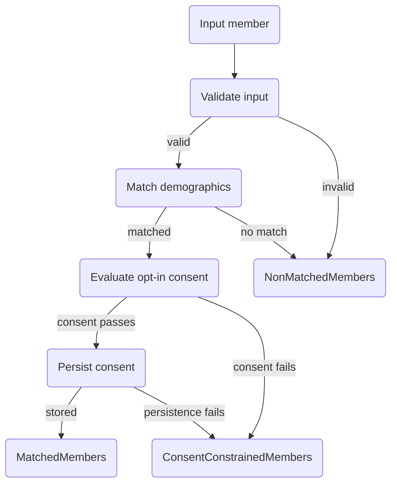

# Matching logic

`$bulk-member-match` evaluates each submitted member independently and routes it to one of three output buckets. Per-member failures never fail the whole batch.

## Per-member pipeline

Evaluation is **match-first, consent-second**: a member that matches demographically but fails consent still carries a real `matched-patient` reference into `ConsentConstrainedMembers`. Two separate `try`/`catch` blocks preserve this invariant — a thrown exception during matching routes to `NonMatchedMembers`; an exception after a successful match routes to `ConsentConstrainedMembers`.

## Matching algorithm

Demographic matching is exact. The submitted Patient must carry every field below, and each must match a payer-side `Patient`:

| Field | Comparison |
| --- | --- |
| `Patient.name[0].family` | Case-insensitive exact |
| `Patient.name[0].given[0]` | Case-insensitive exact |
| `Patient.birthDate` | Exact |
| `Patient.gender` | Exact |

When `CoverageToMatch.subscriberId` is present, the lookup additionally requires `_has:Coverage:beneficiary:subscriber-id=<subscriberId>` so only Patients with a matching Coverage are returned.

When `MemberPatient.identifier[]` carries one or more `{system, value}` pairs, each becomes a separate `?identifier=system|value` filter on the Patient search. Per FHIR R4 repeated-parameter semantics this is **AND** — every submitted identifier must be present on the matched Patient. Bare-value entries (no `system`) search any system. The AND semantics disambiguates twins or family members who share demographics but carry different MRNs.

A member is treated as **unmatched** when the search returns zero entries or more than one — ambiguous matches are rejected.

The algorithm is identical to [Provider Access matching](../provider-access-api/matching-logic.md#matching-algorithm).

## Output buckets

| Bucket | Card. | Code | Profile |
| --- | --- | --- | --- |
| `MatchedMembers` | 1..1 | `match` | [pdex-member-match-group](https://hl7.org/fhir/us/davinci-pdex/StructureDefinition-pdex-member-match-group.html) |
| `NonMatchedMembers` | 0..1 | `nomatch` | [pdex-member-no-match-group](https://hl7.org/fhir/us/davinci-pdex/StructureDefinition-pdex-member-no-match-group.html) |
| `ConsentConstrainedMembers` | 0..1 | `consentconstraint` | [pdex-member-no-match-group](https://hl7.org/fhir/us/davinci-pdex/StructureDefinition-pdex-member-no-match-group.html) |


**IG asymmetry.** `ConsentConstrainedMembers` and `NonMatchedMembers` share the **same** profile (`pdex-member-no-match-group`); they differ only by `Group.code.coding[0].code`. This differs from the Provider Access output, where each bucket has a distinct profile.


`MatchedMembers` is **always emitted**, even when no members matched — `quantity: 0` and the `member` field omitted entirely. The wrapper profile fixes the parameter cardinality at `1..1`. The `member: []` empty-array form is rejected by Aidbox's schema validator and is therefore omitted on the wire.

## Opt-in consent evaluation

After a successful demographic match, the server evaluates the submitted HRex `Consent` against five predicates. All must pass for the member to be eligible for `MatchedMembers`. Any failure routes the member to `ConsentConstrainedMembers` carrying the matched Patient reference.

| Predicate | Source | Pass condition |
| --- | --- | --- |
| `active?` | `Consent.status` | Equals `active`. The HRex Consent profile fixes `status = active`, so `$validate` enforces this; the predicate is defense-in-depth. |
| `period-covers-now?` | `Consent.provision.period` | `start ≤ now ≤ end`. A date-only `period.end` extends through end-of-day per FHIR R4. Field present but unparseable → fails (does not slip through). |
| `payer-matches-recipient?` | `Consent.provision.actor[role.coding=IRCP]` | The recipient slice (`role.coding.code = IRCP` on `v3-ParticipationType`) resolves to the requesting payer Organization. Strategy: literal reference match → `Reference.identifier` NPI match (no fetch) → dereference + NPI match. Multi-recipient: ANY match wins. |
| `non-sensitive-policy?` | `Consent.policy[0].uri` | Equals the HRex `#sensitive` URI. `#regular` and unknown URIs route to `ConsentConstrainedMembers` (MVP fallback — Aidbox cannot segment sensitive data per REQ-P2P-2.7). |
| `provider-access-opted-out?` (negated) | `Consent` search on matched Patient | The matched Patient has **no** active `provider-access` opt-out. Transient Aidbox failure during this check fails safe to "opted out" (privacy-leaning). |

The two HRex policy URIs:

| Policy URI | Bucket |
| --- | --- |
| `http://hl7.org/fhir/us/davinci-hrex/StructureDefinition-hrex-consent.html#sensitive` | Matched-eligible |
| `http://hl7.org/fhir/us/davinci-hrex/StructureDefinition-hrex-consent.html#regular` | `ConsentConstrainedMembers` |
| anything else | `ConsentConstrainedMembers` (fail-safe) |

The HRex Consent Policy ValueSet is `status: draft`. When PDex publishes a third code, routing falls through to the fail-safe direction (over-constrains rather than over-discloses). Re-verify the URIs each time the package version is bumped.


**Opt-out signal is shared with Provider Access.** The recently-opted-out check uses the same `Consent.category = provider-access` deny pattern as `$provider-member-match`. A single member-managed opt-out covers both APIs. See [Provider Access opt-out check](../provider-access-api/matching-logic.md#opt-out-check) for the exact FHIR query.


## Consent persistence

PDex P2P **SHALL** persist the consent so `$davinci-data-export` can re-evaluate it at export time without trusting the export-time payload.

For every member routed to `MatchedMembers`, the server stores the submitted HRex `Consent` verbatim:

| Field | Value |
| --- | --- |
| `Consent.id` | `sha1("${payer-org-id}|${patient-id}")` — derived, deterministic, idempotent. |
| `Consent.patient` | Reference to the matched payer-side Patient. |
| `Consent.organization` | Reference to the requesting payer Organization. |
| `Consent.dateTime`, `provision.period`, `provision.actor`, `policy[].uri`, `category`, `performer`, `status` | Preserved from input. |

Persistence semantics:

* **Single PUT to a derived id** collapses concurrent persists to one row — no search-then-create race.
* **Submitter `Consent.id` is overridden** by the derived id before the PUT. Submitter spoofing is impossible.
* **Persistence failure → re-bucket.** A non-2xx response on persist throws; the member is re-bucketed to `ConsentConstrainedMembers` (still carrying the matched Patient reference). The invariant for `$davinci-data-export` is that every member in `MatchedMembers` has exactly one current `Consent` row at the join key.
* **Sweep on cancel or worker error.** Persisted Consent ids are tracked alongside Group/Binary outputs in the worker's cleanup set; cancellation or a worker exception deletes them in the same DELETE pass. `$davinci-data-export` will not see Consent rows under cancelled or failed Tasks.

`$davinci-data-export` reads the persisted record via `Consent?patient={memberId}&organization={payerId}` and re-runs the shared `active?`, `period-covers-now?`, and `payer-matches-recipient?` predicates against it.

## Output Group fields

All three buckets share `type = "person"`, `actual = true`, and `active = true`. The rest depends on the bucket.

`MatchedMembers` and `ConsentConstrainedMembers`:

* `characteristic[0].valueReference.identifier` — requesting-payer NPI (system `http://hl7.org/fhir/sid/us-npi`), always present.
* `characteristic[0].valueReference.reference` — literal `Organization/{id}` reference, present when the requesting payer's Organization resolves by NPI. Lets downstream access policies and cleanup join on either key.
* `member[].entity.reference` — literal reference to the matched payer-side `Patient`.

`MatchedMembers` only:

* Emitted with `quantity: 0` and no `member` field when no members matched.

`NonMatchedMembers`:

* Submitted Patients are **not** persisted as standalone resources. Each is carried in `Group.contained[]` with a local id (`"1"`, `"2"`, …).
* `member[].entity.reference` is a fragment reference (`#1`, `#2`, …) plus a `base-ext-match-parameters` extension carrying the same fragment reference.
* `characteristic[0].valueBoolean = true`.

## Per-member edge cases

| Condition | Bucket |
| --- | --- |
| Submitted `Consent` missing or fails `$validate` against HRex Consent | `NonMatchedMembers` |
| Submitted Patient missing any of `family`, `given[0]`, `birthDate`, `gender` | `NonMatchedMembers` |
| Demographic search returns zero payer Patients | `NonMatchedMembers` |
| Demographic search returns more than one payer Patient | `NonMatchedMembers` |
| `Coverage.subscriberId` present but no payer Patient has a matching Coverage | `NonMatchedMembers` |
| `Patient.identifier` submitted but the matched Patient is missing one of the supplied `{system, value}` pairs | `NonMatchedMembers` |
| Unhandled exception while matching a single member | `NonMatchedMembers` |
| Match succeeds but `Consent.provision.period` does not cover now | `ConsentConstrainedMembers` |
| Match succeeds but `provision.actor[IRCP]` does not resolve to the requesting payer | `ConsentConstrainedMembers` |
| Match succeeds but `Consent.policy[0].uri = #regular` (or unknown) | `ConsentConstrainedMembers` |
| Match succeeds but matched Patient has an active provider-access opt-out | `ConsentConstrainedMembers` |
| Match succeeds, consent passes, but persistence to Aidbox fails (non-2xx) | `ConsentConstrainedMembers` |
| Match succeeds, consent passes, but no `Organization` is registered for the requesting payer's NPI | `ConsentConstrainedMembers` |
| Unhandled exception after a successful match | `ConsentConstrainedMembers` |

## Group lifecycle

Output Groups are created with `Group.active = true` and **no TTL field**. A 7-day expiration is planned but not yet enforced — Groups stay active until manually deleted or until the cancellation endpoint reaps them. Until lifecycle automation lands, treat `MatchedMembers` Group ids as long-lived and re-run `$bulk-member-match` if you need a fresh consent re-evaluation before exporting.

## Differences from $provider-member-match

| Dimension | `$provider-member-match` | `$bulk-member-match` |
| --- | --- | --- |
| API family | Provider Access | Payer-to-Payer |
| Initiator | Provider | Requesting payer |
| Input container parameter | `MembersToMatch` | `MemberBundle` |
| Consent semantic | Provider attests treatment relationship | Member opt-in (HRex `Consent`) |
| Consent persistence | Not required | **SHALL persist** verbatim, keyed `sha1(payer-org-id\|patient-id)` |
| `MatchedMembers` cardinality | `0..1` (omit on empty) | `1..1` (always emit, `quantity: 0` when empty) |
| `MatchedMembers` profile | `pdex-treatment-relationship` | `pdex-member-match-group` |
| `ConsentConstrained` profile | `pdex-member-opt-out` (distinct) | `pdex-member-no-match-group` (shared with `NonMatched`) |
| Group TTL | 30 days enforced | 7 days planned, not yet enforced |
| OAuth scope | One token covers match + export | Separate tokens planned for match vs export |

The matching algorithm itself is identical between the two operations.
