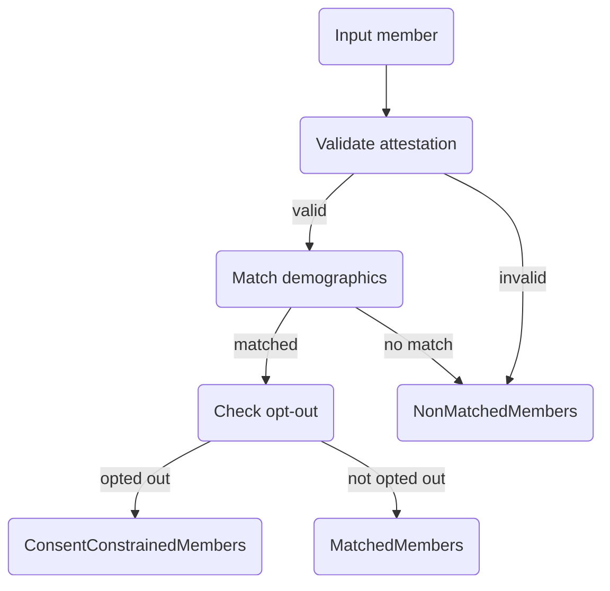

# Matching logic

`$provider-member-match` evaluates each submitted member independently and routes it to one of three output buckets. Per-member failures never fail the whole batch.

## Per-member pipeline



## Matching algorithm

Demographic matching is exact. The submitted Patient must carry every field below, and each must match a payer-side `Patient`:

| Field | Comparison |
| --- | --- |
| `Patient.name[0].family` | Case-insensitive exact |
| `Patient.name[0].given[0]` | Case-insensitive exact |
| `Patient.birthDate` | Exact |
| `Patient.gender` | Exact |

When `CoverageToMatch.subscriberId` is present, the lookup additionally requires `_has:Coverage:beneficiary:subscriber-id=<subscriberId>` so only Patients with a matching Coverage are returned.

A member is treated as **unmatched** when the search returns zero entries or more than one — ambiguous matches are rejected.

## Treatment attestation

The `Consent` part is the provider's attestation that a treatment relationship exists with the member. The attestation passes when the resource is present and `Consent.status = "active"`. The claim itself is not cross-checked — the attestation **is** the declaration.

## Opt-out check

After a successful demographic match, the server searches for an active opt-out `Consent` on the matched payer-side Patient:

```http
GET /fhir/Consent
  ?patient=<matched-patient-id>
  &status=active
  &category=http://hl7.org/fhir/us/davinci-pdex/CodeSystem/pdex-consent-api-purpose|provider-access
  &provision-type=deny
```

A single hit places the member in `ConsentConstrainedMembers`. Revocations (`provision.type = "permit"`) are not returned by this query and do not block the member.


Every opt-out scope (`global`, `provider-specific`, `purpose-specific`, `payer-specific`, `provider-category`) is currently treated the same — any active `deny` constrains the match. Scope-aware enforcement is not yet implemented.


## Output buckets

| Bucket | Code | Profile |
| --- | --- | --- |
| `MatchedMembers` | `match` | [pdex-treatment-relationship](https://build.fhir.org/ig/HL7/davinci-epdx/StructureDefinition-pdex-treatment-relationship.html) |
| `NonMatchedMembers` | `nomatch` | [pdex-member-no-match-group](https://build.fhir.org/ig/HL7/davinci-epdx/StructureDefinition-pdex-member-no-match-group.html) |
| `ConsentConstrainedMembers` | `consentconstraint` | [pdex-member-opt-out](https://build.fhir.org/ig/HL7/davinci-epdx/StructureDefinition-pdex-member-opt-out.html) |

Empty buckets are omitted from the output `Parameters`. The Group ID of `MatchedMembers` is what the provider feeds into `$davinci-data-export`.

### Output Group fields

All three buckets share `type = "person"`, `actual = true`, and `active = true`. The rest depends on the bucket.

`MatchedMembers` and `ConsentConstrainedMembers`:

* `managingEntity.identifier` — payer NPI, resolved from the first submitted member's `Coverage.payor[0].reference` (an `Organization` with a `system = http://hl7.org/fhir/sid/us-npi` identifier). Falls back to `"unknown"` when the Organization is missing or has no NPI.
* `member[].entity.reference` — literal reference to the matched payer-side `Patient`.
* `characteristic[0].period` — 30-day validity window starting today.

`MatchedMembers` only:

* `identifier[]` — provider NPI taken from the OAuth client's `Client.identifier[*]` entry (system `http://hl7.org/fhir/sid/us-npi`).
* `characteristic[0].valueReference` — logical reference to the provider Organization by NPI.

`NonMatchedMembers`:

* Submitted Patients are **not** persisted as standalone resources. Each is carried in `Group.contained[]` with a local id (`"1"`, `"2"`, …).
* `member[].entity.reference` is a fragment reference (`#1`, `#2`, …) plus a `base-ext-match-parameters` extension carrying the same fragment reference.
* `characteristic[0].valueBoolean = true`.

## Per-member edge cases

| Condition | Bucket |
| --- | --- |
| `Consent` part missing or `status` not `active` | `NonMatchedMembers` |
| Submitted Patient missing any of `family`, `given[0]`, `birthDate`, `gender` | `NonMatchedMembers` |
| Demographic search returns zero payer Patients | `NonMatchedMembers` |
| Demographic search returns more than one payer Patient | `NonMatchedMembers` |
| `Coverage.subscriberId` present but no payer Patient has a matching Coverage | `NonMatchedMembers` |
| Unhandled exception while evaluating a single member | `NonMatchedMembers` (reason in `Task` logs) |
| Match succeeds and matched Patient has an active opt-out | `ConsentConstrainedMembers` |
| Match succeeds and no opt-out exists | `MatchedMembers` |

## Group lifecycle

Each output Group carries a 30-day validity window on `Group.characteristic[0].period`:

```json
"period": {"start": "2026-04-20", "end": "2026-05-20"}
```

A background job runs hourly and:

1. Flips `active` to `false` on Groups whose `period.end` has passed.
2. Hard-deletes inactive Groups whose `period.end` is more than 90 days in the past, along with the Task and Binary they belong to.

Cleanup filters on `_profile=<pdex-treatment-relationship,pdex-member-no-match-group,pdex-member-opt-out>`. Non-PDex Groups are not touched.
