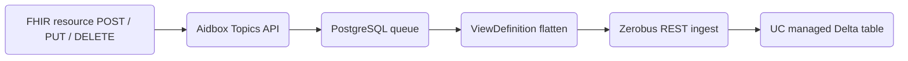
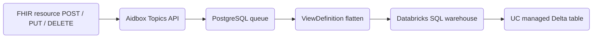
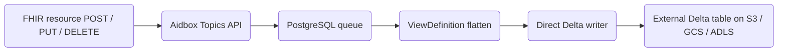
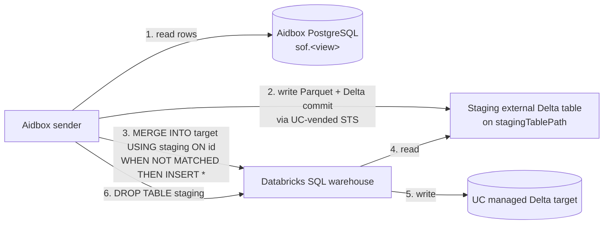
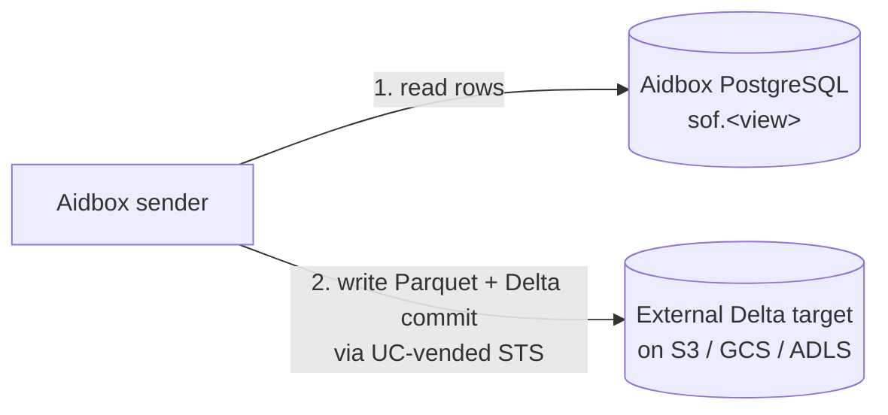

# Data Lakehouse AidboxTopicDestination


This functionality is available starting from Aidbox version **2605**.


## Background: the stack you'll be using

"Data Lakehouse" is the generic name for the destination category — a hybrid of object-storage data lake and warehouse, implemented here on top of the Delta Lake table format. Concretely the module writes Delta-formatted tables that can live on plain cloud object storage you own, or in Databricks Unity Catalog managed storage; either way the destination kind is the same (`data-lakehouse-at-least-once`).

If you're already comfortable with Databricks, Unity Catalog, and Delta Lake, skip to [Overview](#overview).

### Databricks

[Databricks](https://www.databricks.com/) is a managed analytics platform. For this tutorial you only need to think of it as **three things bundled together**:

1. **[Unity Catalog (UC)](https://docs.databricks.com/aws/en/data-governance/unity-catalog/)** — the metadata + governance layer. UC knows about every catalog, schema, table, column, and grant in your workspace. It also issues short-lived cloud-storage credentials on demand ("vending") so external clients can write data without being given long-lived bucket keys.
2. **[SQL warehouse](https://docs.databricks.com/aws/en/compute/sql-warehouse/)** — a compute cluster that runs SQL queries against tables in your Unity Catalog. Usually you query it from the Databricks UI's SQL Editor; the module can drive it programmatically over an API.
3. **[Zerobus Ingest](https://docs.databricks.com/aws/en/ingestion/zerobus-overview)** — a push-based ingestion service that writes data directly into Unity Catalog Delta tables. Databricks exposes Zerobus via two transports — gRPC and REST. The Aidbox module uses the [REST endpoint](https://docs.databricks.com/aws/en/ingestion/zerobus-ingest): batches are POSTed as JSON arrays and Zerobus durably commits them to the managed Delta table on the Databricks side.

### Data lakehouse, and Delta Lake as its implementation

A **data lakehouse** is a hybrid of two older patterns:

- A **data lake** stores raw files (Parquet, JSON, CSV) on cheap object storage (S3, GCS, ADLS). Scalable and cheap, but no schema enforcement, no ACID transactions, no time travel.
- A **data warehouse** (Snowflake, Redshift, BigQuery) gives you ACID + schema + indexes — at the cost of a proprietary storage format you don't own.

A lakehouse is the lake side with the warehouse's guarantees bolted on: ACID, schema, and time travel **on plain Parquet files in your own bucket**. The thing doing that bolting is an **open table format** — and [Delta Lake](https://delta.io/) is the one this module uses. A Delta table is a directory on object storage:

```
s3://bucket/prefix/my_table/
├── _delta_log/
│   ├── 00000000000000000000.json       ← transaction log: each commit is one JSON file
│   ├── 00000000000000000001.json
│   └── ...
├── part-00000-xxx.snappy.parquet       ← row data
├── part-00001-xxx.snappy.parquet
└── ...
```

The `_delta_log/` directory is the source of truth: readers replay it; writers append a new commit. Concurrent writers race on the next log filename — that's where Delta's ACID comes from.

### External vs managed tables

Unity Catalog tables come in two flavours:

|                                | **Managed**                                                          | **External**                                                          |
| ------------------------------ | -------------------------------------------------------------------- | --------------------------------------------------------------------- |
| Status                         | Databricks' **default and recommended** table type                   | Use when you need files in your own bucket                            |
| Storage location               | Databricks-managed cloud storage (path picked by UC)                 | Your bucket — declared with `LOCATION 's3://...' / 'gs://...' / 'abfss://...'` at `CREATE TABLE` |
| Who owns the files             | Unity Catalog — manages read, write, storage, and optimization       | You — UC manages metadata only                                        |
| `DROP TABLE`                   | Deletes the data                                                     | Drops metadata only — files stay in your bucket                       |
| Sanctioned write paths from Aidbox | **Zerobus REST ingest** (Aidbox `managed-zerobus`), or **SQL warehouse INSERT** (Aidbox `managed-sql`) | **Direct Parquet + Delta commit** via STS-vended UC creds (Aidbox `external-direct`) |
| External STS credential vending| Not available for managed targets (`EXTERNAL USE SCHEMA` is only grantable on external schemas) | Allowed if the principal has `EXTERNAL USE SCHEMA` on the schema      |
| Predictive Optimization        | Enabled by default for accounts created on or after **2024-11-11**; runs `OPTIMIZE` / `VACUUM` / `ANALYZE` automatically. Billed under the **Jobs Serverless** SKU. | **Not supported** — Predictive Optimization runs only on managed tables |
| Liquid Clustering              | Opt-in per table (automatic liquid clustering requires Predictive Optimization and is also opt-in) | Opt-in per table                                                      |

The "Sanctioned write paths" row drives the module's three `writeMode` values — see [Overview](#overview) for the resulting write paths.

## Overview

The Data Lakehouse Topic Destination module exports FHIR resources from Aidbox to a Delta Lake table in a flattened format using [ViewDefinitions](../../modules/sql-on-fhir/defining-flat-views-with-view-definitions.md) (SQL-on-FHIR).


The flow:

1. A FHIR API client (a user, an integration, a backfill script) sends a `POST` / `PUT` / `DELETE` to Aidbox.
2. Aidbox persists the resource and enqueues a topic event for the destination in PostgreSQL.
3. The Data Lakehouse module polls the destination's batch from the same PostgreSQL queue.
4. For `managed-zerobus` mode (default): the module POSTs each batch as a JSON array to Databricks' Zerobus REST ingest endpoint, which writes directly to the managed table. No SQL parsing / planning per write.
5. For `managed-sql` mode: the module sends `INSERT` (and `ALTER` / `DESCRIBE` when needed) to the Databricks SQL warehouse; the warehouse writes the Delta files to storage.
6. For `external-direct` mode: the module gets short-lived storage credentials from Unity Catalog and writes Delta files directly to your bucket.

The module may also perform an initial export of pre-existing resources at first start — see [Initial export](#initial-export) for when this runs and how to skip it.

### Write modes

The module supports three **write modes**, picked per-destination via the `writeMode` parameter (see the [Configuration](#configuration) section below for the full parameter list).

### managed-zerobus mode (default)

`writeMode=managed-zerobus` targets a **Databricks Unity Catalog managed table** via the [Zerobus REST ingest endpoint](https://docs.databricks.com/aws/en/ingestion/zerobus-ingest).



- Each batch is JSON-encoded as an array and POSTed to `https://<workspace-id>.zerobus.<region>.cloud.databricks.com/zerobus/v1/tables/<catalog>.<schema>.<table>/insert` with an OAuth M2M bearer. Zerobus is a purpose-built ingest pipe — no SQL parsing / planning / scheduling per batch, and no warehouse cold-start.
- Initial bulk export still uses a one-shot staging Delta table under `stagingTablePath` (Zerobus is append-only ingest, designed for incremental row writes, not bulk loads). The bulk merge is the same `MERGE INTO managed USING staging` pattern as `managed-sql`. This staging table is a plain external Delta table the module drops after the merge — not a Databricks [temporary table](https://docs.databricks.com/aws/en/tables/temporary-tables).
- Schema sync at sender bootstrap still uses a SQL warehouse (one-shot `INFORMATION_SCHEMA.COLUMNS` describe + optional `ALTER TABLE`) — the warehouse is required but only used at boot, not on every batch.

### managed-sql mode

`writeMode=managed-sql` — same target as `managed-zerobus` (UC **managed** table), but routes incoming batches through a Databricks SQL warehouse. Use this when Zerobus isn't available on your Databricks SKU.



- Each batch becomes a single `INSERT INTO managed (cols) VALUES (...)` statement sent to a Databricks SQL warehouse. The warehouse writes the Delta files (Parquet + a transaction-log commit) under the managed table.
- Initial bulk export uses a one-shot staging Delta table under `stagingTablePath` because Databricks-managed tables refuse direct writes from outside Databricks compute. See [Initial Export](#how-it-works-managed-modes) for the staging diagram.

### external-direct mode

`writeMode=external-direct` targets a **non-managed external Delta table** that you own.



- The module writes Delta files straight to your bucket from the Aidbox process. No SQL warehouse involved.
- Storage backends supported: AWS S3, Google Cloud Storage, Azure ADLS Gen2.
- No Databricks compute is involved in the write path — you pay only for the bucket. Because Databricks doesn't own the files, you're responsible for the maintenance Databricks would otherwise run automatically: schedule `OPTIMIZE` (file compaction) and `VACUUM` (cleanup of stale Parquet referenced by no commit) yourself. See [Compaction and maintenance](#compaction-and-maintenance).

## Output semantics

How writes show up in your Delta table, and how to query the result.

### Append-only

Every change to a FHIR resource is written as a **new row** — there are no in-place UPDATEs or DELETEs:

- **Create** → new row with `is_deleted = 0`
- **Update** → new row with `is_deleted = 0` (old row remains)
- **Delete** → new row with `is_deleted = 1`

Example — a single patient created, updated twice, then deleted produces four rows with the same `id`:

| `id` | `ts` (`meta.lastUpdated`) | `gender` | `family_name` | `is_deleted` |
|------|-----|---------|--------|---|
| `p-1` | `2026-04-01T10:00:00Z` | `male`   | `Smith`        | `0` |
| `p-1` | `2026-04-02T08:00:00Z` | `male`   | `Smith-Jones`  | `0` |
| `p-1` | `2026-04-03T14:00:00Z` | `other`  | `Smith-Jones`  | `0` |
| `p-1` | `2026-04-04T09:00:00Z` | `other`  | `Smith-Jones`  | `1` |

Use [the read-time projection below](#reading-current-state-out-of-the-append-only-history) to collapse history to "latest row per id, excluding deleted".

### At-least-once delivery

Messages are persisted in a PostgreSQL queue before being sent. If delivery fails, the message stays in the queue and is retried on the next batch cycle. The three modes differ in what happens during a crash-between-commit-and-ack — the narrow window where the write landed in storage but the sender died before marking the queue entry as delivered:

- **`managed-zerobus`** — initial export is idempotent (`MERGE INTO managed USING staging ON id` no-ops on replay). Live per-batch writes are at-least-once: Zerobus has server-side offset dedup, but on Aidbox queue replay after a sender crash the SDK allocates a fresh offset, which Zerobus treats as a new record.
- **`managed-sql`** — initial export is idempotent (same MERGE pattern as `managed-zerobus`). Live per-batch writes can produce duplicates. The per-batch INSERT route to the SQL warehouse can't carry a transaction id, so a replayed batch becomes a second INSERT and a duplicate row.
- **`external-direct`** — restart-safe-idempotent for both live writes and initial export. Every Delta commit carries a stable transaction id; a replay lands on the same id and Delta silently skips it.

### Querying the table

Because every change is written as a new row (and `managed-*` modes can deliver duplicates on crash-replay), querying the table directly returns full history plus possible dupes. Most analytics workloads (cohort builds, longitudinal queries, time-windowed aggregates) want exactly this — full event history is the point.

If your query needs "latest state per resource", one common SQL pattern is window-function dedup. Add a timestamp column to your ViewDefinition (e.g. `meta.lastUpdated` as `ts`) and:

```sql
SELECT * EXCEPT(rn) FROM (
  SELECT *, ROW_NUMBER() OVER (PARTITION BY id ORDER BY ts DESC) AS rn
  FROM aidbox_export.fhir.patients
)
WHERE rn = 1 AND is_deleted = 0;
```

This is one example, not the only approach — wrap it in a Databricks SQL view if used frequently, or skip it entirely if your queries already aggregate over history.

## Choosing between the three modes

**Default to `managed-zerobus`.** Pick a different mode only when one of these applies:

- **Zerobus isn't available on your Databricks SKU** → `managed-sql`. Same managed UC target, same initial-bulk path, but every batch goes through a SQL warehouse (which has to stay warm).
- **You want the files in your own bucket, not Databricks-managed storage**, and you accept owning schema + `OPTIMIZE` / `VACUUM` yourself → `external-direct`. No Databricks compute on the write path; no Predictive Optimization either (Databricks restricts PO to managed tables).

|                                | `managed-zerobus` (default)                                              | `managed-sql`                                                            | `external-direct`                                            |
| ------------------------------ | ------------------------------------------------------------------------ | ------------------------------------------------------------------------ | ------------------------------------------------------------ |
| Table type                     | UC **managed** (Databricks owns the files)                               | UC **managed** (Databricks owns the files)                               | **External** (the User's bucket owns the files)              |
| Hot-path transport             | Zerobus REST ingest API                                                  | Databricks SQL warehouse (Statement Execution API)                       | Direct Delta commits via Hadoop FS                            |
| Who runs maintenance           | Databricks (Predictive Optimization handles `OPTIMIZE` / `VACUUM`)       | Databricks (Predictive Optimization handles `OPTIMIZE` / `VACUUM`)       | The User schedules `OPTIMIZE` / `VACUUM`                     |
| Databricks compute cost surface| **No warm warehouse** — pay-per-row Zerobus + storage only               | SQL warehouse must be running to accept INSERTs — Databricks bills uptime | No warehouse — no Databricks compute charge for write path   |
| Schema drift handling          | Auto-`ALTER` on mismatch                                                 | Auto-`ALTER` on mismatch                                                 | User runs `ALTER TABLE` and recreates the destination        |
| Initial export path            | Staging Delta on your bucket → `MERGE INTO` target                       | Staging Delta on your bucket → `MERGE INTO` target                       | Bulk written straight to the target in one Delta commit      |
| Storage backends               | Databricks-managed storage                                                | Databricks-managed storage                                                | AWS S3, GCS, Azure ADLS Gen2                                  |

## Authentication

All three modes authenticate to Databricks via [**OAuth Machine-to-Machine (M2M)**](https://docs.databricks.com/aws/en/dev-tools/auth/oauth-m2m) with a service principal: the module exchanges `client_id` + `client_secret` at the workspace token endpoint for a ~1h bearer token, caches it, and re-issues a fresh one when fewer than 5 minutes remain.

The bearer is sent on every Databricks call. What differs between modes is which Databricks surfaces see it:

| Mode                        | UC REST                                       | SQL warehouse                              | Other transport            | Who talks to storage                 |
|-----------------------------|-----------------------------------------------|--------------------------------------------|----------------------------|--------------------------------------|
| `managed-zerobus` (default) | only during initial-export (staging vending)  | bootstrap + initial-export only            | Zerobus REST (every batch) | Zerobus ingest service, Databricks-side |
| `managed-sql`               | only during initial-export (staging vending)  | every batch (`INSERT` / `ALTER` / `DESCRIBE`) | —                          | SQL warehouse compute                 |
| `external-direct`           | every cred-refresh (~45 min)                  | none                                       | —                          | sender process, with UC-vended STS    |

In `external-direct` you can also skip Databricks entirely and authenticate against the bucket with static AWS keys (`awsAccessKeyId` + `awsSecretAccessKey`) or the [AWS default provider chain](https://docs.aws.amazon.com/sdk-for-java/latest/developer-guide/credentials-chain.html). Set up of the SP and grants is part of [Step 1](#step-1-set-up-databricks-side).

## Installation

### Prerequisites

- Aidbox **2605** or newer ([install guide](../../getting-started/run-aidbox-locally.md))
- A Databricks workspace (Free Edition works for evaluation, paid for production)
- A managed (or external, for `external-direct`) Delta table you intend to write into
- A SQL warehouse (skip only for `external-direct`)
- For `managed-zerobus`: Zerobus enabled on your SKU (Databricks Free Edition supports it; for paid plans confirm with Databricks support)
- For initial-export in the `managed-*` modes: an S3/GCS/ADLS bucket you control with a UC External Location for staging

The service principal that authenticates the module is created in [Step 1](#step-1-set-up-databricks-side) — you don't need it before you start.

### Docker Compose

1. Download the Databricks module JAR file and place it next to your **docker-compose.yaml**:

   ```sh
   curl -O https://storage.googleapis.com/aidbox-modules/topic-destination-deltalake/topic-destination-deltalake-2605.0.jar
   ```

2. Edit your **docker-compose.yaml** and add these lines to the Aidbox service:

   ```yaml
   aidbox:
     volumes:
       - ./topic-destination-deltalake-2605.0.jar:/topic-destination-deltalake.jar
       # ... other volumes ...
     environment:
       BOX_MODULE_LOAD: io.healthsamurai.topic-destination.data-lakehouse.core
       BOX_MODULE_JAR: "/topic-destination-deltalake.jar"
       BOX_FHIR_SCHEMA_VALIDATION: "true"
       # ... other environment variables ...
   ```

3. Start Aidbox:

   ```sh
   docker compose up
   ```

4. Verify the module is loaded. In Aidbox UI, go to **FHIR Packages** and check that the Delta Lake profile is present:
   `http://health-samurai.io/fhir/core/StructureDefinition/aidboxtopicdestination-dataLakehouseAtLeastOnceProfile`


The profile URL above is a FHIR canonical identifier, not an HTTP endpoint. You can find it in the Aidbox UI under FHIR Packages.


### Kubernetes

For Kubernetes deployments, the module can be downloaded automatically using an init container:

```yaml
apiVersion: apps/v1
kind: Deployment
metadata:
  name: aidbox
spec:
  template:
    spec:
      initContainers:
        - name: download-deltalake-module
          image: debian:bookworm-slim
          command:
            - sh
            - -c
            - |
              apt-get -y update && apt-get -y install curl
              curl -L -o /modules/topic-destination-deltalake.jar \
                https://storage.googleapis.com/aidbox-modules/topic-destination-deltalake/topic-destination-deltalake-2605.0.jar
              chmod 644 /modules/topic-destination-deltalake.jar
          volumeMounts:
            - mountPath: /modules
              name: modules-volume
      containers:
        - name: aidbox
          image: healthsamurai/aidboxone:edge
          env:
            - name: BOX_MODULE_LOAD
              value: "io.healthsamurai.topic-destination.data-lakehouse.core"
            - name: BOX_MODULE_JAR
              value: "/modules/topic-destination-deltalake.jar"
            - name: BOX_FHIR_SCHEMA_VALIDATION
              value: "true"
            # ... other environment variables ...
          volumeMounts:
            - name: modules-volume
              mountPath: /modules
      volumes:
        - name: modules-volume
          emptyDir: {}
```

## Configuration

All requests in this tutorial use `Content-Type: application/json`.



**Required:**

<table>
<thead>
<tr><th width="230">Parameter</th><th width="110">Type</th><th>Description</th></tr>
</thead>
<tbody>
<tr><td><code>viewDefinition</code></td><td>string</td><td>The <code>name</code> field of the ViewDefinition resource (not <code>id</code>)</td></tr>
<tr><td><code>batchSize</code></td><td>unsignedInt</td><td>Rows per worker tick / batch commit</td></tr>
<tr><td><code>sendIntervalMs</code></td><td>unsignedInt</td><td>Max time between batched commits, in ms</td></tr>
<tr><td><code>databricksWorkspaceUrl</code></td><td>string</td><td><code>https://&lt;workspace&gt;.cloud.databricks.com</code></td></tr>
<tr><td><code>databricksWorkspaceId</code></td><td>string</td><td>Numeric workspace ID (e.g. <code>1234567890123456</code>). Composes the Zerobus REST endpoint host</td></tr>
<tr><td><code>databricksRegion</code></td><td>string</td><td>Workspace AWS region (e.g. <code>us-east-1</code>). Composes the Zerobus REST endpoint host</td></tr>
<tr><td><code>databricksClientId</code></td><td>string</td><td>Service principal <code>client_id</code> for OAuth M2M</td></tr>
<tr><td><code>databricksClientSecret</code></td><td>string</td><td>Service principal <code>client_secret</code>; supports vault refs</td></tr>
<tr><td><code>tableName</code></td><td>string</td><td>Managed table full name: <code>catalog.schema.table</code></td></tr>
<tr><td><code>databricksWarehouseId</code></td><td>string</td><td>SQL warehouse ID — used at bootstrap for schema sync + (if initial-export runs) the final <code>MERGE INTO</code>. No warm-warehouse traffic during live writes.</td></tr>
<tr><td><code>awsRegion</code></td><td>string</td><td>AWS region of the staging bucket</td></tr>
<tr><td><code>stagingTablePath</code></td><td>string</td><td><code>s3://bucket/path/</code> for the staging Delta table created during initial export. Required when <code>skipInitialExport</code> is not <code>true</code></td></tr>
</tbody>
</table>

<details>

<summary>Advanced parameters</summary>

<table>
<thead>
<tr><th width="230">Parameter</th><th width="110">Type</th><th>Description</th></tr>
</thead>
<tbody>
<tr><td><code>writeMode</code></td><td>string</td><td><code>managed-zerobus</code> (default), <code>managed-sql</code>, or <code>external-direct</code>. Omit to get <code>managed-zerobus</code></td></tr>
<tr><td><code>skipInitialExport</code></td><td>boolean</td><td>Skip initial export of existing data (default: <code>false</code>)</td></tr>
<tr><td><code>targetFileSizeMb</code></td><td>unsignedInt</td><td>Parquet target size during initial export (default: <code>128</code>)</td></tr>
</tbody>
</table>

</details>




**Required:**

<table>
<thead>
<tr><th width="230">Parameter</th><th width="110">Type</th><th>Description</th></tr>
</thead>
<tbody>
<tr><td><code>writeMode</code></td><td>string</td><td>Must be <code>managed-sql</code> (otherwise the default <code>managed-zerobus</code> path is used)</td></tr>
<tr><td><code>viewDefinition</code></td><td>string</td><td>The <code>name</code> field of the ViewDefinition resource (not <code>id</code>)</td></tr>
<tr><td><code>batchSize</code></td><td>unsignedInt</td><td>Rows per worker tick / batch commit</td></tr>
<tr><td><code>sendIntervalMs</code></td><td>unsignedInt</td><td>Max time between batched commits, in ms</td></tr>
<tr><td><code>databricksWorkspaceUrl</code></td><td>string</td><td><code>https://&lt;workspace&gt;.cloud.databricks.com</code></td></tr>
<tr><td><code>databricksClientId</code></td><td>string</td><td>Service principal <code>client_id</code> for OAuth M2M</td></tr>
<tr><td><code>databricksClientSecret</code></td><td>string</td><td>Service principal <code>client_secret</code>; supports vault refs</td></tr>
<tr><td><code>tableName</code></td><td>string</td><td>Managed table full name: <code>catalog.schema.table</code></td></tr>
<tr><td><code>databricksWarehouseId</code></td><td>string</td><td>SQL warehouse ID</td></tr>
<tr><td><code>awsRegion</code></td><td>string</td><td>AWS region of the staging bucket</td></tr>
<tr><td><code>stagingTablePath</code></td><td>string</td><td><code>s3://bucket/path/</code> for the staging Delta table created during initial export. Required when <code>skipInitialExport</code> is not <code>true</code></td></tr>
</tbody>
</table>

<details>

<summary>Advanced parameters</summary>

<table>
<thead>
<tr><th width="230">Parameter</th><th width="110">Type</th><th>Description</th></tr>
</thead>
<tbody>
<tr><td><code>skipInitialExport</code></td><td>boolean</td><td>Skip initial export of existing data (default: <code>false</code>)</td></tr>
<tr><td><code>targetFileSizeMb</code></td><td>unsignedInt</td><td>Parquet target size during initial export (default: <code>128</code>)</td></tr>
</tbody>
</table>

</details>



**Required:**

<table>
<thead>
<tr><th width="230">Parameter</th><th width="110">Type</th><th>Description</th></tr>
</thead>
<tbody>
<tr><td><code>viewDefinition</code></td><td>string</td><td>The <code>name</code> field of the ViewDefinition resource (not <code>id</code>)</td></tr>
<tr><td><code>batchSize</code></td><td>unsignedInt</td><td>Rows per worker tick / batch commit</td></tr>
<tr><td><code>sendIntervalMs</code></td><td>unsignedInt</td><td>Max time between batched commits, in ms</td></tr>
<tr><td><code>writeMode</code></td><td>string</td><td>Must be <code>external-direct</code> (otherwise the default <code>managed-zerobus</code> path is used)</td></tr>
<tr><td><code>tablePath</code></td><td>string</td><td><code>s3://...</code> / <code>gs://...</code> / <code>abfss://...</code>. Required unless <code>databricksWorkspaceUrl</code> set (then resolved from Unity Catalog)</td></tr>
<tr><td><code>awsRegion</code></td><td>string</td><td>Required for real AWS / GovCloud (skip for MinIO / LocalStack)</td></tr>
</tbody>
</table>

<details>

<summary>Authentication parameters</summary>

Pick **one** of: UC credential vending, static AWS keys, or default AWS provider chain.

<table>
<thead>
<tr><th width="230">Parameter</th><th width="80">Type</th><th>Description</th></tr>
</thead>
<tbody>
<tr><td><code>databricksWorkspaceUrl</code></td><td>string</td><td>If set: UC credential vending; <code>databricksClientId</code> + <code>databricksClientSecret</code> + <code>tableName</code> must also be set</td></tr>
<tr><td><code>databricksClientId</code></td><td>string</td><td>SP <code>client_id</code> (required iff <code>databricksWorkspaceUrl</code> set)</td></tr>
<tr><td><code>databricksClientSecret</code></td><td>string</td><td>SP <code>client_secret</code>; supports vault refs (required iff <code>databricksWorkspaceUrl</code> set)</td></tr>
<tr><td><code>tableName</code></td><td>string</td><td>UC <code>catalog.schema.table</code> (when using UC vending)</td></tr>
<tr><td><code>awsAccessKeyId</code></td><td>string</td><td>Static IAM key (falls back to default provider chain when absent). Supports vault refs</td></tr>
<tr><td><code>awsSecretAccessKey</code></td><td>string</td><td>Static IAM secret. Supports vault refs</td></tr>
</tbody>
</table>

</details>

<details>

<summary>Advanced parameters</summary>

<table>
<thead>
<tr><th width="230">Parameter</th><th width="110">Type</th><th>Description</th></tr>
</thead>
<tbody>
<tr><td><code>skipInitialExport</code></td><td>boolean</td><td>Skip initial export of existing data (default: <code>false</code>)</td></tr>
<tr><td><code>targetFileSizeMb</code></td><td>unsignedInt</td><td>Parquet target size during initial export (default: <code>128</code>)</td></tr>
<tr><td><code>s3Endpoint</code></td><td>string</td><td>MinIO / LocalStack endpoint (forces path-style URLs)</td></tr>
</tbody>
</table>

</details>



## Usage example: patient data export

The example below uses `managed-zerobus` (the default). For non-default modes see [`managed-sql`](#alternative-managed-sql-configuration) or [`external-direct`](#alternative-external-direct-configuration).



### Step 1: Set up Databricks side

Do the Databricks-side setup first so the values you pass to Aidbox in later steps (workspace URL + ID + region, service principal ID/secret, warehouse ID, table name) already exist.

#### 1a. Catalog and schema

In the Databricks SQL Editor (Catalog Explorer → Create catalog / schema, or via SQL):

```sql
CREATE CATALOG IF NOT EXISTS aidbox_export;
CREATE SCHEMA  IF NOT EXISTS aidbox_export.fhir;
```

#### 1b. Managed Delta table

```sql
CREATE TABLE aidbox_export.fhir.patients (
  id          STRING,
  gender      STRING,
  birth_date  DATE,
  family_name STRING,
  given_name  STRING,
  is_deleted  INT
) USING DELTA;
```


The table **must** include an `is_deleted` column (`INT`). The module sets this to `0` for create/update operations and `1` for delete operations.

**No `LOCATION` clause** — that's what makes this a managed table. UC owns the physical layout, runs Predictive Optimization automatically, and refuses external STS-vended writes — which is why both `managed-*` modes go through Databricks compute (Zerobus or SQL warehouse).


**Type mapping:**

| FHIR / ViewDefinition type | Databricks SQL type |
| -------------------------- | ------------------- |
| `id`, `string`, `code`     | `STRING`            |
| `date`                     | `DATE`              |
| `dateTime`, `instant`      | `TIMESTAMP`         |
| `integer`, `positiveInt`   | `INT`               |
| `decimal`                  | `DOUBLE`            |
| `boolean`                  | `BOOLEAN`           |


In both `managed-*` modes the module **automatically issues `ALTER TABLE ADD COLUMNS`** when the ViewDefinition has columns the managed target is missing — you don't have to keep them in sync manually. See [Schema evolution](#schema-evolution).


#### 1c. SQL warehouse

Compute → SQL Warehouses → use an existing warehouse or create a new one. Serverless 2X-Small is the cheapest option that supports the Statement Execution API. Copy the **Warehouse ID** — you'll use it as `databricksWarehouseId`.

#### 1d. Service principal

1. In your Databricks workspace, go to **Settings → Identity and access → Service principals → Add service principal**.
2. Give it a name (e.g. `aidbox-topic-destination`) and create.
3. Click the new SP, open the **Secrets** tab, click **Generate secret**.
4. Copy the **Client ID** and **Secret** — you'll use these as `databricksClientId` / `databricksClientSecret`.

#### 1e. Grant the service principal

Grant only the set that matches the `writeMode` you'll use.



| Privilege | Granted on | Purpose |
|---|---|---|
| `USE CATALOG` | `aidbox_export` | navigate the catalog |
| `USE SCHEMA` | `aidbox_export.fhir` | resolve the target table |
| `SELECT`, `MODIFY` | target table | `DESCRIBE` + initial-bulk `MERGE INTO` |
| `USAGE` (UI: "Can use") | the SQL warehouse | submit bootstrap schema-sync statements + initial-bulk `MERGE` (no warehouse traffic during live writes) |
| `EXTERNAL USE SCHEMA` | the staging schema | UC vends STS for the staging table (initial-export only) |
| `READ FILES`, `WRITE FILES`, `CREATE EXTERNAL TABLE` | staging External Location | write the bulk Parquet via UC-vended STS (initial-export only) |

```sql
GRANT USE CATALOG ON CATALOG aidbox_export                TO `<sp-client-id>`;
GRANT USE SCHEMA  ON SCHEMA  aidbox_export.fhir           TO `<sp-client-id>`;
GRANT SELECT, MODIFY ON TABLE aidbox_export.fhir.patients TO `<sp-client-id>`;
GRANT USAGE ON WAREHOUSE `<warehouse-id>`                 TO `<sp-client-id>`;
-- initial-export only:
GRANT EXTERNAL USE SCHEMA ON SCHEMA aidbox_export.fhir    TO `<sp-client-id>`;
GRANT READ FILES, WRITE FILES, CREATE EXTERNAL TABLE
  ON EXTERNAL LOCATION `<staging-external-location>`      TO `<sp-client-id>`;
```

The warehouse "Can use" also has to be granted via UI: **SQL Warehouses → your warehouse → Permissions → Add → service principal → Can use**.



| Privilege | Granted on | Purpose |
|---|---|---|
| `USE CATALOG` | `aidbox_export` | navigate the catalog |
| `USE SCHEMA` | `aidbox_export.fhir` | resolve the target table |
| `SELECT`, `MODIFY` | target table | every `INSERT` + bootstrap `DESCRIBE` + initial-bulk `MERGE` |
| `USAGE` (UI: "Can use") | the SQL warehouse | submit every statement |
| `EXTERNAL USE SCHEMA` | the staging schema | UC vends STS for the staging table (initial-export only) |
| `READ FILES`, `WRITE FILES`, `CREATE EXTERNAL TABLE` | staging External Location | write the bulk Parquet via UC-vended STS (initial-export only) |

```sql
GRANT USE CATALOG ON CATALOG aidbox_export                TO `<sp-client-id>`;
GRANT USE SCHEMA  ON SCHEMA  aidbox_export.fhir           TO `<sp-client-id>`;
GRANT SELECT, MODIFY ON TABLE aidbox_export.fhir.patients TO `<sp-client-id>`;
GRANT USAGE ON WAREHOUSE `<warehouse-id>`                 TO `<sp-client-id>`;
-- initial-export only:
GRANT EXTERNAL USE SCHEMA ON SCHEMA aidbox_export.fhir    TO `<sp-client-id>`;
GRANT READ FILES, WRITE FILES, CREATE EXTERNAL TABLE
  ON EXTERNAL LOCATION `<staging-external-location>`      TO `<sp-client-id>`;
```

The warehouse "Can use" also has to be granted via UI: **SQL Warehouses → your warehouse → Permissions → Add → service principal → Can use**.



| Privilege | Granted on | Purpose |
|---|---|---|
| `USE CATALOG` | `aidbox_export` | navigate the catalog |
| `USE SCHEMA` | `aidbox_export.fhir` | resolve the target table |
| `SELECT`, `MODIFY` | target table | UC checks before vending creds |
| `EXTERNAL USE SCHEMA` | the target's schema | UC vends STS creds for direct-to-bucket writes |
| `READ FILES`, `WRITE FILES`, `CREATE EXTERNAL TABLE` | target's External Location | write Parquet + Delta commits directly to the bucket |

```sql
GRANT USE CATALOG ON CATALOG aidbox_export                TO `<sp-client-id>`;
GRANT USE SCHEMA  ON SCHEMA  aidbox_export.fhir           TO `<sp-client-id>`;
GRANT SELECT, MODIFY ON TABLE aidbox_export.fhir.patients TO `<sp-client-id>`;
GRANT EXTERNAL USE SCHEMA ON SCHEMA aidbox_export.fhir    TO `<sp-client-id>`;
GRANT READ FILES, WRITE FILES, CREATE EXTERNAL TABLE
  ON EXTERNAL LOCATION `<target-external-location>`       TO `<sp-client-id>`;
```


`EXTERNAL USE SCHEMA` is **only grantable on external schemas** (where the schema's tables sit at an external location). UC managed schemas refuse this grant by design — managed tables can't be vended.




External-Location provisioning + Storage Credential setup live in step 1f below.

#### 1f. (Optional, `managed-zerobus` / `managed-sql` only) Staging location for initial export

If you plan to use `skipInitialExport=false` (the default), you also need a UC **External Location** for the staging Delta table the module writes to during bulk export. Both `managed-zerobus` and `managed-sql` go through the same staging path during initial bulk; `external-direct` writes the bulk straight to the target instead and skips this step.

1. Provision an S3 bucket (or GCS / ADLS prefix) you control. Example: `s3://my-aidbox-staging/`.
2. Configure a **Storage Credential** in Databricks (Data → External Data → Credentials). For S3 this is an IAM role with trust policy granting Databricks AWS account access; follow [Databricks docs on storage credentials](https://docs.databricks.com/en/connect/unity-catalog/storage-credentials.html).
3. Create the **External Location** in Databricks (Data → External Data → External Locations) pointing at the bucket path with the Storage Credential. The location's name is what you reference as `<staging-external-location>` in the grants in step 1e.

The SP grants for the staging External Location are already covered in the `managed-zerobus` / `managed-sql` tabs of step 1e.

#### 1g. (Optional) Store the SP secret in vault

`databricksClientSecret` (and any other parameter) can be passed either inline on the destination resource or as a vault-backed reference. The module supports Aidbox's [External Secrets](../../configuration/secret-files.md) integration — store the secret in a file (Kubernetes Secrets, Docker Secrets, CSI driver, …) and reference it from the destination parameter via the FHIR primitive-extension pattern:

```json
{
  "name": "databricksClientSecret",
  "_valueString": {
    "extension": [
      {"url": "http://hl7.org/fhir/StructureDefinition/data-absent-reason", "valueCode": "masked"},
      {"url": "http://health-samurai.io/fhir/secret-reference", "valueString": "dbx-sp-secret"}
    ]
  }
}
```

The string `dbx-sp-secret` is a secret name from your `BOX_VAULT_CONFIG` mapping; the actual secret value is read from the file at request time, never stored in the resource. Configuration details live in [External Secrets](../../configuration/secret-files.md).




### Step 2: Create subscription topic

```http
POST /fhir/AidboxSubscriptionTopic

{
  "resourceType": "AidboxSubscriptionTopic",
  "url": "http://example.org/subscriptions/patient-updates",
  "status": "active",
  "trigger": [
    {
      "resource": "Patient",
      "supportedInteraction": ["create", "update", "delete"],
      "fhirPathCriteria": "name.exists()"
    }
  ]
}
```




### Step 3: Create ViewDefinition

A [ViewDefinition](../../modules/sql-on-fhir/defining-flat-views-with-view-definitions.md) defines how to transform a complex FHIR resource into a flat table structure suitable for analytics. Each `column` maps a [FHIRPath](https://hl7.org/fhirpath/) expression to a named column.

```http
POST /fhir/ViewDefinition

{
  "resourceType": "ViewDefinition",
  "id": "patient_flat",
  "name": "patient_flat",
  "resource": "Patient",
  "status": "active",
  "select": [
    {
      "column": [
        {"name": "id", "path": "id"},
        {"name": "gender", "path": "gender"},
        {"name": "birth_date", "path": "birthDate"}
      ]
    },
    {
      "forEach": "name.where(use = 'official').first()",
      "column": [
        {"name": "family_name", "path": "family"},
        {"name": "given_name", "path": "given.join(' ')"}
      ]
    }
  ]
}
```




### Step 4: Materialize ViewDefinition

The ViewDefinition must be [materialized](../../modules/sql-on-fhir/operation-materialize.md) as a database view before the module can use it to transform data. Materialization creates a SQL view in the `sof` schema.

```http
POST /fhir/ViewDefinition/patient_flat/$materialize

{
  "resourceType": "Parameters",
  "parameter": [
    {
      "name": "type",
      "valueCode": "view"
    }
  ]
}
```


The ViewDefinition must be materialized as a **view** (not a table). See the [`$materialize` operation](../../modules/sql-on-fhir/operation-materialize.md) documentation for details.





### Step 5: Configure the destination (`managed-zerobus`)

```http
POST /fhir/AidboxTopicDestination

{
  "resourceType": "AidboxTopicDestination",
  "id": "patient-databricks",
  "topic": "http://example.org/subscriptions/patient-updates",
  "kind": "data-lakehouse-at-least-once",
  "meta": {
    "profile": [
      "http://health-samurai.io/fhir/core/StructureDefinition/aidboxtopicdestination-dataLakehouseAtLeastOnceProfile"
    ]
  },
  "parameter": [
    {"name": "writeMode", "valueString": "managed-zerobus"},
    {"name": "databricksWorkspaceUrl", "valueString": "https://dbc-XXXXXXXX-XXXX.cloud.databricks.com"},
    {"name": "databricksWorkspaceId", "valueString": "1234567890123456"},
    {"name": "databricksRegion", "valueString": "us-east-1"},
    {"name": "databricksClientId", "valueString": "<sp-client-id>"},
    {"name": "databricksClientSecret", "valueString": "<sp-client-secret>"},
    {"name": "tableName", "valueString": "aidbox_export.fhir.patients"},
    {"name": "databricksWarehouseId", "valueString": "<warehouse-id>"},
    {"name": "awsRegion", "valueString": "us-east-1"},
    {"name": "stagingTablePath", "valueString": "s3://my-aidbox-staging/patient_flat_staging/"},
    {"name": "viewDefinition", "valueString": "patient_flat"},
    {"name": "batchSize", "valueUnsignedInt": 50},
    {"name": "sendIntervalMs", "valueUnsignedInt": 5000}
  ]
}
```

To pass `databricksClientSecret` (or any other parameter) as a vault-backed reference instead of inline, use the FHIR primitive-extension pattern described in [External Secrets](../../configuration/secret-files.md).




### Step 6: Verify

Create a test patient:

```http
POST /fhir/Patient

{
  "name": [{"use": "official", "family": "Smith", "given": ["John"]}],
  "gender": "male",
  "birthDate": "1990-01-15"
}
```

Then query your Databricks table to confirm the data arrived:

```sql
SELECT * FROM aidbox_export.fhir.patients;
```



### Stopping the export

To stop exporting data, delete the `AidboxTopicDestination` resource:

```http
DELETE /fhir/AidboxTopicDestination/patient-databricks
```

This stops the export and cleans up the internal message queue. Data already written to Databricks is not affected.

## Alternative: `managed-sql` configuration

If Zerobus isn't available on your Databricks SKU (older paid plans, some regions), set `writeMode=managed-sql`. Same managed UC target, same staging-MERGE initial-export, but live per-batch writes go through a Databricks SQL warehouse instead of Zerobus REST.

The destination payload differs from the `managed-zerobus` example in three rows: drop `databricksWorkspaceId` + `databricksRegion`, change `writeMode` to `managed-sql`:

```http
POST /fhir/AidboxTopicDestination

{
  "resourceType": "AidboxTopicDestination",
  "id": "patient-databricks-sql",
  "topic": "http://example.org/subscriptions/patient-updates",
  "kind": "data-lakehouse-at-least-once",
  "meta": {
    "profile": [
      "http://health-samurai.io/fhir/core/StructureDefinition/aidboxtopicdestination-dataLakehouseAtLeastOnceProfile"
    ]
  },
  "parameter": [
    {"name": "writeMode", "valueString": "managed-sql"},
    {"name": "databricksWorkspaceUrl", "valueString": "https://dbc-XXXXXXXX-XXXX.cloud.databricks.com"},
    {"name": "databricksClientId", "valueString": "<sp-client-id>"},
    {"name": "databricksClientSecret", "valueString": "<sp-client-secret>"},
    {"name": "tableName", "valueString": "aidbox_export.fhir.patients"},
    {"name": "databricksWarehouseId", "valueString": "<warehouse-id>"},
    {"name": "awsRegion", "valueString": "us-east-1"},
    {"name": "stagingTablePath", "valueString": "s3://my-aidbox-staging/patient_flat_staging/"},
    {"name": "viewDefinition", "valueString": "patient_flat"},
    {"name": "batchSize", "valueUnsignedInt": 50},
    {"name": "sendIntervalMs", "valueUnsignedInt": 5000}
  ]
}
```

The Databricks setup in Step 4 is identical for `managed-sql` — same table, same warehouse, same SP, same grants. The warehouse simply ends up servicing every batch instead of only the bootstrap.

## Alternative: `external-direct` configuration

If you don't need UC managed-table governance and want the highest throughput (direct-to-storage Parquet writes, zero Databricks compute cost), use `writeMode=external-direct`. The module commits Parquet + Delta transaction-log entries straight to your bucket via UC credential vending.

### Setup differences from the managed modes

1. **Create the table with `LOCATION`** so it's external:

   ```sql
   CREATE TABLE aidbox_export.fhir.patients (
     id          STRING,
     gender      STRING,
     birth_date  DATE,
     family_name STRING,
     given_name  STRING,
     is_deleted  INT
   ) USING DELTA LOCATION 's3://my-aidbox-bucket/patients/';
   ```

2. **No warehouse needed** — writes don't go through SQL compute.

3. **Different grants** — `EXTERNAL USE SCHEMA` on the schema, and `READ FILES, WRITE FILES, CREATE EXTERNAL TABLE` on the External Location backing the bucket (see [Required privileges](#for-external-direct-mode-with-uc-vending)).

4. **No `stagingTablePath`** — initial export writes directly to the final external table; no intermediate staging.

5. **The User owns the schema** — there's no auto-`ALTER` in this mode. If you add a column to the ViewDefinition, you must `ALTER TABLE` yourself before recreating the destination, or initial validation will fail.

### Destination configuration

```http
POST /fhir/AidboxTopicDestination

{
  "resourceType": "AidboxTopicDestination",
  "id": "patient-databricks-external",
  "topic": "http://example.org/subscriptions/patient-updates",
  "kind": "data-lakehouse-at-least-once",
  "meta": {
    "profile": [
      "http://health-samurai.io/fhir/core/StructureDefinition/aidboxtopicdestination-dataLakehouseAtLeastOnceProfile"
    ]
  },
  "parameter": [
    {"name": "writeMode", "valueString": "external-direct"},
    {"name": "databricksWorkspaceUrl", "valueString": "https://dbc-XXXXXXXX-XXXX.cloud.databricks.com"},
    {"name": "databricksClientId", "valueString": "<sp-client-id>"},
    {"name": "databricksClientSecret", "valueString": "<sp-client-secret>"},
    {"name": "tableName", "valueString": "aidbox_export.fhir.patients"},
    {"name": "awsRegion", "valueString": "us-east-1"},
    {"name": "viewDefinition", "valueString": "patient_flat"},
    {"name": "batchSize", "valueUnsignedInt": 50},
    {"name": "sendIntervalMs", "valueUnsignedInt": 5000}
  ]
}
```

### Static AWS keys (no UC vending)

`external-direct` can also write to a Delta table that isn't governed by Unity Catalog — for example, a bucket your own AWS account owns directly, or a MinIO / non-Databricks S3 deployment. Omit `databricksWorkspaceUrl` entirely and provide static AWS keys + `tablePath`:

```http
POST /fhir/AidboxTopicDestination

{
  "resourceType": "AidboxTopicDestination",
  "id": "patient-deltalake-s3",
  "topic": "http://example.org/subscriptions/patient-updates",
  "kind": "data-lakehouse-at-least-once",
  "meta": {
    "profile": [
      "http://health-samurai.io/fhir/core/StructureDefinition/aidboxtopicdestination-dataLakehouseAtLeastOnceProfile"
    ]
  },
  "parameter": [
    {"name": "writeMode", "valueString": "external-direct"},
    {"name": "tablePath", "valueString": "s3://my-bucket/patients/"},
    {"name": "awsRegion", "valueString": "us-east-1"},
    {"name": "awsAccessKeyId", "valueString": "<key>"},
    {"name": "awsSecretAccessKey", "valueString": "<secret>"},
    {"name": "viewDefinition", "valueString": "patient_flat"},
    {"name": "batchSize", "valueUnsignedInt": 50},
    {"name": "sendIntervalMs", "valueUnsignedInt": 5000}
  ]
}
```

You can also omit `awsAccessKeyId` / `awsSecretAccessKey` to fall back to the [AWS SDK default credentials provider chain](https://docs.aws.amazon.com/sdk-for-java/latest/developer-guide/credentials-chain.html) — env vars, EC2 instance profile / ECS task role, EKS IRSA, or shared profile from `~/.aws/credentials`.

## Initial export

When a new destination is created and `skipInitialExport` is not `true`, the module automatically exports all existing resources that match the subscription topic — one row per resource — so the Delta table has the **current state** of every matching resource as of destination-creation time. Subsequent updates (and the resource's pre-existing history) behave differently:

- **Updates after destination creation** — every `PUT` / `POST` / `DELETE` on a tracked resource appends a new row, so the Delta table accumulates a full audit trail going forward.
- **History that existed before destination creation** — **not exported**. Initial export reads each resource's _current_ row from the materialized SQL-on-FHIR view (`sof.<view>`), not Aidbox's `_history` table. If you need historical versions in Delta, query Aidbox's `_history` for the resource type yourself and load them with a one-off ETL before creating the destination, or accept that only forward-going history will be present.

To skip the initial export (e.g., the table is already populated or you only need forward-going data), add `skipInitialExport` to the destination's `parameter` array:

```json
{ "name": "skipInitialExport", "valueBoolean": true }
```

### How it works — managed modes

Managed tables can't accept direct writes from outside Databricks compute (and Zerobus is append-only stream-ingest, not a bulk-load API), so initial bulk export uses a **temporary staging table** as a relay: the module writes the bulk Parquet to an external Delta table at `stagingTablePath` (which it can write to directly via Unity Catalog credential vending), then asks the SQL warehouse to merge from staging into the managed target on the resource `id`, then drops the staging table.

This path is identical for `managed-zerobus` and `managed-sql` — both modes reuse the same staging + MERGE flow during initial export. The difference between the two modes only shows up after initial export, on live per-batch writes: `managed-zerobus` switches to Zerobus REST, `managed-sql` continues to use the warehouse.



Steps in detail:

1. Register a temporary external Delta table at `stagingTablePath` with the same schema as `sof.<view>`.
2. Unity Catalog vends short-lived STS credentials for the staging path.
3. The module writes all `sof.<view>` rows to the staging path as one Delta commit.
4. The module issues `MERGE INTO {managed_target} USING {staging} ON t.id = s.id WHEN NOT MATCHED THEN INSERT *` against the SQL warehouse. The MERGE reads the staging Delta snapshot through the Delta protocol and inserts any rows whose `id` is not yet present in the target.
5. The module drops the staging table.

The whole sequence runs as one atomic operation from the destination's lifecycle perspective. On failure: best-effort drop of the staging table, retry up to 3 times with exponential backoff (1s → 2s → 4s).


**Why MERGE INTO and not plain INSERT SELECT?** Initial export is a one-shot operation that imports the current state of every existing resource. If the MERGE commits successfully but the network response is lost — and the sender retries — the second MERGE finds the same `id`s already in the target and inserts nothing. A plain `INSERT INTO target SELECT * FROM staging` would have re-inserted every row, doubling the initial dataset. The MERGE has no `WHEN MATCHED` clause, so it never overwrites existing rows — the append-only contract is preserved.

This idempotency relies on your ViewDefinition having an `id` column, which is the standard pattern (the resource id). If it's missing, the SQL planner will fail with a clear column-resolution error before any data moves.



The staging table lives only for the duration of initial export — typically minutes. Once `DROP TABLE staging` succeeds, `stagingTablePath` is left as an empty bucket prefix; you can reuse the same path for future destinations or other purposes.


### How it works — `external-direct` mode



No staging — the module writes `sof.<view>` rows straight to the external target table. All rows land in one Delta commit at the end, so consumers see either zero rows or the full historical batch (all-or-nothing visibility). Requires `EXTERNAL USE SCHEMA` so UC will vend write credentials for the target.

## Monitoring

### Status endpoint

```http
GET /fhir/AidboxTopicDestination/patient-databricks/$status
```

Returns a FHIR [Parameters](https://www.hl7.org/fhir/parameters.html) resource:

```json
{
  "resourceType": "Parameters",
  "parameter": [
    { "name": "status", "valueString": "active" },
    { "name": "messagesDelivered", "valueDecimal": 100 },
    { "name": "messagesQueued", "valueDecimal": 0 },
    { "name": "messagesInProcess", "valueDecimal": 0 },
    { "name": "messagesDeliveryAttempts", "valueDecimal": 100 },
    { "name": "initialExportStatus", "valueString": "completed" },
    { "name": "initialExportProgress_rowsSent", "valueDecimal": 100 }
  ]
}
```

- `messagesDelivered` — total messages sent to Databricks
- `messagesQueued` — messages waiting in the PG queue
- `messagesInProcess` — messages currently being sent
- `messagesDeliveryAttempts` — total delivery attempts (including retries)
- `initialExportStatus` — `not_started`, `export-in-progress`, `completed`, `skipped`, or `failed`
- `initialExportProgress_rowsSent` — number of rows sent during initial export

## Data transformation

The module automatically:

1. **Applies ViewDefinition**: Transforms each FHIR resource using the specified ViewDefinition SQL
2. **Adds deletion flag**: Sets `is_deleted = 0` for create/update, `is_deleted = 1` for delete operations
3. **Batches messages**: Groups messages according to `batchSize` and `sendIntervalMs` parameters
4. **Coerces types**: Java SQL dates / timestamps from PostgreSQL are converted to ISO-8601 strings; the warehouse parses them into `DATE` / `TIMESTAMP` columns

See [Output semantics](#output-semantics) for append-only behaviour, at-least-once delivery, and the recommended read-time dedup query.

## Compaction and maintenance

**Managed modes (`managed-zerobus` and `managed-sql`)** — Databricks runs maintenance for you:

- [Predictive Optimization](https://docs.databricks.com/aws/en/optimizations/predictive-optimization) is enabled by default for Databricks accounts created on or after **2024-11-11**. Older accounts can enable it manually at the catalog / schema level.
- When enabled, it runs `OPTIMIZE`, `VACUUM`, and `ANALYZE` in the background.
- Predictive Optimization runs against managed tables **only** and is billed under the **Jobs Serverless** SKU.

**`external-direct` mode** — you own the table and the maintenance:

- Predictive Optimization does **not** apply to external tables (Databricks restricts it to managed tables).
- Recommended pattern: schedule a [Databricks SQL Job](https://docs.databricks.com/aws/en/jobs/) running

  ```sql
  OPTIMIZE aidbox_export.fhir.patients;
  VACUUM   aidbox_export.fhir.patients RETAIN 168 HOURS;
  ```

## Schema evolution

### Managed modes (auto-heal)

Both `managed-zerobus` and `managed-sql` auto-heal schema drift. If you add a column to the ViewDefinition and re-materialize, the module will automatically detect the diff at the next sender start and issue `ALTER TABLE ADD COLUMNS (...)` against the managed target. Additionally, if a write fails mid-batch with `DELTA_INSERT_COLUMN_ARITY_MISMATCH` (`managed-sql`) or a schema-mismatch from the Zerobus stream (`managed-zerobus`), the module re-describes the target via the SQL warehouse, ALTERs the missing columns, and retries the batch once.

To add a column:

1. Add the column to your ViewDefinition.
2. Re-materialize: `POST /fhir/ViewDefinition/{id}/$materialize`.
3. Either delete and recreate the destination, OR wait for the next write — auto-heal will catch it on the first batch.

Existing rows will have `NULL` in the new column.


The module only ADDS columns automatically. Column drops, renames, or narrowing type changes (e.g., `BIGINT` → `INT`) are not auto-applied — you must run the corresponding `ALTER TABLE` manually.


### `external-direct` mode (manual)

The User owns the external table schema. If the ViewDefinition adds a column without a matching `ALTER TABLE` on the Databricks side, the destination's healthcheck will **fail at startup** with a clear error message pointing at the missing column.

To add a column:

1. Run `ALTER TABLE aidbox_export.fhir.patients ADD COLUMNS (new_col STRING)` in Databricks SQL.
2. Add the column to your ViewDefinition.
3. Re-materialize: `POST /fhir/ViewDefinition/{id}/$materialize`.
4. Delete and recreate the destination.

## Multiple destinations

You can create multiple destinations for the same topic — for example, to mirror the same data into both a managed analytics table and an external archive table, or to use different ViewDefinitions for different downstream consumers. Each destination operates independently with its own queue, writer, and status.

## Retry behavior

- **Failed batch** — message stays in the PostgreSQL queue and retries on the next `sendIntervalMs` tick. 1-second backoff between failed attempts.
- **OAuth bearer token** — cached; auto-refreshed via `/oidc/v1/token` when the current one has under 5 minutes remaining.
- **Worker thread crash** — auto-restarts with exponential backoff (1s initial, 60s max). The queue ensures no messages are lost.
- **Initial export failure** — retries up to 3 times with `1s → 2s → 4s` backoff. After 3 failures, `initialExportStatus = failed`, error available via `$status`, live delivery continues unaffected, and recreating the destination kicks off a fresh attempt.

## Troubleshooting

### Common issues

1. **`EXTERNAL_WRITE_NOT_ALLOWED_FOR_TABLE`** (writeMode=external-direct against a managed table) — UC vending refuses managed tables by design. Either recreate the table as external (with explicit `LOCATION '...'`), or switch the destination to `writeMode=managed`.
2. **`EXTERNAL_ACCESS_DISABLED_ON_METASTORE`** — your Unity Catalog metastore has external data access disabled (the Databricks Free Edition default). In Catalog Explorer → Metastore → enable **External data access**.
3. **`Privilege EXTERNAL USE SCHEMA is not applicable to this entity`** — you're trying to grant `EXTERNAL USE SCHEMA` on a managed schema. Either recreate the schema as external, or switch to `writeMode=managed`.
4. **`INSUFFICIENT_PRIVILEGES` on table or warehouse** — verify all grants in the [Required privileges](#required-databricks-privileges) section. Don't forget the **Can use** permission on the warehouse via UI.
5. **`DELTA_INSERT_COLUMN_ARITY_MISMATCH`** in managed mode — the module should auto-heal this once. If it persists, check that the schema diff is column-add only (drops / renames are not auto-applied).
6. **Schema mismatch in external-direct mode** — the module fails at startup with a clear message naming the missing columns. Run the corresponding `ALTER TABLE` and recreate the destination.
7. **Slow first write** — Serverless warehouses cold-start in 30-90s on first use after idle. The module's HTTP timeout is 120s for SQL Statement Execution and uses `wait_timeout=50s` polling, so cold starts succeed transparently but the first batch's latency is high. Keep the warehouse warm with a periodic ping if first-batch latency matters.
8. **Duplicate rows after recreating destination** — deleting and recreating a destination triggers initial export again. Set `skipInitialExport: true` when recreating a destination that already has its data exported.

### Debug tips

- Check the `$status` endpoint for error details
- Verify ViewDefinition works correctly: `GET /fhir/ViewDefinition/patient_flat`
- Test the SP independently: `curl -X POST https://<workspace>/oidc/v1/token -d 'grant_type=client_credentials&scope=all-apis' -u '<client-id>:<client-secret>'`
- Test warehouse access: `POST https://<workspace>/api/2.0/sql/statements` with `{"statement":"SELECT 1","warehouse_id":"<id>"}`
- Check Aidbox logs for detailed error messages — the module emits structured `klog` events under `io.healthsamurai.topic-destination.data-lakehouse.*`

## Related documentation

- [ViewDefinitions](../../modules/sql-on-fhir/defining-flat-views-with-view-definitions.md)
- [`$materialize` operation](../../modules/sql-on-fhir/operation-materialize.md)
- [Topic-based Subscriptions](../../modules/topic-based-subscriptions/README.md)
- [External Secrets (Vault)](../../configuration/secret-files.md) — storing sensitive parameters like `databricksClientSecret` as file-backed secrets
- [HashiCorp Vault Integration](../../tutorials/other-tutorials/hashicorp-vault-external-secrets.md) — step-by-step tutorial for Kubernetes with Secrets Store CSI Driver
- [Azure Key Vault Integration](../../tutorials/other-tutorials/azure-key-vault-external-secrets.md) — step-by-step tutorial for AKS with Azure Key Vault
- [Databricks: Predictive Optimization](https://docs.databricks.com/aws/en/optimizations/predictive-optimization)
- [Databricks: Unity Catalog managed tables](https://docs.databricks.com/aws/en/tables/managed)
- [Databricks: Statement Execution API](https://docs.databricks.com/api/workspace/statementexecution)
- [Delta Lake protocol](https://github.com/delta-io/delta/blob/master/PROTOCOL.md)
