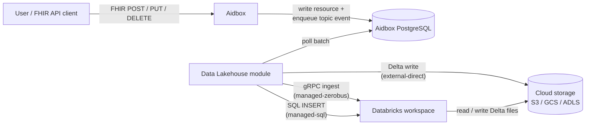
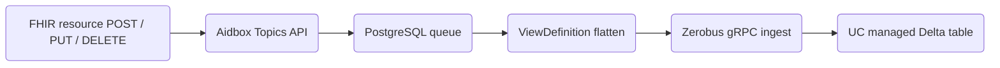
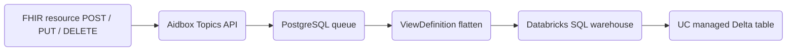
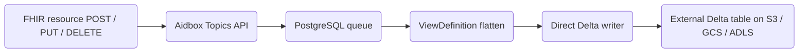
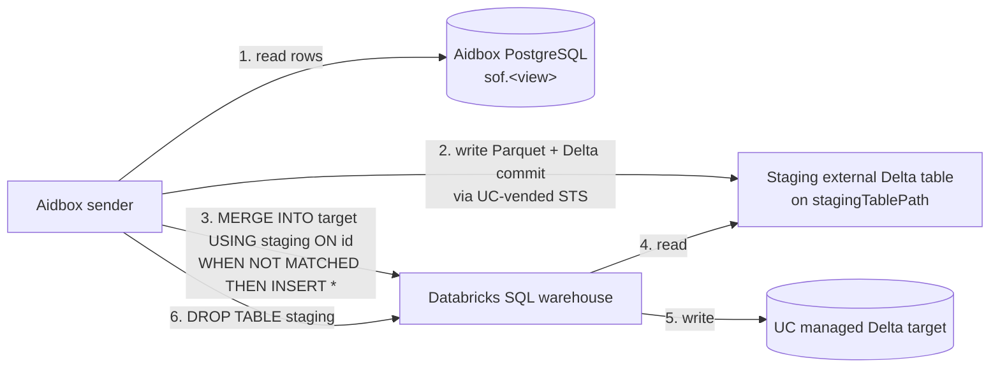
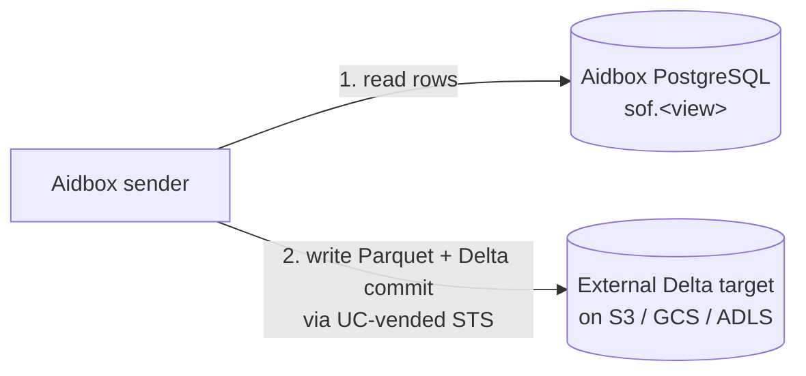

# Data Lakehouse AidboxTopicDestination


This functionality is available starting from Aidbox version **2605**.



**In a hurry?** Jump straight to [Usage Example: Patient Data Export](#usage-example-patient-data-export) for the end-to-end setup walkthrough (Topic + ViewDefinition + Databricks side + destination).


## Background: the stack you'll be using

"Data Lakehouse" is the generic name for the destination category — a hybrid of object-storage data lake and warehouse, implemented here on top of the Delta Lake table format. Concretely the module writes Delta-formatted tables that can live on plain cloud object storage you own, or in Databricks Unity Catalog managed storage; either way the destination kind is the same (`data-lakehouse-at-least-once`).

If you're already comfortable with Databricks, Unity Catalog, and Delta Lake, skip to [Overview](#overview).

### Databricks

[Databricks](https://www.databricks.com/) is a managed analytics platform. For this tutorial you only need to think of it as **three things bundled together**:

1. **Unity Catalog (UC)** — the metadata + governance layer. UC knows about every catalog, schema, table, column, and grant in your workspace. It also issues short-lived cloud-storage credentials on demand ("vending") so external clients can write data without being given long-lived bucket keys.
2. **SQL warehouse** — a compute cluster that runs SQL queries against tables in your Unity Catalog. Usually you query it from the Databricks UI's SQL Editor; the module can drive it programmatically over an API.
3. **[Zerobus Ingest](https://docs.databricks.com/aws/en/ingestion/zerobus-overview)** — a push-based ingestion API that writes data directly into Unity Catalog Delta tables. Designed for high-throughput, low-overhead row ingestion: clients open a stream, push records, and Zerobus durably commits them with per-stream ordering guarantees.

### Data lakehouse, and Delta Lake as its implementation

A **data lakehouse** is a hybrid of two older patterns:

- A **data lake** stores raw files (Parquet, JSON, CSV) on cheap object storage (S3, GCS, ADLS). Scalable and cheap, but no schema enforcement, no ACID transactions, no time travel.
- A **data warehouse** (Snowflake, Redshift, BigQuery) gives you ACID + schema + indexes — at the cost of a proprietary storage format you don't own.

A lakehouse is the lake side with the warehouse's guarantees bolted on: ACID, schema, and time travel **on plain Parquet files in your own bucket**. The thing doing that bolting is an **open table format** — and [Delta Lake](https://delta.io/) is the one this module uses. A Delta table is a directory on object storage:

```
s3://bucket/prefix/my_table/
├── _delta_log/
│   ├── 00000000000000000000.json       ← transaction log: each commit is one JSON file
│   ├── 00000000000000000001.json
│   └── ...
├── part-00000-xxx.snappy.parquet       ← row data
├── part-00001-xxx.snappy.parquet
└── ...
```

The `_delta_log/` directory is the source of truth: readers replay it; writers append a new commit. Concurrent writers race on the next log filename — that's where Delta's ACID comes from.

### External vs managed tables

Unity Catalog tables come in two flavours:

|                                | **Managed**                                                          | **External**                                                          |
| ------------------------------ | -------------------------------------------------------------------- | --------------------------------------------------------------------- |
| Status                         | Databricks' **default and recommended** table type                   | Use when you need files in your own bucket                            |
| Storage location               | Databricks-managed cloud storage (path picked by UC)                 | Your bucket — declared with `LOCATION 's3://...' / 'gs://...' / 'abfss://...'` at `CREATE TABLE` |
| Who owns the files             | Unity Catalog — manages read, write, storage, and optimization       | You — UC manages metadata only                                        |
| `DROP TABLE`                   | Deletes the data                                                     | Drops metadata only — files stay in your bucket                       |
| Sanctioned write paths from Aidbox | **Zerobus gRPC ingest** (Aidbox `managed-zerobus`), or **SQL warehouse INSERT** (Aidbox `managed-sql`) | **Direct Parquet + Delta commit** via STS-vended UC creds (Aidbox `external-direct`) |
| External STS credential vending| Not available for managed targets (`EXTERNAL USE SCHEMA` is only grantable on external schemas) | Allowed if the principal has `EXTERNAL USE SCHEMA` on the schema      |
| Predictive Optimization        | Enabled by default for accounts created on or after **2024-11-11**; runs `OPTIMIZE` / `VACUUM` / `ANALYZE` automatically. Billed under the **Jobs Serverless** SKU. | **Not supported** — Predictive Optimization runs only on managed tables |
| Liquid Clustering              | Opt-in per table (automatic liquid clustering requires Predictive Optimization and is also opt-in) | Opt-in per table                                                      |

The "Sanctioned write paths" row drives the module's three `writeMode` values — see [Overview](#overview) for the resulting write paths.

## Overview

The Data Lakehouse Topic Destination module exports FHIR resources from Aidbox to a Delta Lake table in a flattened format using [ViewDefinitions](../../modules/sql-on-fhir/defining-flat-views-with-view-definitions.md) (SQL-on-FHIR).



The flow:

1. A FHIR API client (a user, an integration, a backfill script) sends a `POST` / `PUT` / `DELETE` to Aidbox.
2. Aidbox persists the resource and enqueues a topic event for the destination in PostgreSQL.
3. The Data Lakehouse module polls the destination's batch from the same PostgreSQL queue.
4. For `managed-zerobus` mode (default): the module pushes each batch into the managed table over Zerobus, Databricks' streaming-ingest API. No SQL parsing / planning per write.
5. For `managed-sql` mode: the module sends `INSERT` (and `ALTER` / `DESCRIBE` when needed) to the Databricks SQL warehouse; the warehouse writes the Delta files to storage.
6. For `external-direct` mode: the module gets short-lived storage credentials from Unity Catalog and writes Delta files directly to your bucket.

The module may also perform an initial export of pre-existing resources at first start — see [Initial Export](#initial-export) for when this runs and how to skip it.

### Write modes

The module supports three **write modes**, picked per-destination via the `writeMode` parameter (see the [Configuration](#configuration) section below for the full parameter list).

### `writeMode: managed-zerobus` (default)

Targets a **Databricks Unity Catalog managed table** via the Zerobus gRPC streaming-ingest service.



- Each batch is JSON-encoded and pushed into the managed table via the `zerobus-ingest-sdk` (`ingestRecordsOffset` → `waitForOffset` → `flush`). Zerobus is a purpose-built ingest pipe: no SQL parsing / planning / scheduling per batch, server-side offset tracking with per-stream ordering, and a long-lived stream that doesn't cold-start per write.
- Initial bulk export still uses a one-shot staging Delta table under `stagingTablePath` (Zerobus is append-only stream ingest, designed for incremental row writes, not bulk loads). The bulk merge is the same `MERGE INTO managed USING staging` pattern as `managed-sql`. This staging table is a plain external Delta table the module drops after the merge — not a Databricks [temporary table](https://docs.databricks.com/aws/en/tables/temporary-tables).
- Schema sync at sender bootstrap still uses a SQL warehouse (one-shot `INFORMATION_SCHEMA.COLUMNS` describe + optional `ALTER TABLE`) — the warehouse is required but only used at boot, not on every batch.

### `writeMode: managed-sql`

Same target as `managed-zerobus` (UC **managed** table), but routes the hot path through a Databricks SQL warehouse. Use this when Zerobus isn't available on your Databricks SKU.



- Each batch becomes a single `INSERT INTO managed (cols) VALUES (...)` statement sent to a Databricks SQL warehouse. The warehouse writes the Delta files (Parquet + a transaction-log commit) under the managed table.
- Initial bulk export uses a one-shot staging Delta table under `stagingTablePath` because Databricks-managed tables refuse direct writes from outside Databricks compute. See [Initial Export](#how-it-works-managed-modes) for the staging diagram.

### `writeMode: external-direct`

Targets a **non-managed external Delta table** that you own.



- The module writes Delta files straight to your bucket from the Aidbox process. No SQL warehouse involved.
- Storage backends supported: AWS S3, Google Cloud Storage, Azure ADLS Gen2.
- No Databricks compute is involved in the write path — you pay only for the bucket. Because Databricks doesn't own the files, you're responsible for the maintenance Databricks would otherwise run automatically: schedule `OPTIMIZE` (file compaction) and `VACUUM` (cleanup of stale Parquet referenced by no commit) yourself. See [Compaction and maintenance](#compaction-and-maintenance).

## Output semantics

How writes show up in your Delta table, and how to query the result.

### Append-only

Every change to a FHIR resource is written as a **new row** — there are no in-place UPDATEs or DELETEs:

- **Create** → new row with `is_deleted = 0`
- **Update** → new row with `is_deleted = 0` (old row remains)
- **Delete** → new row with `is_deleted = 1`

Example — a single patient created, updated twice, then deleted produces four rows with the same `id`:

| `id` | `ts` (`meta.lastUpdated`) | `gender` | `family_name` | `is_deleted` |
|------|-----|---------|--------|---|
| `p-1` | `2026-04-01T10:00:00Z` | `male`   | `Smith`        | `0` |
| `p-1` | `2026-04-02T08:00:00Z` | `male`   | `Smith-Jones`  | `0` |
| `p-1` | `2026-04-03T14:00:00Z` | `other`  | `Smith-Jones`  | `0` |
| `p-1` | `2026-04-04T09:00:00Z` | `other`  | `Smith-Jones`  | `1` |

Use [the read-time projection below](#reading-current-state-out-of-the-append-only-history) to collapse history to "latest row per id, excluding deleted".

### At-least-once delivery

Messages are persisted in a PostgreSQL queue before being sent. If delivery fails, the message stays in the queue and is retried on the next batch cycle. The three modes differ in what happens during a crash-between-commit-and-ack — the narrow window where the write landed in storage but the sender died before marking the queue entry as delivered:

- **`managed-zerobus`** — initial export is idempotent (`MERGE INTO managed USING staging ON id` no-ops on replay). The **hot path** is at-least-once: Zerobus has server-side offset dedup, but on Aidbox queue replay after a sender crash the SDK allocates a fresh offset, which Zerobus treats as a new record.
- **`managed-sql`** — initial export is idempotent (same MERGE pattern as `managed-zerobus`). The **hot path** can produce duplicates. The per-batch INSERT route to the SQL warehouse can't carry a transaction id, so a replayed batch becomes a second INSERT and a duplicate row.
- **`external-direct`** — restart-safe-idempotent for both hot path and initial export. Every Delta commit carries a stable transaction id; a replay lands on the same id and Delta silently skips it.

### Reading "current state" out of the append-only history

Because every change is written as a new row (and `managed-*` modes can deliver duplicates on crash-replay), querying the table directly gives you all historical versions plus possible dupes. To project the table down to one row per resource id — i.e. "the latest state of each resource, with deletes excluded" — add a timestamp column to your ViewDefinition (e.g. `meta.lastUpdated` as `ts`) and select via a window function:

```sql
SELECT * EXCEPT(rn) FROM (
  SELECT *, ROW_NUMBER() OVER (PARTITION BY id ORDER BY ts DESC) AS rn
  FROM aidbox_export.fhir.patients
)
WHERE rn = 1 AND is_deleted = 0;
```

## Choosing between the three modes

|                                | `managed-zerobus` (default)                                              | `managed-sql`                                                            | `external-direct`                                            |
| ------------------------------ | ------------------------------------------------------------------------ | ------------------------------------------------------------------------ | ------------------------------------------------------------ |
| Table type                     | UC **managed** (Databricks owns the files)                               | UC **managed** (Databricks owns the files)                               | **External** (the User's bucket owns the files)              |
| Hot-path transport             | Zerobus gRPC streaming-ingest SDK                                        | Databricks SQL warehouse (Statement Execution API)                       | Direct Delta commits via Hadoop FS                            |
| Who runs maintenance           | Databricks (Predictive Optimization handles `OPTIMIZE` / `VACUUM`)       | Databricks (Predictive Optimization handles `OPTIMIZE` / `VACUUM`)       | The User schedules `OPTIMIZE` / `VACUUM`                     |
| Databricks compute cost surface| **No warm warehouse** — pay-per-row Zerobus + storage only               | SQL warehouse must be running to accept INSERTs — Databricks bills uptime | No warehouse — no Databricks compute charge for write path   |

Details that follow:

- **Schema drift** — both managed modes auto-`ALTER` the target on schema mismatch (Aidbox owns managed-target schema). `external-direct` requires the User to `ALTER TABLE` manually and recreate the destination.
- **Initial export path** — both managed modes materialize via a temporary staging Delta table on your bucket (see [Initial Export — managed modes](#how-it-works-managed-modes)). `external-direct` writes the bulk straight to the target in one commit.
- **Bootstrap warehouse use** — `managed-zerobus` still pings a SQL warehouse ONCE at sender boot for schema sync (`INFORMATION_SCHEMA.COLUMNS` + optional `ALTER`). After that, no warehouse traffic on the hot path. `managed-sql` keeps the warehouse warm.
- **Storage backends** — `external-direct` supports AWS S3, GCS, Azure ADLS Gen2. Both managed modes use whatever Databricks-managed storage your workspace is configured with.

## Authentication

All three modes authenticate to Databricks via **OAuth Machine-to-Machine (M2M)** with a service principal.

```mermaid
sequenceDiagram
    participant S as Aidbox sender
    participant T as Databricks token endpoint

    S->>T: client_id + client_secret
    T-->>S: bearer token (~1h TTL)
    Note over S: cached; refreshed when <5 min remain
```

The bearer is then sent on every subsequent Databricks call (Unity Catalog REST, SQL Statement Execution, Zerobus stream open). What changes between modes is **which Databricks surfaces the bearer reaches** — see below.

### How the same token gets used differently in each mode

The module exchanges `databricksClientId` + `databricksClientSecret` for a short-lived bearer token via `POST /oidc/v1/token` (`client_credentials` grant). That bearer is cached and re-issued automatically when less than 5 minutes remain. What changes between modes is **what the bearer authorizes**:

**`managed-zerobus`** — the SDK uses `client_id`/`client_secret` for its own gRPC auth (no module-managed bearer for the hot path); the module-managed bearer authenticates the warehouse bootstrap only:

- Module bearer (only at bootstrap): one `DESCRIBE` + optional `ALTER` on the SQL warehouse, plus (if initial-export runs) the staging-table UC-vend and final `MERGE INTO target USING staging`.
- Zerobus SDK auth: `client_id`/`client_secret` passed to `createJsonStream(...)` for the gRPC channel. The SDK refreshes its own credentials internally.
- The module never touches your bucket directly in this mode — Zerobus' native ingest writes the Delta files.

**`managed-sql`** — bearer authenticates every call to Databricks compute:

- The module never touches your bucket directly.
- The module submits SQL to the warehouse; the warehouse's storage credential talks to storage.
- Calls the module makes:
  - `POST /api/2.0/sql/statements` — `INSERT INTO target VALUES (...)` (every batch)
  - `POST /api/2.0/sql/statements` — `ALTER TABLE ADD COLUMNS (...)` (schema drift)
  - `POST /api/2.0/sql/statements` — `SELECT * FROM information_schema.columns ...` (schema introspection)
- Initial bulk export reuses the same bearer twice:
  - once to register a staging external Delta table + UC-vend STS for it (so the module can write the bulk parquet from the Aidbox process)
  - once to issue `MERGE INTO target USING staging ON id WHEN NOT MATCHED THEN INSERT *` on the warehouse

**`external-direct`** — bearer authenticates Unity Catalog REST only, never SQL:

- The module asks UC for short-lived AWS STS credentials scoped to one table, then writes directly to S3 from the sender process. No Databricks compute involved.
- Calls the module makes:
  - `GET /api/2.1/unity-catalog/tables/{full_name}` — resolves `full_name` to a `table_id`
  - `POST /api/2.1/unity-catalog/temporary-table-credentials` — exchanges `table_id` + `READ_WRITE` for `access_key` + `secret_key` + `session_token`
- A background thread refreshes the STS session 15 min before expiry and reconnects the writer, so writes never see expired session tokens.
- If `databricksWorkspaceUrl` is **not** set, UC is skipped entirely:
  - static AWS keys from `awsAccessKeyId` / `awsSecretAccessKey`, or
  - the [AWS default provider chain](https://docs.aws.amazon.com/sdk-for-java/latest/developer-guide/credentials-chain.html) — IAM instance profile, IRSA on EKS, environment variables.

### Side-by-side

| Mode                       | UC REST calls                                | SQL Statement API calls               | Other transport            | Who talks to S3                 |
| -------------------------- | -------------------------------------------- | ------------------------------------- | -------------------------- | ------------------------------- |
| `managed-zerobus` (default)| only during initial-export (staging vending) | bootstrap + initial-export only       | Zerobus gRPC (every batch) | Zerobus native ingest (Databricks-side) |
| `managed-sql`              | only during initial-export (staging vending) | every batch (INSERT, ALTER, DESCRIBE) | —                          | SQL warehouse compute           |
| `external-direct`          | every cred-refresh (~45 min)                 | none                                  | —                          | sender process                  |

The concrete steps to create the service principal, grant privileges, and (optionally) wire up vault-backed secrets are part of [Usage Example: Patient Data Export](#usage-example-patient-data-export) — that walkthrough sets up everything end-to-end without duplicating the GRANT SQL or the Databricks UI clicks across sections.

## Before you begin

- Make sure your Aidbox version is **2605** or newer
- Set up a local Aidbox instance using the getting started [guide](../../getting-started/run-aidbox-locally.md)
- Have a Databricks workspace (Free Edition works for evaluation, paid for production)
- For `managed-zerobus` mode: a managed Delta table, a SQL warehouse (used at bootstrap for schema sync + initial-export MERGE), the **numeric workspace ID** and **AWS region** of the workspace (to compose the Zerobus endpoint host), and (if doing initial export) an S3/GCS/ADLS path you control with a UC External Location for staging. **Zerobus must be enabled on your SKU** — Databricks Free Edition workspaces support it; check with Databricks support if you're not sure for paid plans.
- For `managed-sql` mode: a running SQL warehouse, a managed Delta table, and (if doing initial export) an S3/GCS/ADLS path you control with a UC External Location for staging
- For `external-direct` mode: an external Delta table registered in UC (or static AWS keys for non-UC deployments)

The service principal that authenticates the module is created in the [Authentication](#authentication) section below, as part of the setup flow — you don't need it before you start.

## Installation

### Docker Compose

1. Download the Databricks module JAR file and place it next to your **docker-compose.yaml**:

   ```sh
   curl -O https://storage.googleapis.com/aidbox-modules/topic-destination-deltalake/topic-destination-deltalake-2605.0.jar
   ```

2. Edit your **docker-compose.yaml** and add these lines to the Aidbox service:

   ```yaml
   aidbox:
     volumes:
       - ./topic-destination-deltalake-2605.0.jar:/topic-destination-deltalake.jar
       # ... other volumes ...
     environment:
       BOX_MODULE_LOAD: io.healthsamurai.topic-destination.data-lakehouse.core
       BOX_MODULE_JAR: "/topic-destination-deltalake.jar"
       BOX_FHIR_SCHEMA_VALIDATION: "true"
       # ... other environment variables ...
   ```

3. Start Aidbox:

   ```sh
   docker compose up
   ```

4. Verify the module is loaded. In Aidbox UI, go to **FHIR Packages** and check that the Delta Lake profile is present:
   `http://health-samurai.io/fhir/core/StructureDefinition/aidboxtopicdestination-dataLakehouseAtLeastOnceProfile`


The profile URL above is a FHIR canonical identifier, not an HTTP endpoint. You can find it in the Aidbox UI under FHIR Packages.


### Kubernetes

For Kubernetes deployments, the module can be downloaded automatically using an init container:

```yaml
apiVersion: apps/v1
kind: Deployment
metadata:
  name: aidbox
spec:
  template:
    spec:
      initContainers:
        - name: download-deltalake-module
          image: debian:bookworm-slim
          command:
            - sh
            - -c
            - |
              apt-get -y update && apt-get -y install curl
              curl -L -o /modules/topic-destination-deltalake.jar \
                https://storage.googleapis.com/aidbox-modules/topic-destination-deltalake/topic-destination-deltalake-2605.0.jar
              chmod 644 /modules/topic-destination-deltalake.jar
          volumeMounts:
            - mountPath: /modules
              name: modules-volume
      containers:
        - name: aidbox
          image: healthsamurai/aidboxone:edge
          env:
            - name: BOX_MODULE_LOAD
              value: "io.healthsamurai.topic-destination.data-lakehouse.core"
            - name: BOX_MODULE_JAR
              value: "/modules/topic-destination-deltalake.jar"
            - name: BOX_FHIR_SCHEMA_VALIDATION
              value: "true"
            # ... other environment variables ...
          volumeMounts:
            - name: modules-volume
              mountPath: /modules
      volumes:
        - name: modules-volume
          emptyDir: {}
```

## Configuration

All requests in this tutorial use `Content-Type: application/json`.



**Required:**

| Parameter                | Type        | Description                                                              |
| ------------------------ | ----------- | ------------------------------------------------------------------------ |
| `viewDefinition`         | string      | The `name` field of the ViewDefinition resource (not `id`)               |
| `batchSize`              | unsignedInt | Rows per worker tick / batch commit                                      |
| `sendIntervalMs`         | unsignedInt | Max time between batched commits, in ms                                  |
| `databricksWorkspaceUrl` | string      | `https://<workspace>.cloud.databricks.com`                               |
| `databricksWorkspaceId`  | string      | Numeric workspace ID (e.g. `1234567890123456`). Composes the Zerobus gRPC endpoint host |
| `databricksRegion`       | string      | Workspace AWS region (e.g. `us-east-1`). Composes the Zerobus gRPC endpoint host |
| `databricksClientId`     | string      | Service principal `client_id` for OAuth M2M                              |
| `databricksClientSecret` | string      | Service principal `client_secret`; supports vault refs                   |
| `tableName`              | string      | Managed table full name: `catalog.schema.table`                          |
| `databricksWarehouseId`  | string      | SQL warehouse ID — used at bootstrap for schema sync + (if initial-export runs) the final `MERGE INTO`. No warm-warehouse traffic on the hot path. |
| `awsRegion`              | string      | AWS region of the staging bucket                                         |
| `stagingTablePath`       | string      | `s3://bucket/path/` for the staging Delta table created during initial export. Required when `skipInitialExport` is not `true` |

<details>

<summary>Advanced parameters</summary>

| Parameter           | Type        | Description                                                                                |
| ------------------- | ----------- | ------------------------------------------------------------------------------------------ |
| `writeMode`         | string      | `managed-zerobus` (default), `managed-sql`, or `external-direct`. Omit to get `managed-zerobus` |
| `skipInitialExport` | boolean     | Skip initial export of existing data (default: `false`)                                    |
| `targetFileSizeMb`  | unsignedInt | Parquet target size during initial export (default: `128`)                                 |

</details>




**Required:**

| Parameter                | Type        | Description                                                              |
| ------------------------ | ----------- | ------------------------------------------------------------------------ |
| `writeMode`              | string      | Must be `managed-sql` (otherwise the default `managed-zerobus` path is used) |
| `viewDefinition`         | string      | The `name` field of the ViewDefinition resource (not `id`)               |
| `batchSize`              | unsignedInt | Rows per worker tick / batch commit                                      |
| `sendIntervalMs`         | unsignedInt | Max time between batched commits, in ms                                  |
| `databricksWorkspaceUrl` | string      | `https://<workspace>.cloud.databricks.com`                               |
| `databricksClientId`     | string      | Service principal `client_id` for OAuth M2M                              |
| `databricksClientSecret` | string      | Service principal `client_secret`; supports vault refs                   |
| `tableName`              | string      | Managed table full name: `catalog.schema.table`                          |
| `databricksWarehouseId`  | string      | SQL warehouse ID                                                         |
| `awsRegion`              | string      | AWS region of the staging bucket                                         |
| `stagingTablePath`       | string      | `s3://bucket/path/` for the staging Delta table created during initial export. Required when `skipInitialExport` is not `true` |

<details>

<summary>Advanced parameters</summary>

| Parameter           | Type        | Description                                                                                |
| ------------------- | ----------- | ------------------------------------------------------------------------------------------ |
| `skipInitialExport` | boolean     | Skip initial export of existing data (default: `false`)                                    |
| `targetFileSizeMb`  | unsignedInt | Parquet target size during initial export (default: `128`)                                 |

</details>



**Required:**

| Parameter                | Type        | Description                                                                            |
| ------------------------ | ----------- | -------------------------------------------------------------------------------------- |
| `viewDefinition`         | string      | The `name` field of the ViewDefinition resource (not `id`)                             |
| `batchSize`              | unsignedInt | Rows per worker tick / batch commit                                                    |
| `sendIntervalMs`         | unsignedInt | Max time between batched commits, in ms                                                |
| `writeMode`              | string      | Must be `external-direct` (otherwise the default `managed` path is used)               |
| `tablePath`              | string      | `s3://...` / `gs://...` / `abfss://...`. Required unless `databricksWorkspaceUrl` set (then resolved from Unity Catalog) |
| `awsRegion`              | string      | Required for real AWS / GovCloud (skip for MinIO / LocalStack)                         |

<details>

<summary>Authentication parameters</summary>

Pick **one** of: UC credential vending, static AWS keys, or default AWS provider chain.

| Parameter                | Type   | Description                                                                                                  |
| ------------------------ | ------ | ------------------------------------------------------------------------------------------------------------ |
| `databricksWorkspaceUrl` | string | If set: UC credential vending; `databricksClientId` + `databricksClientSecret` + `tableName` must also be set |
| `databricksClientId`     | string | SP `client_id` (required iff `databricksWorkspaceUrl` set)                                                   |
| `databricksClientSecret` | string | SP `client_secret`; supports vault refs (required iff `databricksWorkspaceUrl` set)                          |
| `tableName`              | string | UC `catalog.schema.table` (when using UC vending)                                                            |
| `awsAccessKeyId`         | string | Static IAM key (falls back to default provider chain when absent). Supports vault refs                       |
| `awsSecretAccessKey`     | string | Static IAM secret. Supports vault refs                                                                       |

</details>

<details>

<summary>Advanced parameters</summary>

| Parameter           | Type        | Description                                                              |
| ------------------- | ----------- | ------------------------------------------------------------------------ |
| `skipInitialExport` | boolean     | Skip initial export of existing data (default: `false`)                  |
| `targetFileSizeMb`  | unsignedInt | Parquet target size during initial export (default: `128`)               |
| `s3Endpoint`        | string      | MinIO / LocalStack endpoint (forces path-style URLs)                     |

</details>



## Usage Example: Patient Data Export

The example below uses `managed-zerobus` mode (the default). See "[Alternative: `managed-sql` configuration](#alternative-managed-sql-configuration)" if Zerobus isn't available on your SKU, or "[Alternative: `external-direct` configuration](#alternative-external-direct-configuration)" for the direct-to-bucket path.



### Step 1: Set up Databricks side

Do the Databricks-side setup first so the values you pass to Aidbox in later steps (workspace URL + ID + region, service principal ID/secret, warehouse ID, table name) already exist.

#### 1a. Catalog and schema

In the Databricks SQL Editor (Catalog Explorer → Create catalog / schema, or via SQL):

```sql
CREATE CATALOG IF NOT EXISTS aidbox_export;
CREATE SCHEMA  IF NOT EXISTS aidbox_export.fhir;
```

#### 1b. Managed Delta table

```sql
CREATE TABLE aidbox_export.fhir.patients (
  id          STRING,
  gender      STRING,
  birth_date  DATE,
  family_name STRING,
  given_name  STRING,
  is_deleted  INT
) USING DELTA;
```


The table **must** include an `is_deleted` column (`INT`). The module sets this to `0` for create/update operations and `1` for delete operations.

**No `LOCATION` clause** — that's what makes this a managed table. UC owns the physical layout, runs Predictive Optimization automatically, and refuses external STS-vended writes — which is why both `managed-*` modes go through Databricks compute (Zerobus or SQL warehouse).


**Type mapping:**

| FHIR / ViewDefinition type | Databricks SQL type |
| -------------------------- | ------------------- |
| `id`, `string`, `code`     | `STRING`            |
| `date`                     | `DATE`              |
| `dateTime`, `instant`      | `TIMESTAMP`         |
| `integer`, `positiveInt`   | `INT`               |
| `decimal`                  | `DOUBLE`            |
| `boolean`                  | `BOOLEAN`           |


In both `managed-*` modes the module **automatically issues `ALTER TABLE ADD COLUMNS`** when the ViewDefinition has columns the managed target is missing — you don't have to keep them in sync manually. See [Schema Evolution](#schema-evolution).


#### 1c. SQL warehouse

Compute → SQL Warehouses → use an existing warehouse or create a new one. Serverless 2X-Small is the cheapest option that supports the Statement Execution API. Copy the **Warehouse ID** — you'll use it as `databricksWarehouseId`.

#### 1d. Service principal

1. In your Databricks workspace, go to **Settings → Identity and access → Service principals → Add service principal**.
2. Give it a name (e.g. `aidbox-topic-destination`) and create.
3. Click the new SP, open the **Secrets** tab, click **Generate secret**.
4. Copy the **Client ID** and **Secret** — you'll use these as `databricksClientId` / `databricksClientSecret`.

#### 1e. Grant the service principal

Grant only the set that matches the `writeMode` you'll use.



| Privilege | Granted on | Purpose |
|---|---|---|
| `USE CATALOG` | `aidbox_export` | navigate the catalog |
| `USE SCHEMA` | `aidbox_export.fhir` | resolve the target table |
| `SELECT`, `MODIFY` | target table | `DESCRIBE` + initial-bulk `MERGE INTO` |
| `USAGE` (UI: "Can use") | the SQL warehouse | submit bootstrap schema-sync statements + initial-bulk `MERGE` (no warehouse traffic on the hot path) |
| `EXTERNAL USE SCHEMA` | the staging schema | UC vends STS for the staging table (initial-export only) |
| `READ FILES`, `WRITE FILES`, `CREATE EXTERNAL TABLE` | staging External Location | write the bulk Parquet via UC-vended STS (initial-export only) |

```sql
GRANT USE CATALOG ON CATALOG aidbox_export                TO `<sp-client-id>`;
GRANT USE SCHEMA  ON SCHEMA  aidbox_export.fhir           TO `<sp-client-id>`;
GRANT SELECT, MODIFY ON TABLE aidbox_export.fhir.patients TO `<sp-client-id>`;
GRANT USAGE ON WAREHOUSE `<warehouse-id>`                 TO `<sp-client-id>`;
-- initial-export only:
GRANT EXTERNAL USE SCHEMA ON SCHEMA aidbox_export.fhir    TO `<sp-client-id>`;
GRANT READ FILES, WRITE FILES, CREATE EXTERNAL TABLE
  ON EXTERNAL LOCATION `<staging-external-location>`      TO `<sp-client-id>`;
```

The warehouse "Can use" also has to be granted via UI: **SQL Warehouses → your warehouse → Permissions → Add → service principal → Can use**.



| Privilege | Granted on | Purpose |
|---|---|---|
| `USE CATALOG` | `aidbox_export` | navigate the catalog |
| `USE SCHEMA` | `aidbox_export.fhir` | resolve the target table |
| `SELECT`, `MODIFY` | target table | every `INSERT` + bootstrap `DESCRIBE` + initial-bulk `MERGE` |
| `USAGE` (UI: "Can use") | the SQL warehouse | submit every statement |
| `EXTERNAL USE SCHEMA` | the staging schema | UC vends STS for the staging table (initial-export only) |
| `READ FILES`, `WRITE FILES`, `CREATE EXTERNAL TABLE` | staging External Location | write the bulk Parquet via UC-vended STS (initial-export only) |

```sql
GRANT USE CATALOG ON CATALOG aidbox_export                TO `<sp-client-id>`;
GRANT USE SCHEMA  ON SCHEMA  aidbox_export.fhir           TO `<sp-client-id>`;
GRANT SELECT, MODIFY ON TABLE aidbox_export.fhir.patients TO `<sp-client-id>`;
GRANT USAGE ON WAREHOUSE `<warehouse-id>`                 TO `<sp-client-id>`;
-- initial-export only:
GRANT EXTERNAL USE SCHEMA ON SCHEMA aidbox_export.fhir    TO `<sp-client-id>`;
GRANT READ FILES, WRITE FILES, CREATE EXTERNAL TABLE
  ON EXTERNAL LOCATION `<staging-external-location>`      TO `<sp-client-id>`;
```

The warehouse "Can use" also has to be granted via UI: **SQL Warehouses → your warehouse → Permissions → Add → service principal → Can use**.



| Privilege | Granted on | Purpose |
|---|---|---|
| `USE CATALOG` | `aidbox_export` | navigate the catalog |
| `USE SCHEMA` | `aidbox_export.fhir` | resolve the target table |
| `SELECT`, `MODIFY` | target table | UC checks before vending creds |
| `EXTERNAL USE SCHEMA` | the target's schema | UC vends STS creds for direct-to-bucket writes |
| `READ FILES`, `WRITE FILES`, `CREATE EXTERNAL TABLE` | target's External Location | write Parquet + Delta commits directly to the bucket |

```sql
GRANT USE CATALOG ON CATALOG aidbox_export                TO `<sp-client-id>`;
GRANT USE SCHEMA  ON SCHEMA  aidbox_export.fhir           TO `<sp-client-id>`;
GRANT SELECT, MODIFY ON TABLE aidbox_export.fhir.patients TO `<sp-client-id>`;
GRANT EXTERNAL USE SCHEMA ON SCHEMA aidbox_export.fhir    TO `<sp-client-id>`;
GRANT READ FILES, WRITE FILES, CREATE EXTERNAL TABLE
  ON EXTERNAL LOCATION `<target-external-location>`       TO `<sp-client-id>`;
```


`EXTERNAL USE SCHEMA` is **only grantable on external schemas** (where the schema's tables sit at an external location). UC managed schemas refuse this grant by design — managed tables can't be vended.




External-Location provisioning + Storage Credential setup live in step 1f below.

#### 1f. (Optional, `managed-zerobus` / `managed-sql` only) Staging location for initial export

If you plan to use `skipInitialExport=false` (the default), you also need a UC **External Location** for the staging Delta table the module writes to during bulk export. Both `managed-zerobus` and `managed-sql` go through the same staging path during initial bulk; `external-direct` writes the bulk straight to the target instead and skips this step.

1. Provision an S3 bucket (or GCS / ADLS prefix) you control. Example: `s3://my-aidbox-staging/`.
2. Configure a **Storage Credential** in Databricks (Data → External Data → Credentials). For S3 this is an IAM role with trust policy granting Databricks AWS account access; follow [Databricks docs on storage credentials](https://docs.databricks.com/en/connect/unity-catalog/storage-credentials.html).
3. Create the **External Location** in Databricks (Data → External Data → External Locations) pointing at the bucket path with the Storage Credential. The location's name is what you reference as `<staging-external-location>` in the grants in step 1e.

The SP grants for the staging External Location are already covered in the `managed-zerobus` / `managed-sql` tabs of step 1e.

#### 1g. (Optional) Store the SP secret in vault

`databricksClientSecret` can be passed either inline on the destination resource or as a vault-backed reference. The module fully supports Aidbox's vault integration — see [External Secrets](../../configuration/secret-files.md) for the supported backends and the FHIR primitive-extension pattern that wires a parameter to a vault secret.




### Step 2: Create Subscription Topic

```http
POST /fhir/AidboxSubscriptionTopic

{
  "resourceType": "AidboxSubscriptionTopic",
  "url": "http://example.org/subscriptions/patient-updates",
  "status": "active",
  "trigger": [
    {
      "resource": "Patient",
      "supportedInteraction": ["create", "update", "delete"],
      "fhirPathCriteria": "name.exists()"
    }
  ]
}
```




### Step 3: Create ViewDefinition

A [ViewDefinition](../../modules/sql-on-fhir/defining-flat-views-with-view-definitions.md) defines how to transform a complex FHIR resource into a flat table structure suitable for analytics. Each `column` maps a [FHIRPath](https://hl7.org/fhirpath/) expression to a named column.

```http
POST /fhir/ViewDefinition

{
  "resourceType": "ViewDefinition",
  "id": "patient_flat",
  "name": "patient_flat",
  "resource": "Patient",
  "status": "active",
  "select": [
    {
      "column": [
        {"name": "id", "path": "id"},
        {"name": "gender", "path": "gender"},
        {"name": "birth_date", "path": "birthDate"}
      ]
    },
    {
      "forEach": "name.where(use = 'official').first()",
      "column": [
        {"name": "family_name", "path": "family"},
        {"name": "given_name", "path": "given.join(' ')"}
      ]
    }
  ]
}
```




### Step 4: Materialize ViewDefinition

The ViewDefinition must be [materialized](../../modules/sql-on-fhir/operation-materialize.md) as a database view before the module can use it to transform data. Materialization creates a SQL view in the `sof` schema.

```http
POST /fhir/ViewDefinition/patient_flat/$materialize

{
  "resourceType": "Parameters",
  "parameter": [
    {
      "name": "type",
      "valueCode": "view"
    }
  ]
}
```


The ViewDefinition must be materialized as a **view** (not a table). See the [`$materialize` operation](../../modules/sql-on-fhir/operation-materialize.md) documentation for details.





### Step 5: Configure the destination (`managed-zerobus`)

```http
POST /fhir/AidboxTopicDestination

{
  "resourceType": "AidboxTopicDestination",
  "id": "patient-databricks",
  "topic": "http://example.org/subscriptions/patient-updates",
  "kind": "data-lakehouse-at-least-once",
  "meta": {
    "profile": [
      "http://health-samurai.io/fhir/core/StructureDefinition/aidboxtopicdestination-dataLakehouseAtLeastOnceProfile"
    ]
  },
  "parameter": [
    {"name": "writeMode", "valueString": "managed-zerobus"},
    {"name": "databricksWorkspaceUrl", "valueString": "https://dbc-XXXXXXXX-XXXX.cloud.databricks.com"},
    {"name": "databricksWorkspaceId", "valueString": "1234567890123456"},
    {"name": "databricksRegion", "valueString": "us-east-1"},
    {"name": "databricksClientId", "valueString": "<sp-client-id>"},
    {"name": "databricksClientSecret", "valueString": "<sp-client-secret>"},
    {"name": "tableName", "valueString": "aidbox_export.fhir.patients"},
    {"name": "databricksWarehouseId", "valueString": "<warehouse-id>"},
    {"name": "awsRegion", "valueString": "us-east-1"},
    {"name": "stagingTablePath", "valueString": "s3://my-aidbox-staging/patient_flat_staging/"},
    {"name": "viewDefinition", "valueString": "patient_flat"},
    {"name": "batchSize", "valueUnsignedInt": 50},
    {"name": "sendIntervalMs", "valueUnsignedInt": 5000}
  ]
}
```

To pass `databricksClientSecret` (or any other parameter) as a vault-backed reference instead of inline, use the FHIR primitive-extension pattern described in [External Secrets](../../configuration/secret-files.md).




### Step 6: Verify

Create a test patient:

```http
POST /fhir/Patient

{
  "name": [{"use": "official", "family": "Smith", "given": ["John"]}],
  "gender": "male",
  "birthDate": "1990-01-15"
}
```

Then query your Databricks table to confirm the data arrived:

```sql
SELECT * FROM aidbox_export.fhir.patients;
```



### Stopping the export

To stop exporting data, delete the `AidboxTopicDestination` resource:

```http
DELETE /fhir/AidboxTopicDestination/patient-databricks
```

This stops the export and cleans up the internal message queue. Data already written to Databricks is not affected.

## Alternative: `managed-sql` configuration

If Zerobus isn't available on your Databricks SKU (older paid plans, some regions), set `writeMode=managed-sql`. Same managed UC target, same staging-MERGE initial-export, but the hot path goes through a Databricks SQL warehouse instead of Zerobus gRPC.

The destination payload differs from the `managed-zerobus` example in three rows: drop `databricksWorkspaceId` + `databricksRegion`, change `writeMode` to `managed-sql`:

```http
POST /fhir/AidboxTopicDestination

{
  "resourceType": "AidboxTopicDestination",
  "id": "patient-databricks-sql",
  "topic": "http://example.org/subscriptions/patient-updates",
  "kind": "data-lakehouse-at-least-once",
  "meta": {
    "profile": [
      "http://health-samurai.io/fhir/core/StructureDefinition/aidboxtopicdestination-dataLakehouseAtLeastOnceProfile"
    ]
  },
  "parameter": [
    {"name": "writeMode", "valueString": "managed-sql"},
    {"name": "databricksWorkspaceUrl", "valueString": "https://dbc-XXXXXXXX-XXXX.cloud.databricks.com"},
    {"name": "databricksClientId", "valueString": "<sp-client-id>"},
    {"name": "databricksClientSecret", "valueString": "<sp-client-secret>"},
    {"name": "tableName", "valueString": "aidbox_export.fhir.patients"},
    {"name": "databricksWarehouseId", "valueString": "<warehouse-id>"},
    {"name": "awsRegion", "valueString": "us-east-1"},
    {"name": "stagingTablePath", "valueString": "s3://my-aidbox-staging/patient_flat_staging/"},
    {"name": "viewDefinition", "valueString": "patient_flat"},
    {"name": "batchSize", "valueUnsignedInt": 50},
    {"name": "sendIntervalMs", "valueUnsignedInt": 5000}
  ]
}
```

The Databricks setup in Step 4 is identical for `managed-sql` — same table, same warehouse, same SP, same grants. The warehouse simply ends up servicing every batch instead of only the bootstrap.

## Alternative: `external-direct` configuration

If you don't need UC managed-table governance and want the highest throughput (direct-to-storage Parquet writes, zero Databricks compute cost), use `writeMode=external-direct`. The module commits Parquet + Delta transaction-log entries straight to your bucket via UC credential vending.

### Setup differences from the managed modes

1. **Create the table with `LOCATION`** so it's external:

   ```sql
   CREATE TABLE aidbox_export.fhir.patients (
     id          STRING,
     gender      STRING,
     birth_date  DATE,
     family_name STRING,
     given_name  STRING,
     is_deleted  INT
   ) USING DELTA LOCATION 's3://my-aidbox-bucket/patients/';
   ```

2. **No warehouse needed** — writes don't go through SQL compute.

3. **Different grants** — `EXTERNAL USE SCHEMA` on the schema, and `READ FILES, WRITE FILES, CREATE EXTERNAL TABLE` on the External Location backing the bucket (see [Required privileges](#for-external-direct-mode-with-uc-vending)).

4. **No `stagingTablePath`** — initial export writes directly to the final external table; no intermediate staging.

5. **The User owns the schema** — there's no auto-`ALTER` in this mode. If you add a column to the ViewDefinition, you must `ALTER TABLE` yourself before recreating the destination, or initial validation will fail.

### Destination configuration

```http
POST /fhir/AidboxTopicDestination

{
  "resourceType": "AidboxTopicDestination",
  "id": "patient-databricks-external",
  "topic": "http://example.org/subscriptions/patient-updates",
  "kind": "data-lakehouse-at-least-once",
  "meta": {
    "profile": [
      "http://health-samurai.io/fhir/core/StructureDefinition/aidboxtopicdestination-dataLakehouseAtLeastOnceProfile"
    ]
  },
  "parameter": [
    {"name": "writeMode", "valueString": "external-direct"},
    {"name": "databricksWorkspaceUrl", "valueString": "https://dbc-XXXXXXXX-XXXX.cloud.databricks.com"},
    {"name": "databricksClientId", "valueString": "<sp-client-id>"},
    {"name": "databricksClientSecret", "valueString": "<sp-client-secret>"},
    {"name": "tableName", "valueString": "aidbox_export.fhir.patients"},
    {"name": "awsRegion", "valueString": "us-east-1"},
    {"name": "viewDefinition", "valueString": "patient_flat"},
    {"name": "batchSize", "valueUnsignedInt": 50},
    {"name": "sendIntervalMs", "valueUnsignedInt": 5000}
  ]
}
```

### Static AWS keys (no UC vending)

If you don't want to involve Databricks UC at all — for example, you're writing to a MinIO bucket or a non-Databricks S3 deployment — omit `databricksWorkspaceUrl` entirely and provide static AWS keys + `tablePath`:

```http
POST /fhir/AidboxTopicDestination

{
  "resourceType": "AidboxTopicDestination",
  "id": "patient-deltalake-s3",
  "topic": "http://example.org/subscriptions/patient-updates",
  "kind": "data-lakehouse-at-least-once",
  "meta": {
    "profile": [
      "http://health-samurai.io/fhir/core/StructureDefinition/aidboxtopicdestination-dataLakehouseAtLeastOnceProfile"
    ]
  },
  "parameter": [
    {"name": "writeMode", "valueString": "external-direct"},
    {"name": "tablePath", "valueString": "s3://my-bucket/patients/"},
    {"name": "awsRegion", "valueString": "us-east-1"},
    {"name": "awsAccessKeyId", "valueString": "<key>"},
    {"name": "awsSecretAccessKey", "valueString": "<secret>"},
    {"name": "viewDefinition", "valueString": "patient_flat"},
    {"name": "batchSize", "valueUnsignedInt": 50},
    {"name": "sendIntervalMs", "valueUnsignedInt": 5000}
  ]
}
```

You can also omit `awsAccessKeyId` / `awsSecretAccessKey` to use the default AWS credentials provider chain (EC2 instance profile / EKS IRSA / environment variables).

## Initial Export

When a new destination is created and `skipInitialExport` is not `true`, the module automatically exports all existing data that matches the subscription topic. This ensures your Databricks table has complete historical data.

To skip the initial export (e.g., the table is already populated or you only need real-time data), add `skipInitialExport` to the destination's `parameter` array:

```json
{ "name": "skipInitialExport", "valueBoolean": true }
```

### How it works — managed modes

Managed tables can't accept direct writes from outside Databricks compute (and Zerobus is append-only stream-ingest, not a bulk-load API), so initial bulk export uses a **temporary staging table** as a relay: the module writes the bulk Parquet to an external Delta table at `stagingTablePath` (which it can write to directly via Unity Catalog credential vending), then asks the SQL warehouse to merge from staging into the managed target on the resource `id`, then drops the staging table.

This path is identical for `managed-zerobus` and `managed-sql` — both modes reuse the same staging + MERGE flow during initial export. The difference between the two modes only shows up on the post-initial-export **hot path**: `managed-zerobus` switches to Zerobus gRPC, `managed-sql` continues to use the warehouse.



Steps in detail:

1. Register a temporary external Delta table at `stagingTablePath` with the same schema as `sof.<view>`.
2. Unity Catalog vends short-lived STS credentials for the staging path.
3. The module writes all `sof.<view>` rows to the staging path as one Delta commit.
4. The module issues `MERGE INTO {managed_target} USING {staging} ON t.id = s.id WHEN NOT MATCHED THEN INSERT *` against the SQL warehouse. The MERGE reads the staging Delta snapshot through the Delta protocol and inserts any rows whose `id` is not yet present in the target.
5. The module drops the staging table.

The whole sequence runs as one atomic operation from the destination's lifecycle perspective. On failure: best-effort drop of the staging table, retry up to 3 times with exponential backoff (1s → 2s → 4s).


**Why MERGE INTO and not plain INSERT SELECT?** Initial export is a one-shot operation that imports the current state of every existing resource. If the MERGE commits successfully but the network response is lost — and the sender retries — the second MERGE finds the same `id`s already in the target and inserts nothing. A plain `INSERT INTO target SELECT * FROM staging` would have re-inserted every row, doubling the initial dataset. The MERGE has no `WHEN MATCHED` clause, so it never overwrites existing rows — the append-only contract is preserved.

This idempotency relies on your ViewDefinition having an `id` column, which is the standard pattern (the resource id). If it's missing, the SQL planner will fail with a clear column-resolution error before any data moves.



The staging table lives only for the duration of initial export — typically minutes. Once `DROP TABLE staging` succeeds, `stagingTablePath` is left as an empty bucket prefix; you can reuse the same path for future destinations or other purposes.


### How it works — `external-direct` mode



No staging — the module writes `sof.<view>` rows straight to the external target table. All rows land in one Delta commit at the end, so consumers see either zero rows or the full historical batch (all-or-nothing visibility). Requires `EXTERNAL USE SCHEMA` so UC will vend write credentials for the target.

## Monitoring

### Status Endpoint

```http
GET /fhir/AidboxTopicDestination/patient-databricks/$status
```

Returns a FHIR [Parameters](https://www.hl7.org/fhir/parameters.html) resource:

```json
{
  "resourceType": "Parameters",
  "parameter": [
    { "name": "status", "valueString": "active" },
    { "name": "messagesDelivered", "valueDecimal": 100 },
    { "name": "messagesQueued", "valueDecimal": 0 },
    { "name": "messagesInProcess", "valueDecimal": 0 },
    { "name": "messagesDeliveryAttempts", "valueDecimal": 100 },
    { "name": "initialExportStatus", "valueString": "completed" },
    { "name": "initialExportProgress_rowsSent", "valueDecimal": 100 }
  ]
}
```

- `messagesDelivered` — total messages sent to Databricks
- `messagesQueued` — messages waiting in the PG queue
- `messagesInProcess` — messages currently being sent
- `messagesDeliveryAttempts` — total delivery attempts (including retries)
- `initialExportStatus` — `not_started`, `export-in-progress`, `completed`, `skipped`, or `failed`
- `initialExportProgress_rowsSent` — number of rows sent during initial export

## Data Transformation

The module automatically:

1. **Applies ViewDefinition**: Transforms each FHIR resource using the specified ViewDefinition SQL
2. **Adds deletion flag**: Sets `is_deleted = 0` for create/update, `is_deleted = 1` for delete operations
3. **Batches messages**: Groups messages according to `batchSize` and `sendIntervalMs` parameters
4. **Coerces types**: Java SQL dates / timestamps from PostgreSQL are converted to ISO-8601 strings; the warehouse parses them into `DATE` / `TIMESTAMP` columns

See [Output semantics](#output-semantics) for append-only behaviour, at-least-once delivery, and the recommended read-time dedup query.

## Compaction and maintenance

**Managed modes (`managed-zerobus` and `managed-sql`)** — Databricks runs maintenance for you:

- [Predictive Optimization](https://docs.databricks.com/aws/en/optimizations/predictive-optimization) is enabled by default for Databricks accounts created on or after **2024-11-11**. Older accounts can enable it manually at the catalog / schema level.
- When enabled, it runs `OPTIMIZE`, `VACUUM`, and `ANALYZE` in the background.
- Predictive Optimization runs against managed tables **only** and is billed under the **Jobs Serverless** SKU.

**`external-direct` mode** — you own the table and the maintenance:

- Predictive Optimization does **not** apply to external tables (Databricks restricts it to managed tables).
- Recommended pattern: schedule a [Databricks SQL Job](https://docs.databricks.com/aws/en/jobs/) running

  ```sql
  OPTIMIZE aidbox_export.fhir.patients;
  VACUUM   aidbox_export.fhir.patients RETAIN 168 HOURS;
  ```

## Schema Evolution

### Managed modes (auto-heal)

Both `managed-zerobus` and `managed-sql` auto-heal schema drift. If you add a column to the ViewDefinition and re-materialize, the module will automatically detect the diff at the next sender start and issue `ALTER TABLE ADD COLUMNS (...)` against the managed target. Additionally, if a write fails mid-batch with `DELTA_INSERT_COLUMN_ARITY_MISMATCH` (`managed-sql`) or a schema-mismatch from the Zerobus stream (`managed-zerobus`), the module re-describes the target via the SQL warehouse, ALTERs the missing columns, and retries the batch once.

To add a column:

1. Add the column to your ViewDefinition.
2. Re-materialize: `POST /fhir/ViewDefinition/{id}/$materialize`.
3. Either delete and recreate the destination, OR wait for the next write — auto-heal will catch it on the first batch.

Existing rows will have `NULL` in the new column.


The module only ADDS columns automatically. Column drops, renames, or narrowing type changes (e.g., `BIGINT` → `INT`) are not auto-applied — you must run the corresponding `ALTER TABLE` manually.


### `external-direct` mode (manual)

The User owns the external table schema. If the ViewDefinition adds a column without a matching `ALTER TABLE` on the Databricks side, the destination's healthcheck will **fail at startup** with a clear error message pointing at the missing column.

To add a column:

1. Run `ALTER TABLE aidbox_export.fhir.patients ADD COLUMNS (new_col STRING)` in Databricks SQL.
2. Add the column to your ViewDefinition.
3. Re-materialize: `POST /fhir/ViewDefinition/{id}/$materialize`.
4. Delete and recreate the destination.

## Multiple Destinations

You can create multiple destinations for the same topic — for example, to mirror the same data into both a managed analytics table and an external archive table, or to use different ViewDefinitions for different downstream consumers. Each destination operates independently with its own queue, writer, and status.

## Retry behavior

See [Delivery guarantees](#delivery-guarantees) for the at-least-once semantics and the per-mode dedup story. This section covers what happens on the wire when a single attempt fails.

If a delivery fails, the message stays in the PostgreSQL queue and is retried on the next batch cycle (every `sendIntervalMs`). There is a 1-second backoff between failed attempts to prevent log storms.

### Token refresh

The OAuth M2M bearer token is cached and refreshed automatically — the module re-issues a fresh token via `/oidc/v1/token` when the current one has less than 5 minutes remaining.

### Worker Crash Recovery

If the delivery worker thread crashes with an unexpected error, it automatically restarts with exponential backoff (1 second initially, up to 60 seconds maximum). The PostgreSQL queue ensures no messages are lost between restarts.

### Initial Export Retry

Initial export retries up to 3 times with exponential backoff (1s → 2s → 4s between attempts). If all attempts fail:

- The `initialExportStatus` is set to `failed`
- The error message is available via the `$status` endpoint
- Real-time delivery continues to work — only the initial export is affected
- To retry, delete and recreate the destination

## Troubleshooting

### Common Issues

1. **`EXTERNAL_WRITE_NOT_ALLOWED_FOR_TABLE`** (writeMode=external-direct against a managed table) — UC vending refuses managed tables by design. Either recreate the table as external (with explicit `LOCATION '...'`), or switch the destination to `writeMode=managed`.
2. **`EXTERNAL_ACCESS_DISABLED_ON_METASTORE`** — your Unity Catalog metastore has external data access disabled (the Databricks Free Edition default). In Catalog Explorer → Metastore → enable **External data access**.
3. **`Privilege EXTERNAL USE SCHEMA is not applicable to this entity`** — you're trying to grant `EXTERNAL USE SCHEMA` on a managed schema. Either recreate the schema as external, or switch to `writeMode=managed`.
4. **`INSUFFICIENT_PRIVILEGES` on table or warehouse** — verify all grants in the [Required privileges](#required-databricks-privileges) section. Don't forget the **Can use** permission on the warehouse via UI.
5. **`DELTA_INSERT_COLUMN_ARITY_MISMATCH`** in managed mode — the module should auto-heal this once. If it persists, check that the schema diff is column-add only (drops / renames are not auto-applied).
6. **Schema mismatch in external-direct mode** — the module fails at startup with a clear message naming the missing columns. Run the corresponding `ALTER TABLE` and recreate the destination.
7. **Slow first write** — Serverless warehouses cold-start in 30-90s on first use after idle. The module's HTTP timeout is 120s for SQL Statement Execution and uses `wait_timeout=50s` polling, so cold starts succeed transparently but the first batch's latency is high. Keep the warehouse warm with a periodic ping if first-batch latency matters.
8. **Duplicate rows after recreating destination** — deleting and recreating a destination triggers initial export again. Set `skipInitialExport: true` when recreating a destination that already has its data exported.

### Debug Tips

- Check the `$status` endpoint for error details
- Verify ViewDefinition works correctly: `GET /fhir/ViewDefinition/patient_flat`
- Test the SP independently: `curl -X POST https://<workspace>/oidc/v1/token -d 'grant_type=client_credentials&scope=all-apis' -u '<client-id>:<client-secret>'`
- Test warehouse access: `POST https://<workspace>/api/2.0/sql/statements` with `{"statement":"SELECT 1","warehouse_id":"<id>"}`
- Check Aidbox logs for detailed error messages — the module emits structured `klog` events under `io.healthsamurai.topic-destination.data-lakehouse.*`

## Related Documentation

- [ViewDefinitions](../../modules/sql-on-fhir/defining-flat-views-with-view-definitions.md)
- [`$materialize` operation](../../modules/sql-on-fhir/operation-materialize.md)
- [Topic-based Subscriptions](../../modules/topic-based-subscriptions/README.md)
- [External Secrets (Vault)](../../configuration/secret-files.md) — storing sensitive parameters like `databricksClientSecret` as file-backed secrets
- [HashiCorp Vault Integration](../../tutorials/other-tutorials/hashicorp-vault-external-secrets.md) — step-by-step tutorial for Kubernetes with Secrets Store CSI Driver
- [Azure Key Vault Integration](../../tutorials/other-tutorials/azure-key-vault-external-secrets.md) — step-by-step tutorial for AKS with Azure Key Vault
- [Databricks: Predictive Optimization](https://docs.databricks.com/aws/en/optimizations/predictive-optimization)
- [Databricks: Unity Catalog managed tables](https://docs.databricks.com/aws/en/tables/managed)
- [Databricks: Statement Execution API](https://docs.databricks.com/api/workspace/statementexecution)
- [Delta Lake protocol](https://github.com/delta-io/delta/blob/master/PROTOCOL.md)
