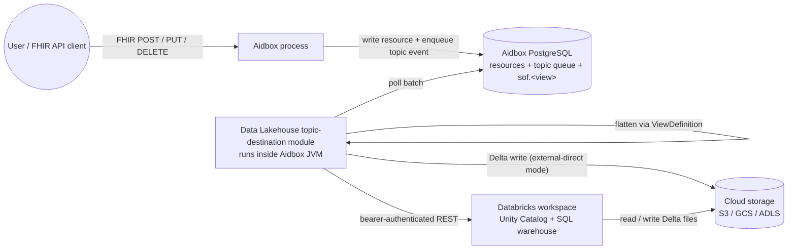
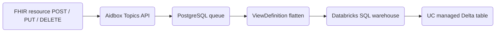
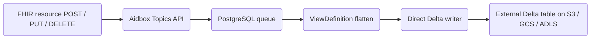
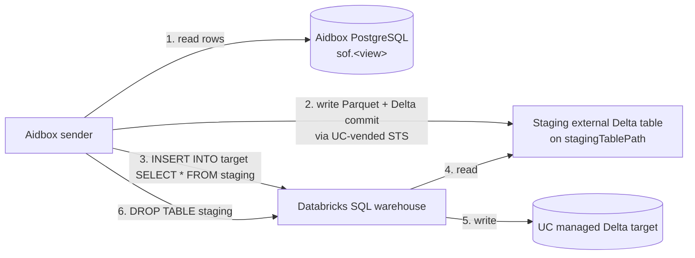
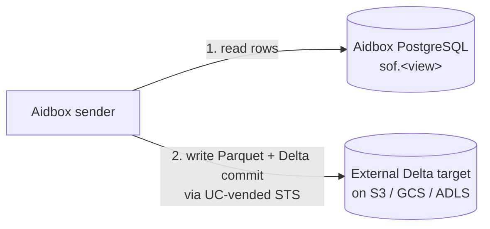

# Data Lakehouse AidboxTopicDestination


This functionality is available starting from Aidbox version **2605**.


## Background: the stack you'll be using

If you're already comfortable with Databricks, Unity Catalog, and Delta Lake, skip to [Overview](#overview).

### Databricks

[Databricks](https://www.databricks.com/) is a managed analytics platform. For this tutorial you only need to think of it as **two things bundled together**:

1. **Unity Catalog (UC)** — the metadata + governance layer. UC knows about every catalog, schema, table, column, and grant in your workspace. It also issues short-lived cloud-storage credentials on demand ("vending") so external clients can write data without being given long-lived bucket keys.
2. **SQL warehouse** — a compute cluster that executes SQL on your behalf. You send a statement over a REST endpoint, the warehouse runs it on data sitting in cloud storage, and returns the result.

The module talks to both: Unity Catalog for metadata + credential vending, and the SQL warehouse for executing INSERTs into Databricks-managed tables.

### Data lakehouse, and Delta Lake as its implementation

A **data lakehouse** is a hybrid of two older patterns:

- A **data lake** stores raw files (Parquet, JSON, CSV) on cheap object storage (S3, GCS, ADLS). Scalable and cheap, but no schema enforcement, no ACID transactions, no time travel.
- A **data warehouse** (Snowflake, Redshift, BigQuery) gives you ACID + schema + indexes — at the cost of a proprietary storage format you don't own.

A lakehouse is the lake side with the warehouse's guarantees bolted on: ACID, schema, and time travel **on plain Parquet files in your own bucket**. The thing doing that bolting is an **open table format** — and [Delta Lake](https://delta.io/) is the one this module uses. A Delta table is a directory on object storage:

```
s3://bucket/prefix/my_table/
├── _delta_log/
│   ├── 00000000000000000000.json       ← transaction log: each commit is one JSON file
│   ├── 00000000000000000001.json
│   └── ...
├── part-00000-xxx.snappy.parquet       ← row data
├── part-00001-xxx.snappy.parquet
└── ...
```

The `_delta_log/` directory is the source of truth. To read the table, replay the log to get a list of active Parquet files and their stats. To write, append a new `.json` commit describing the files added or removed. Multiple writers coordinate via optimistic concurrency on log filenames — that's where Delta's ACID comes from.

### External vs managed tables

Unity Catalog tables come in two flavours:

|                          | **Managed**                                                        | **External**                                                                |
| ------------------------ | ------------------------------------------------------------------ | --------------------------------------------------------------------------- |
| Storage location         | Databricks-managed bucket (you don't see / pick the path)          | Your bucket — declared with `LOCATION 's3://...'` at `CREATE TABLE`         |
| Who owns the files       | Databricks runtime                                                 | You                                                                         |
| `DROP TABLE`             | Deletes the data                                                   | Drops metadata only — files stay in your bucket                             |
| External STS vending     | **Refused.** UC won't hand out write creds — managed tables can't be written by anything but Databricks compute | **Allowed** if the principal has `EXTERNAL USE SCHEMA`                      |
| Predictive Optimization  | Automatic — Databricks runs `OPTIMIZE` / `VACUUM` / `ANALYZE` for you | Not applicable — you run them yourself                                      |
| Liquid Clustering        | Default                                                            | Opt-in per table                                                            |
| Best for                 | Production analytics with UC governance + zero maintenance         | Multi-cloud, cost-sensitive, you-own-the-files architectures                |

The split matters because it dictates which write path the module can use:

- For a **managed table** the module must route writes through Databricks compute (a SQL warehouse) — UC vending is a non-starter. That's `writeMode=managed`.
- For an **external table** the module can either route through compute (also possible, but pays for warehouse hours unnecessarily) or have UC vend STS credentials and write directly from the sender process. The module picks the direct path — that's `writeMode=external-direct`.

## Overview

The Data Lakehouse Topic Destination module exports FHIR resources from Aidbox to a Delta Lake table in a flattened format using [ViewDefinitions](../../modules/sql-on-fhir/defining-flat-views-with-view-definitions.md) and SQL-on-FHIR technology.

### High-level architecture



The module ships as a JAR loaded into the Aidbox JVM. It does not run as a separate process and has no state of its own — everything it needs (resources, topic queue, ViewDefinition output) lives in Aidbox PostgreSQL.

### Append-only output

Every change to a FHIR resource is written as a **new row** in the Delta table — there are no in-place UPDATEs or DELETEs:

- **Create** → new row with `is_deleted = 0`
- **Update** → new row with `is_deleted = 0` (old row remains)
- **Delete** → new row with `is_deleted = 1`

So a patient that was created and then updated 3 times appears as 4 rows. Add `meta.lastUpdated` to your ViewDefinition as a `ts` column and use a window function to recover the latest state. The query is in [Delivery guarantees](#delivery-guarantees) and reused for read-time dedup.

### Write modes

The module supports two **write modes**, picked per-destination via the `writeMode` parameter.

### `writeMode: managed` (default)

Targets a **Databricks Unity Catalog managed table**.



- Each batch becomes a single `INSERT INTO managed (cols) VALUES (...)` statement sent to a Databricks SQL warehouse over REST. The warehouse writes Parquet + commits to the managed table.
- Initial bulk export uses a **temporary staging table** under `stagingTablePath` because Databricks-managed tables refuse direct writes from outside their compute. See [Initial Export](#how-it-works-managed-mode) for the staging diagram.
- The warehouse must stay warm to keep INSERT latency low — you trade compute hours for Unity Catalog governance + Predictive Optimization.

### `writeMode: external-direct`

Targets a **non-managed external Delta table** that you own.



- The module writes Parquet + Delta commits straight to your bucket from the Aidbox process. No SQL warehouse involved.
- Storage backends supported: S3, MinIO, Garage, GCS, Azure ADLS Gen2.
- Zero Databricks compute cost. In return, you're responsible for running `OPTIMIZE` / `VACUUM` on the table yourself.

## Delivery guarantees

Both modes are **at-least-once**. Messages are persisted in a PostgreSQL queue before being sent — if delivery fails, the message stays in the queue and is retried on the next batch cycle.

The two modes differ in what happens during a crash-between-commit-and-ack — the narrow window where the write landed in storage but the sender died before marking the queue entry as delivered:

- **`external-direct`** is restart-safe-idempotent. Every commit carries a stable transaction id, so when the replayed batch hits Delta a second time, Delta itself recognises it and silently skips it.
- **`managed`** can produce duplicates. The route to the warehouse can't carry that transaction id, so a replayed batch becomes a second INSERT and a duplicate row.

Deduplicate downstream on read with a window function on `(id, ts)`:

```sql
SELECT * EXCEPT(rn) FROM (
  SELECT *, ROW_NUMBER() OVER (PARTITION BY id ORDER BY ts DESC) AS rn
  FROM aidbox_export.healthcare.patients
)
WHERE rn = 1 AND is_deleted = 0;
```

## Key Features

- **Real-time data export**: Automatically exports FHIR resources to Delta Lake as they are created, updated, or deleted
- **Data flattening**: Uses ViewDefinitions to transform complex FHIR resources into flat, analytical-friendly tables
- **At-least-once delivery**: Persistent message queue with guaranteed delivery and batch processing
- **Initial export**: Automatically exports existing data when setting up a new destination
- **Schema drift auto-heal (managed mode)**: When a column is added to the ViewDefinition, the module automatically issues `ALTER TABLE ADD COLUMNS` on the managed target — no manual sync required
- **Monitoring**: Built-in metrics and status reporting via `$status` endpoint

## Choosing between `managed` and `external-direct`

|                                | `managed` (default)                                                      | `external-direct`                                                  |
| ------------------------------ | ------------------------------------------------------------------------ | ------------------------------------------------------------------ |
| Table type                     | Unity Catalog **managed** (Databricks owns the files)                    | **External** (the User's bucket owns the files)                    |
| Storage backends               | Whatever Databricks-managed storage your workspace is set up with        | S3, MinIO, Garage, GCS, ADLS Gen2                                  |
| Write path                     | SQL warehouse runs `INSERT`                                              | Direct Parquet + Delta commit straight to the User's bucket        |
| Initial export                 | Staging external Delta → `INSERT INTO managed SELECT * FROM staging`     | Single Delta commit straight to the target                         |
| Throughput                     | Bound by warehouse size (~10-100k rows/sec)                              | 100k+ rows/sec direct-to-storage                                   |
| Databricks compute cost        | Warehouse must stay warm — ~$2,000/month per running 2X-Small Serverless | Zero — no warehouse involvement                                    |
| Compaction / OPTIMIZE / VACUUM | Automatic via Databricks Predictive Optimization                         | The User runs them (e.g. scheduled `OPTIMIZE` job)                 |
| Schema drift handling          | Aidbox auto-`ALTER`s the target on schema mismatch                       | Fail-loud at bootstrap — the User runs `ALTER TABLE`               |
| Best for                       | Production analytics with UC governance                                  | High-throughput pipelines, multi-cloud, cost-sensitive deployments |


**Default is `managed`.** If `writeMode` isn't set on the destination, the module uses the Databricks SQL warehouse path. Set `writeMode=external-direct` explicitly to get the direct-to-storage flow.


## Before you begin

- Make sure your Aidbox version is **2605** or newer
- Set up a local Aidbox instance using the getting started [guide](../../getting-started/run-aidbox-locally.md)
- Have a Databricks workspace (Free Edition works for evaluation, paid for production)
- Have a service principal (SP) with OAuth M2M credentials (`client_id` + `client_secret`)
- For `managed` mode: a running SQL warehouse, a managed Delta table, and (if doing initial export) an S3/GCS/ADLS path you control with a UC External Location for staging
- For `external-direct` mode: an external Delta table registered in UC (or static AWS keys for non-UC deployments)

## Installation

### Docker Compose

1. Download the Databricks module JAR file and place it next to your **docker-compose.yaml**:

   ```sh
   curl -O https://storage.googleapis.com/aidbox-modules/topic-destination-deltalake/topic-destination-deltalake-2605.0.jar
   ```

2. Edit your **docker-compose.yaml** and add these lines to the Aidbox service:

   ```yaml
   aidbox:
     volumes:
       - ./topic-destination-deltalake-2605.0.jar:/topic-destination-deltalake.jar
       # ... other volumes ...
     environment:
       BOX_MODULE_LOAD: io.healthsamurai.topic-destination.data-lakehouse.core
       BOX_MODULE_JAR: "/topic-destination-deltalake.jar"
       BOX_FHIR_SCHEMA_VALIDATION: "true"
       # ... other environment variables ...
   ```

3. Start Aidbox:

   ```sh
   docker compose up
   ```

4. Verify the module is loaded. In Aidbox UI, go to **FHIR Packages** and check that the Delta Lake profile is present:
   `http://health-samurai.io/fhir/core/StructureDefinition/aidboxtopicdestination-dataLakehouseAtLeastOnceProfile`


The profile URL above is a FHIR canonical identifier, not an HTTP endpoint. You can find it in the Aidbox UI under FHIR Packages.


### Kubernetes

For Kubernetes deployments, the module can be downloaded automatically using an init container:

```yaml
apiVersion: apps/v1
kind: Deployment
metadata:
  name: aidbox
spec:
  template:
    spec:
      initContainers:
        - name: download-deltalake-module
          image: debian:bookworm-slim
          command:
            - sh
            - -c
            - |
              apt-get -y update && apt-get -y install curl
              curl -L -o /modules/topic-destination-deltalake.jar \
                https://storage.googleapis.com/aidbox-modules/topic-destination-deltalake/topic-destination-deltalake-2605.0.jar
              chmod 644 /modules/topic-destination-deltalake.jar
          volumeMounts:
            - mountPath: /modules
              name: modules-volume
      containers:
        - name: aidbox
          image: healthsamurai/aidboxone:edge
          env:
            - name: BOX_MODULE_LOAD
              value: "io.healthsamurai.topic-destination.data-lakehouse.core"
            - name: BOX_MODULE_JAR
              value: "/modules/topic-destination-deltalake.jar"
            - name: BOX_FHIR_SCHEMA_VALIDATION
              value: "true"
            # ... other environment variables ...
          volumeMounts:
            - name: modules-volume
              mountPath: /modules
      volumes:
        - name: modules-volume
          emptyDir: {}
```


This is a partial Deployment manifest showing only the module-related configuration. You still need your existing Aidbox environment variables, Service, and other Kubernetes resources. Use a pinned Aidbox version (e.g., `healthsamurai/aidboxone:2605`) for production instead of `edge`.


### Updating the module

When a new version is released, update the JAR URL/filename in your deployment configuration and restart Aidbox. Available versions are listed in `gs://aidbox-modules/topic-destination-deltalake/`.

## Configuration

All requests in this tutorial use `Content-Type: application/json`.

### Common parameters (both modes)

| Parameter           | Type        | Required | Description                                                |
| ------------------- | ----------- | -------- | ---------------------------------------------------------- |
| `viewDefinition`    | string      | yes      | The `name` field of the ViewDefinition resource (not `id`) |
| `batchSize`         | unsignedInt | yes      | Rows per worker tick / batch commit                        |
| `sendIntervalMs`    | unsignedInt | yes      | Max time between batched commits, in ms                    |
| `writeMode`         | string      | no       | `managed` (default) or `external-direct`                   |
| `skipInitialExport` | boolean     | no       | Skip initial export of existing data (default: `false`)    |
| `targetFileSizeMb`  | unsignedInt | no       | Parquet target size during initial export (default: `128`) |

### `writeMode = managed` parameters

| Parameter                | Type   | Required    | Description                                                                                               |
| ------------------------ | ------ | ----------- | --------------------------------------------------------------------------------------------------------- |
| `databricksWorkspaceUrl` | string | yes         | `https://<workspace>.cloud.databricks.com`                                                                |
| `databricksClientId`     | string | yes         | SP `client_id` for OAuth M2M                                                                              |
| `databricksClientSecret` | string | yes         | SP `client_secret`; supports vault refs                                                                   |
| `tableName`              | string | yes         | Managed table full name: `catalog.schema.table`                                                           |
| `databricksWarehouseId`  | string | yes         | SQL warehouse ID for INSERT / COPY INTO / ALTER                                                           |
| `awsRegion`              | string | yes         | AWS region of the staging bucket                                                                          |
| `stagingTablePath`       | string | conditional | `s3://bucket/path/` for the external staging Delta table. Required when `skipInitialExport` is not `true` |

### `writeMode = external-direct` parameters

| Parameter                | Type   | Required    | Description                                                                            |
| ------------------------ | ------ | ----------- | -------------------------------------------------------------------------------------- |
| `tablePath`              | string | conditional | `s3://...` / `gs://...` / `abfss://...` — required unless using UC vending             |
| `databricksWorkspaceUrl` | string | no          | If set: UC credential vending; `tableName` must also be set                            |
| `databricksClientId`     | string | conditional | Required iff `databricksWorkspaceUrl` set                                              |
| `databricksClientSecret` | string | conditional | Required iff `databricksWorkspaceUrl` set                                              |
| `tableName`              | string | conditional | UC `catalog.schema.table` (when using UC vending)                                      |
| `awsRegion`              | string | conditional | Required for real AWS / GovCloud                                                       |
| `awsAccessKeyId`         | string | no          | Static IAM key (falls back to default provider chain when absent). Supports vault refs |
| `awsSecretAccessKey`     | string | no          | Static IAM secret. Supports vault refs                                                 |
| `s3Endpoint`             | string | no          | MinIO / LocalStack endpoint (forces path-style URLs)                                   |


**Choosing batch parameters:** For low-latency dashboards, use small batches (e.g., `batchSize: 10`, `sendIntervalMs: 1000`). For high-throughput bulk workloads, use larger batches (e.g., `batchSize: 500`, `sendIntervalMs: 5000`). Start with `batchSize: 50` and `sendIntervalMs: 5000` as a reasonable default.


## Authentication

Both modes authenticate to Databricks via **OAuth Machine-to-Machine (M2M)** with a service principal.

```mermaid
sequenceDiagram
    autonumber
    participant S as Aidbox sender
    participant T as Databricks token endpoint
    participant UC as Unity Catalog REST
    participant WH as SQL warehouse
    participant FS as Cloud storage (S3 / GCS / ADLS)

    S->>T: client_id + client_secret (HTTP Basic)
    T-->>S: bearer token (about 1h TTL)
    Note over S: cached; refreshed when under 5 min remain

    alt writeMode = managed
        S->>WH: submit INSERT / ALTER / DESCRIBE + bearer
        WH->>FS: warehouse storage credential writes parquet
        WH-->>S: SUCCEEDED
    else writeMode = external-direct
        S->>UC: resolve table_id + bearer
        UC-->>S: table_id
        S->>UC: request temporary credentials + bearer
        UC-->>S: STS access_key + secret + session_token
        S->>FS: module writes parquet + Delta commit using STS
    end
```

### How the same token gets used differently in each mode

The module exchanges `databricksClientId` + `databricksClientSecret` for a short-lived bearer token via `POST /oidc/v1/token` (`client_credentials` grant). That bearer is cached and re-issued automatically when less than 5 minutes remain. What changes between modes is **what the bearer authorizes**:

**`managed`** — bearer authenticates every call to Databricks compute:

- The module never touches your bucket directly.
- The module submits SQL to the warehouse; the warehouse's storage credential talks to storage.
- Calls the module makes:
  - `POST /api/2.0/sql/statements` — `INSERT INTO target VALUES (...)` (every batch)
  - `POST /api/2.0/sql/statements` — `ALTER TABLE ADD COLUMNS (...)` (schema drift)
  - `POST /api/2.0/sql/statements` — `SELECT * FROM information_schema.columns ...` (schema introspection)
- Initial bulk export reuses the same bearer twice:
  - once to register a staging external Delta table + UC-vend STS for it (so the module can write the bulk parquet from the Aidbox process)
  - once to issue `INSERT INTO target SELECT * FROM staging` on the warehouse

**`external-direct`** — bearer authenticates Unity Catalog REST only, never SQL:

- The module asks UC for short-lived AWS STS credentials scoped to one table, then writes directly to S3 from the sender process. No Databricks compute involved.
- Calls the module makes:
  - `GET /api/2.1/unity-catalog/tables/{full_name}` — resolves `full_name` to a `table_id`
  - `POST /api/2.1/unity-catalog/temporary-table-credentials` — exchanges `table_id` + `READ_WRITE` for `access_key` + `secret_key` + `session_token`
- A background thread refreshes the STS session 15 min before expiry and reconnects the writer, so writes never see expired session tokens.
- If `databricksWorkspaceUrl` is **not** set, UC is skipped entirely:
  - static AWS keys from `awsAccessKeyId` / `awsSecretAccessKey`, or
  - the [AWS default provider chain](https://docs.aws.amazon.com/sdk-for-java/latest/developer-guide/credentials-chain.html) — IAM instance profile, IRSA on EKS, environment variables.

### Side-by-side

| Mode                | UC REST calls                                | SQL Statement API calls               | Who talks to S3         |
| ------------------- | -------------------------------------------- | ------------------------------------- | ----------------------- |
| `managed` (default) | only during initial-export (staging vending) | every batch (INSERT, ALTER, DESCRIBE) | SQL warehouse compute   |
| `external-direct`   | every cred-refresh (~45 min)                 | none                                  | sender process          |

### Setting up a service principal

1. In your Databricks workspace, go to **Settings → Identity and access → Service principals → Add service principal**.
2. Give it a name (e.g., `aidbox-topic-destination`) and create.
3. Click on the new SP, go to **Secrets** tab → **Generate secret**.
4. Copy the **Client ID** and **Secret** — you'll use these as `databricksClientId` / `databricksClientSecret`.

### Storing the secret in Vault (recommended for production)

Instead of embedding the SP secret inline, store it on disk and reference it through Aidbox [External Secrets](../../configuration/secret-files.md):

1. Place the secret in a file on disk (e.g., via [Kubernetes Secrets](https://kubernetes.io/docs/concepts/configuration/secret/), [Docker Secrets](https://docs.docker.com/engine/swarm/secrets/), or [Secrets Store CSI Driver](../../tutorials/other-tutorials/hashicorp-vault-external-secrets.md)).

2. Create a vault config file (e.g., `vault-config.json`):

   ```json
   {
     "secret": {
       "dbx-sp-secret": {
         "path": "/run/secrets/dbx-sp-secret",
         "scope": { "resource_type": "AidboxTopicDestination" }
       }
     }
   }
   ```

3. Set `BOX_VAULT_CONFIG` environment variable to point to the vault config file.

4. Reference the secret in the destination configuration using the FHIR primitive extension pattern (see [Step 6](#step-6-configure-the-destination-managed) below).

## Required Databricks privileges

### Common to both modes

The service principal needs catalog/schema visibility and read+write access to the target table — regardless of `writeMode`:

```sql
GRANT USE CATALOG ON CATALOG <catalog>             TO `<sp-client-id>`;
GRANT USE SCHEMA  ON SCHEMA  <catalog>.<schema>    TO `<sp-client-id>`;
GRANT MODIFY      ON TABLE   <catalog>.<schema>.<table> TO `<sp-client-id>`;
GRANT SELECT      ON TABLE   <catalog>.<schema>.<table> TO `<sp-client-id>`;
```

### Mode-specific additions



The SP also needs to drive a SQL warehouse:

```sql
-- Also grantable via UI: SQL Warehouses → your warehouse → Permissions → Add → Can use
GRANT USAGE ON WAREHOUSE `<warehouse-id>` TO `<sp-client-id>`;
```

If you set `skipInitialExport=false` and need initial bulk export, you **also** need the `external-direct` grants — the staging table the module creates during initial export is itself an external Delta table and goes through UC credential vending.



The SP needs Unity Catalog to vend storage credentials for the external target:

```sql
-- Required for UC credential vending on external tables
GRANT EXTERNAL USE SCHEMA ON SCHEMA <catalog>.<schema> TO `<sp-client-id>`;
```

If the table sits at a registered External Location, also grant on that location:

```sql
GRANT READ FILES, WRITE FILES, CREATE EXTERNAL TABLE
  ON EXTERNAL LOCATION `<external-location-name>` TO `<sp-client-id>`;
```


`EXTERNAL USE SCHEMA` is **only grantable on external schemas** (where the schema's tables sit at an external location). UC managed schemas refuse this grant by design — managed tables can't be vended.




## Usage Example: Patient Data Export

The example below uses `managed` mode (the default). See "[Alternative: external-direct configuration](#alternative-external-direct-configuration)" for the non-managed path.



### Step 1: Create Subscription Topic

```http
POST /fhir/AidboxSubscriptionTopic

{
  "resourceType": "AidboxSubscriptionTopic",
  "url": "http://example.org/subscriptions/patient-updates",
  "status": "active",
  "trigger": [
    {
      "resource": "Patient",
      "supportedInteraction": ["create", "update", "delete"],
      "fhirPathCriteria": "name.exists()"
    }
  ]
}
```




### Step 2: Create ViewDefinition

A [ViewDefinition](../../modules/sql-on-fhir/defining-flat-views-with-view-definitions.md) defines how to transform a complex FHIR resource into a flat table structure suitable for analytics. Each `column` maps a [FHIRPath](https://hl7.org/fhirpath/) expression to a named column.

```http
POST /fhir/ViewDefinition

{
  "resourceType": "ViewDefinition",
  "id": "patient_flat",
  "name": "patient_flat",
  "resource": "Patient",
  "status": "active",
  "select": [
    {
      "column": [
        {"name": "id", "path": "id"},
        {"name": "gender", "path": "gender"},
        {"name": "birth_date", "path": "birthDate"}
      ]
    },
    {
      "forEach": "name.where(use = 'official').first()",
      "column": [
        {"name": "family_name", "path": "family"},
        {"name": "given_name", "path": "given.join(' ')"}
      ]
    }
  ]
}
```




### Step 3: Materialize ViewDefinition

The ViewDefinition must be [materialized](../../modules/sql-on-fhir/operation-materialize.md) as a database view before the module can use it to transform data. Materialization creates a SQL view in the `sof` schema.

```http
POST /fhir/ViewDefinition/patient_flat/$materialize

{
  "resourceType": "Parameters",
  "parameter": [
    {
      "name": "type",
      "valueCode": "view"
    }
  ]
}
```


The ViewDefinition must be materialized as a **view** (not a table). See the [`$materialize` operation](../../modules/sql-on-fhir/operation-materialize.md) documentation for details.





### Step 4: Set up Databricks side

#### 4a. Catalog and schema

In the Databricks SQL Editor (Catalog Explorer → Create catalog / schema, or via SQL):

```sql
CREATE CATALOG IF NOT EXISTS aidbox_export;
CREATE SCHEMA  IF NOT EXISTS aidbox_export.healthcare;
```

#### 4b. Managed Delta table

```sql
CREATE TABLE aidbox_export.healthcare.patients (
  id          STRING,
  gender      STRING,
  birth_date  DATE,
  family_name STRING,
  given_name  STRING,
  is_deleted  INT
) USING DELTA;
```


The table **must** include an `is_deleted` column (`INT`). The module sets this to `0` for create/update operations and `1` for delete operations.

**No `LOCATION` clause** — that's what makes this a managed table. UC owns the physical layout, runs Predictive Optimization automatically, and refuses external STS-vended writes — which is why `managed` mode goes through the SQL warehouse.


**Type mapping:**

| FHIR / ViewDefinition type | Databricks SQL type |
| -------------------------- | ------------------- |
| `id`, `string`, `code`     | `STRING`            |
| `date`                     | `DATE`              |
| `dateTime`, `instant`      | `TIMESTAMP`         |
| `integer`, `positiveInt`   | `INT`               |
| `decimal`                  | `DOUBLE`            |
| `boolean`                  | `BOOLEAN`           |


The module **automatically issues `ALTER TABLE ADD COLUMNS`** in managed mode when the ViewDefinition has columns the managed target is missing — you don't have to keep them in sync manually. See [Schema Evolution](#schema-evolution).


#### 4c. SQL warehouse

Compute → SQL Warehouses → use an existing warehouse or create a new one. Serverless 2X-Small is the cheapest option that supports the Statement Execution API. Copy the **Warehouse ID** — you'll use it as `databricksWarehouseId`.

#### 4d. Service principal grants

```sql
GRANT USE CATALOG ON CATALOG aidbox_export       TO `<sp-client-id>`;
GRANT USE SCHEMA  ON SCHEMA  aidbox_export.healthcare TO `<sp-client-id>`;
GRANT MODIFY ON TABLE aidbox_export.healthcare.patients TO `<sp-client-id>`;
GRANT SELECT ON TABLE aidbox_export.healthcare.patients TO `<sp-client-id>`;
```

And via UI: SQL Warehouses → your warehouse → **Permissions** → Add → service principal → **Can use**.

#### 4e. (Optional) Staging location for initial export

If you plan to use `skipInitialExport=false` (the default), you also need a UC **External Location** for the staging Delta table the module will write to during bulk export.

1. **Provision an S3 bucket** (or GCS / ADLS prefix) owned by your account. Example: `s3://my-aidbox-staging/`.
2. **Configure a Storage Credential** in Databricks (Data → External Data → Credentials). For S3 this is an IAM role with trust policy granting Databricks AWS account access; follow [Databricks docs on storage credentials](https://docs.databricks.com/en/connect/unity-catalog/storage-credentials.html).
3. **Create the External Location** in Databricks (Data → External Data → External Locations) pointing at the bucket path with the Storage Credential.
4. **Grant the SP** read/write on the external location:

   ```sql
   GRANT READ FILES, WRITE FILES, CREATE EXTERNAL TABLE
     ON EXTERNAL LOCATION `<external-location-name>` TO `<sp-client-id>`;
   GRANT EXTERNAL USE SCHEMA ON SCHEMA aidbox_export.healthcare TO `<sp-client-id>`;
   ```

   `EXTERNAL USE SCHEMA` is required because the staging table is created as an external table under `aidbox_export.healthcare`.




### Step 5: Configure the destination (`managed`)

**With inline SP secret:**

```http
POST /fhir/AidboxTopicDestination

{
  "resourceType": "AidboxTopicDestination",
  "id": "patient-databricks",
  "topic": "http://example.org/subscriptions/patient-updates",
  "kind": "data-lakehouse-at-least-once",
  "meta": {
    "profile": [
      "http://health-samurai.io/fhir/core/StructureDefinition/aidboxtopicdestination-dataLakehouseAtLeastOnceProfile"
    ]
  },
  "parameter": [
    {"name": "writeMode", "valueString": "managed"},
    {"name": "databricksWorkspaceUrl", "valueString": "https://dbc-XXXXXXXX-XXXX.cloud.databricks.com"},
    {"name": "databricksClientId", "valueString": "<sp-client-id>"},
    {"name": "databricksClientSecret", "valueString": "<sp-client-secret>"},
    {"name": "tableName", "valueString": "aidbox_export.healthcare.patients"},
    {"name": "databricksWarehouseId", "valueString": "<warehouse-id>"},
    {"name": "awsRegion", "valueString": "us-east-1"},
    {"name": "stagingTablePath", "valueString": "s3://my-aidbox-staging/patient_flat_staging/"},
    {"name": "viewDefinition", "valueString": "patient_flat"},
    {"name": "batchSize", "valueUnsignedInt": 50},
    {"name": "sendIntervalMs", "valueUnsignedInt": 5000}
  ]
}
```

**With Vault secret reference:**

```http
POST /fhir/AidboxTopicDestination

{
  "resourceType": "AidboxTopicDestination",
  "id": "patient-databricks",
  "topic": "http://example.org/subscriptions/patient-updates",
  "kind": "data-lakehouse-at-least-once",
  "meta": {
    "profile": [
      "http://health-samurai.io/fhir/core/StructureDefinition/aidboxtopicdestination-dataLakehouseAtLeastOnceProfile"
    ]
  },
  "parameter": [
    {"name": "writeMode", "valueString": "managed"},
    {"name": "databricksWorkspaceUrl", "valueString": "https://dbc-XXXXXXXX-XXXX.cloud.databricks.com"},
    {"name": "databricksClientId", "valueString": "<sp-client-id>"},
    {"name": "databricksClientSecret", "_valueString": {"extension": [
      {"url": "http://hl7.org/fhir/StructureDefinition/data-absent-reason", "valueCode": "masked"},
      {"url": "http://health-samurai.io/fhir/secret-reference", "valueString": "dbx-sp-secret"}
    ]}},
    {"name": "tableName", "valueString": "aidbox_export.healthcare.patients"},
    {"name": "databricksWarehouseId", "valueString": "<warehouse-id>"},
    {"name": "awsRegion", "valueString": "us-east-1"},
    {"name": "stagingTablePath", "valueString": "s3://my-aidbox-staging/patient_flat_staging/"},
    {"name": "viewDefinition", "valueString": "patient_flat"},
    {"name": "batchSize", "valueUnsignedInt": 50},
    {"name": "sendIntervalMs", "valueUnsignedInt": 5000}
  ]
}
```

The `_valueString` extension tells Aidbox to resolve the value from the vault secret named `dbx-sp-secret` at runtime. The actual key is never stored in the database — only the secret reference name. See [External Secrets](../../configuration/secret-files.md) for details on the extension format.




### Step 6: Verify

Create a test patient:

```http
POST /fhir/Patient

{
  "name": [{"use": "official", "family": "Smith", "given": ["John"]}],
  "gender": "male",
  "birthDate": "1990-01-15"
}
```

Then query your Databricks table to confirm the data arrived:

```sql
SELECT * FROM aidbox_export.healthcare.patients;
```



### Stopping the export

To stop exporting data, delete the `AidboxTopicDestination` resource:

```http
DELETE /fhir/AidboxTopicDestination/patient-databricks
```

This stops the export and cleans up the internal message queue. Data already written to Databricks is not affected.

## Alternative: `external-direct` configuration

If you don't need UC managed-table governance and want the highest throughput (direct-to-storage Parquet writes, zero Databricks compute cost), use `writeMode=external-direct`. The module commits Parquet + Delta transaction-log entries straight to your bucket via UC credential vending.

### Setup differences from `managed`

1. **Create the table with `LOCATION`** so it's external:

   ```sql
   CREATE TABLE aidbox_export.healthcare.patients (
     id          STRING,
     gender      STRING,
     birth_date  DATE,
     family_name STRING,
     given_name  STRING,
     is_deleted  INT
   ) USING DELTA LOCATION 's3://my-aidbox-bucket/patients/';
   ```

2. **No warehouse needed** — writes don't go through SQL compute.

3. **Different grants** — `EXTERNAL USE SCHEMA` on the schema, and `READ FILES, WRITE FILES, CREATE EXTERNAL TABLE` on the External Location backing the bucket (see [Required privileges](#for-external-direct-mode-with-uc-vending)).

4. **No `stagingTablePath`** — initial export writes directly to the final external table; no intermediate staging.

5. **The User owns the schema** — there's no auto-`ALTER` in this mode. If you add a column to the ViewDefinition, you must `ALTER TABLE` yourself before recreating the destination, or initial validation will fail.

### Destination configuration

```http
POST /fhir/AidboxTopicDestination

{
  "resourceType": "AidboxTopicDestination",
  "id": "patient-databricks-external",
  "topic": "http://example.org/subscriptions/patient-updates",
  "kind": "data-lakehouse-at-least-once",
  "meta": {
    "profile": [
      "http://health-samurai.io/fhir/core/StructureDefinition/aidboxtopicdestination-dataLakehouseAtLeastOnceProfile"
    ]
  },
  "parameter": [
    {"name": "writeMode", "valueString": "external-direct"},
    {"name": "databricksWorkspaceUrl", "valueString": "https://dbc-XXXXXXXX-XXXX.cloud.databricks.com"},
    {"name": "databricksClientId", "valueString": "<sp-client-id>"},
    {"name": "databricksClientSecret", "valueString": "<sp-client-secret>"},
    {"name": "tableName", "valueString": "aidbox_export.healthcare.patients"},
    {"name": "awsRegion", "valueString": "us-east-1"},
    {"name": "viewDefinition", "valueString": "patient_flat"},
    {"name": "batchSize", "valueUnsignedInt": 50},
    {"name": "sendIntervalMs", "valueUnsignedInt": 5000}
  ]
}
```

### Static AWS keys (no UC vending)

If you don't want to involve Databricks UC at all — for example, you're writing to a MinIO bucket or a non-Databricks S3 deployment — omit `databricksWorkspaceUrl` entirely and provide static AWS keys + `tablePath`:

```http
POST /fhir/AidboxTopicDestination

{
  "resourceType": "AidboxTopicDestination",
  "id": "patient-deltalake-s3",
  "topic": "http://example.org/subscriptions/patient-updates",
  "kind": "data-lakehouse-at-least-once",
  "meta": {
    "profile": [
      "http://health-samurai.io/fhir/core/StructureDefinition/aidboxtopicdestination-dataLakehouseAtLeastOnceProfile"
    ]
  },
  "parameter": [
    {"name": "writeMode", "valueString": "external-direct"},
    {"name": "tablePath", "valueString": "s3://my-bucket/patients/"},
    {"name": "awsRegion", "valueString": "us-east-1"},
    {"name": "awsAccessKeyId", "valueString": "<key>"},
    {"name": "awsSecretAccessKey", "valueString": "<secret>"},
    {"name": "viewDefinition", "valueString": "patient_flat"},
    {"name": "batchSize", "valueUnsignedInt": 50},
    {"name": "sendIntervalMs", "valueUnsignedInt": 5000}
  ]
}
```

You can also omit `awsAccessKeyId` / `awsSecretAccessKey` to use the default AWS credentials provider chain (EC2 instance profile / EKS IRSA / environment variables).

## Initial Export

When a new destination is created and `skipInitialExport` is not `true`, the module automatically exports all existing data that matches the subscription topic. This ensures your Databricks table has complete historical data.

To skip the initial export (e.g., the table is already populated or you only need real-time data), add `skipInitialExport` to the destination's `parameter` array:

```json
{ "name": "skipInitialExport", "valueBoolean": true }
```

### How it works — `managed` mode

Managed tables can't accept direct writes from outside Databricks compute, so initial bulk export uses a **temporary staging table** as a relay: the module writes the bulk Parquet to an external Delta table at `stagingTablePath` (which it can write to directly via Unity Catalog credential vending), then asks the SQL warehouse to copy from staging into the managed target, then drops the staging table.



Steps in detail:

1. Register a temporary external Delta table at `stagingTablePath` with the same schema as `sof.<view>`.
2. Unity Catalog vends short-lived STS credentials for the staging path.
3. The module writes all `sof.<view>` rows to the staging path as one Delta commit.
4. The module issues `INSERT INTO {managed_target} SELECT * FROM {staging}` against the SQL warehouse — Databricks reads the staging Delta snapshot and writes into the managed table.
5. The module drops the staging table.

The whole sequence runs as one atomic operation from the destination's lifecycle perspective. On failure: best-effort drop of the staging table, retry up to 3 times with exponential backoff (1s → 2s → 4s).


The staging table lives only for the duration of initial export — typically minutes. Once `DROP TABLE staging` succeeds, `stagingTablePath` is left as an empty bucket prefix; you can reuse the same path for future destinations or other purposes.


### How it works — `external-direct` mode



No staging — the module writes `sof.<view>` rows straight to the external target table. All rows land in one Delta commit at the end, so consumers see either zero rows or the full historical batch (all-or-nothing visibility). Requires `EXTERNAL USE SCHEMA` so UC will vend write credentials for the target.

## Monitoring

### Status Endpoint

```http
GET /fhir/AidboxTopicDestination/patient-databricks/$status
```

Returns a FHIR [Parameters](https://www.hl7.org/fhir/parameters.html) resource:

```json
{
  "resourceType": "Parameters",
  "parameter": [
    { "name": "status", "valueString": "active" },
    { "name": "messagesDelivered", "valueDecimal": 100 },
    { "name": "messagesQueued", "valueDecimal": 0 },
    { "name": "messagesInProcess", "valueDecimal": 0 },
    { "name": "messagesDeliveryAttempts", "valueDecimal": 100 },
    { "name": "initialExportStatus", "valueString": "completed" },
    { "name": "initialExportProgress_rowsSent", "valueDecimal": 100 }
  ]
}
```

- `messagesDelivered` — total messages sent to Databricks
- `messagesQueued` — messages waiting in the PG queue
- `messagesInProcess` — messages currently being sent
- `messagesDeliveryAttempts` — total delivery attempts (including retries)
- `initialExportStatus` — `not_started`, `export-in-progress`, `completed`, `skipped`, or `failed`
- `initialExportProgress_rowsSent` — number of rows sent during initial export

## Data Transformation

The module automatically:

1. **Applies ViewDefinition**: Transforms each FHIR resource using the specified ViewDefinition SQL
2. **Adds deletion flag**: Sets `is_deleted = 0` for create/update, `is_deleted = 1` for delete operations
3. **Batches messages**: Groups messages according to `batchSize` and `sendIntervalMs` parameters
4. **Coerces types**: Java SQL dates / timestamps from PostgreSQL are converted to ISO-8601 strings; the warehouse parses them into `DATE` / `TIMESTAMP` columns

### Append-only output and dedup query

See [Append-only output](#append-only-output) in the Overview for the full pattern. In short: every FHIR resource change produces a new row, never an in-place UPDATE; the window-function query in [Delivery guarantees](#delivery-guarantees) returns the latest non-deleted state and also collapses managed-mode retry duplicates.


To track versions, add `meta.lastUpdated` to your ViewDefinition as a `ts` column (type `TIMESTAMP`). Each update appends a new row with a newer `ts`, so you can always find the latest state.


## Compaction and maintenance

**`managed` mode** — Databricks runs maintenance for you:

- [Predictive Optimization](https://docs.databricks.com/aws/en/optimizations/predictive-optimization) is automatic.
- It runs `OPTIMIZE`, `VACUUM`, and `ANALYZE` in the background.
- No manual maintenance required.
- This is the main value-prop of managed mode beyond governance.

**`external-direct` mode** — you own the table and the maintenance:

- Predictive Optimization does **not** apply to external tables.
- Recommended pattern: schedule a [Databricks SQL Job](https://docs.databricks.com/aws/en/jobs/) running

  ```sql
  OPTIMIZE aidbox_export.healthcare.patients;
  VACUUM   aidbox_export.healthcare.patients RETAIN 168 HOURS;
  ```

## Schema Evolution

### `managed` mode (auto-heal)

If you add a column to the ViewDefinition and re-materialize, the module will automatically detect the diff at the next sender start and issue `ALTER TABLE ADD COLUMNS (...)` against the managed target. Additionally, if a write fails mid-batch with `DELTA_INSERT_COLUMN_ARITY_MISMATCH` (e.g., schema drifted between the bootstrap describe and the actual write), the module re-describes the target, ALTERs the missing columns, and retries the batch once.

To add a column:

1. Add the column to your ViewDefinition.
2. Re-materialize: `POST /fhir/ViewDefinition/{id}/$materialize`.
3. Either delete and recreate the destination, OR wait for the next write — auto-heal will catch it on the first batch.

Existing rows will have `NULL` in the new column.


The module only ADDS columns automatically. Column drops, renames, or narrowing type changes (e.g., `BIGINT` → `INT`) are not auto-applied — you must run the corresponding `ALTER TABLE` manually.


### `external-direct` mode (manual)

The User owns the external table schema. If the ViewDefinition adds a column without a matching `ALTER TABLE` on the Databricks side, the destination's healthcheck will **fail at startup** with a clear error message pointing at the missing column.

To add a column:

1. Run `ALTER TABLE aidbox_export.healthcare.patients ADD COLUMNS (new_col STRING)` in Databricks SQL.
2. Add the column to your ViewDefinition.
3. Re-materialize: `POST /fhir/ViewDefinition/{id}/$materialize`.
4. Delete and recreate the destination.

## Cost notes

**`managed` mode** — pays for Databricks compute:

- ~$2,000/month per running 2X-Small Serverless warehouse, kept warm 24/7 to keep INSERT latency low.
- Larger warehouses scale proportionally.
- Storage: managed-table data lives in Databricks-managed cloud storage (still billed to your cloud account, but invisible to you).
- What you get for the money: Predictive Optimization, UC governance, audit trail, zero maintenance.

**`external-direct` mode** — pays for nothing on the Databricks side:

- $0 Databricks compute — no warehouse involvement.
- Storage: your bucket — Parquet + `_delta_log/` written directly. Standard S3 / GCS / ADLS pricing.
- Trade-off: you run your own `OPTIMIZE` / `VACUUM` schedule.

For high-throughput, cost-sensitive deployments, prefer `external-direct`.

## Multiple Destinations

You can create multiple destinations for the same topic — for example, to mirror the same data into both a managed analytics table and an external archive table, or to use different ViewDefinitions for different downstream consumers. Each destination operates independently with its own queue, writer, and status.

## Local Testing with OSS Unity Catalog

You can develop and test the destination locally against [OSS Unity Catalog](https://github.com/unitycatalog/unitycatalog) (which exposes the same REST API surface as Databricks) plus MinIO for storage. This is the setup the module's own integration tests use.

```yaml
services:
  unitycatalog:
    image: unitycatalog/unitycatalog:0.4.0
    ports: ["8081:8081"]
    # ... full config in the topic-destination-deltalake repo's docker-compose.yaml ...

  minio:
    image: quay.io/minio/minio:RELEASE.2024-10-29T16-01-48Z
    ports: ["9000:9000", "9001:9001"]
    environment:
      MINIO_ROOT_USER: minioadmin
      MINIO_ROOT_PASSWORD: minioadmin
    command: server /data --console-address ":9001"
```

Pre-register an external Delta table in OSS UC via its REST API, then point the destination at `databricksWorkspaceUrl=http://unitycatalog:8081`. OSS UC accepts any bearer token in `auth=disable` mode, so the OAuth M2M flow short-circuits.

OSS UC does not implement the Statement Execution API, so **`writeMode=managed` is not testable locally** — only `external-direct` works against OSS UC. For full end-to-end coverage of `managed` mode, point at a Databricks Free Edition workspace (no credit card required for evaluation).

## Retry behavior

See [Delivery guarantees](#delivery-guarantees) for the at-least-once semantics and the per-mode dedup story. This section covers what happens on the wire when a single attempt fails.

If a delivery fails, the message stays in the PostgreSQL queue and is retried on the next batch cycle (every `sendIntervalMs`). There is a 1-second backoff between failed attempts to prevent log storms.

### Token refresh

The OAuth M2M bearer token is cached and refreshed automatically — the module re-issues a fresh token via `/oidc/v1/token` when the current one has less than 5 minutes remaining.

### Worker Crash Recovery

If the delivery worker thread crashes with an unexpected error, it automatically restarts with exponential backoff (1 second initially, up to 60 seconds maximum). The PostgreSQL queue ensures no messages are lost between restarts.

### Initial Export Retry

Initial export retries up to 3 times with exponential backoff (1s → 2s → 4s, capped at 30s). If all attempts fail:

- The `initialExportStatus` is set to `failed`
- The error message is available via the `$status` endpoint
- Real-time delivery continues to work — only the initial export is affected
- To retry, delete and recreate the destination

## Troubleshooting

### Common Issues

1. **`EXTERNAL_WRITE_NOT_ALLOWED_FOR_TABLE`** (writeMode=external-direct against a managed table) — UC vending refuses managed tables by design. Either recreate the table as external (with explicit `LOCATION '...'`), or switch the destination to `writeMode=managed`.
2. **`EXTERNAL_ACCESS_DISABLED_ON_METASTORE`** — your Unity Catalog metastore has external data access disabled (the Databricks Free Edition default). In Catalog Explorer → Metastore → enable **External data access**.
3. **`Privilege EXTERNAL USE SCHEMA is not applicable to this entity`** — you're trying to grant `EXTERNAL USE SCHEMA` on a managed schema. Either recreate the schema as external, or switch to `writeMode=managed`.
4. **`INSUFFICIENT_PRIVILEGES` on table or warehouse** — verify all grants in the [Required privileges](#required-databricks-privileges) section. Don't forget the **Can use** permission on the warehouse via UI.
5. **`DELTA_INSERT_COLUMN_ARITY_MISMATCH`** in managed mode — the module should auto-heal this once. If it persists, check that the schema diff is column-add only (drops / renames are not auto-applied).
6. **Schema mismatch in external-direct mode** — the module fails at startup with a clear message naming the missing columns. Run the corresponding `ALTER TABLE` and recreate the destination.
7. **Slow first write** — Serverless warehouses cold-start in 30-90s on first use after idle. The module's HTTP timeout is 120s for SQL Statement Execution and uses `wait_timeout=50s` polling, so cold starts succeed transparently but the first batch's latency is high. Keep the warehouse warm with a periodic ping if first-batch latency matters.
8. **Duplicate rows after recreating destination** — deleting and recreating a destination triggers initial export again. Set `skipInitialExport: true` when recreating a destination that already has its data exported.

### Debug Tips

- Check the `$status` endpoint for error details
- Verify ViewDefinition works correctly: `GET /fhir/ViewDefinition/patient_flat`
- Test the SP independently: `curl -X POST https://<workspace>/oidc/v1/token -d 'grant_type=client_credentials&scope=all-apis' -u '<client-id>:<client-secret>'`
- Test warehouse access: `POST https://<workspace>/api/2.0/sql/statements` with `{"statement":"SELECT 1","warehouse_id":"<id>"}`
- Check Aidbox logs for detailed error messages — the module emits structured `klog` events under `io.healthsamurai.topic-destination.data-lakehouse.*`

## Related Documentation

- [ViewDefinitions](../../modules/sql-on-fhir/defining-flat-views-with-view-definitions.md)
- [`$materialize` operation](../../modules/sql-on-fhir/operation-materialize.md)
- [Topic-based Subscriptions](../../modules/topic-based-subscriptions/README.md)
- [External Secrets (Vault)](../../configuration/secret-files.md) — storing sensitive parameters like `databricksClientSecret` as file-backed secrets
- [HashiCorp Vault Integration](../../tutorials/other-tutorials/hashicorp-vault-external-secrets.md) — step-by-step tutorial for Kubernetes with Secrets Store CSI Driver
- [Azure Key Vault Integration](../../tutorials/other-tutorials/azure-key-vault-external-secrets.md) — step-by-step tutorial for AKS with Azure Key Vault
- [Databricks: Predictive Optimization](https://docs.databricks.com/aws/en/optimizations/predictive-optimization)
- [Databricks: Unity Catalog managed tables](https://docs.databricks.com/aws/en/tables/managed)
- [Databricks: Statement Execution API](https://docs.databricks.com/api/workspace/statementexecution)
- [Delta Lake protocol](https://github.com/delta-io/delta/blob/master/PROTOCOL.md)
