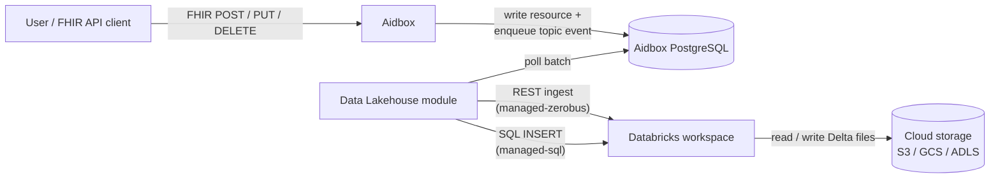
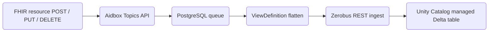
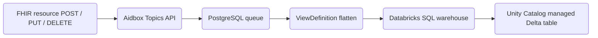
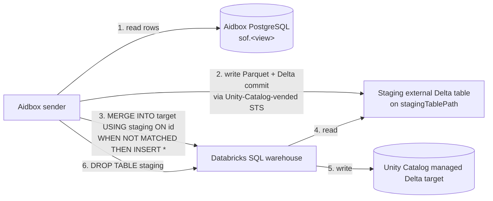

# Data Lakehouse AidboxTopicDestination


This functionality is available starting from Aidbox version **2605**.


This page sets up an `AidboxTopicDestination` that streams FHIR resource changes into Delta-Lake tables — Databricks-managed Unity Catalog tables, or external Delta tables on S3 / GCS / Azure ADLS that you own. Rows are flattened by a [ViewDefinition](../../modules/sql-on-fhir/defining-flat-views-with-view-definitions.md) so analytics consumers see columns, not nested FHIR JSON.

## Background

"Data Lakehouse" is the generic name for the destination category — a hybrid of object-storage data lake and warehouse, implemented here on top of the Delta Lake table format. Concretely the module writes Delta-formatted tables that can live on plain cloud object storage you own, or in Databricks Unity Catalog managed storage; either way the destination kind is the same (`data-lakehouse-at-least-once`).

If you're already comfortable with Databricks, Unity Catalog, and Delta Lake, skip to [Overview](#overview).

### Databricks

[Databricks](https://www.databricks.com/) is a managed analytics platform. For this tutorial you only need to think of it as **three things bundled together**:

1. **[Unity Catalog](https://docs.databricks.com/aws/en/data-governance/unity-catalog/)** — the metadata + governance layer. Unity Catalog knows about every catalog, schema, table, column, and grant in your workspace. It also issues short-lived cloud-storage credentials on demand ("vending") so external clients can write data without being given long-lived bucket keys.
2. **[SQL warehouse](https://docs.databricks.com/aws/en/compute/sql-warehouse/)** — a compute cluster that runs SQL queries against tables in your Unity Catalog. Usually you query it from the Databricks UI's SQL Editor; the module can drive it programmatically over an API.
3. **[Zerobus Ingest](https://docs.databricks.com/aws/en/ingestion/zerobus-overview)** — a push-based ingestion service that writes data directly into Unity Catalog Delta tables. Databricks exposes Zerobus via two transports — gRPC and REST. The Aidbox module uses the [REST endpoint](https://docs.databricks.com/aws/en/ingestion/zerobus-ingest): batches are POSTed as JSON arrays and Zerobus durably commits them to the managed Delta table on the Databricks side.

### Data lakehouse, and Delta Lake as its implementation

A **data lakehouse** is a hybrid of two older patterns:

- A **data lake** stores raw files (Parquet, JSON, CSV) on cheap object storage (S3, GCS, ADLS). Scalable and cheap, but no schema enforcement, no ACID transactions, no time travel.
- A **data warehouse** (Snowflake, Redshift, BigQuery) gives you ACID + schema + indexes — at the cost of a proprietary storage format you don't own.

A lakehouse is the lake side with the warehouse's guarantees bolted on: ACID, schema, and time travel **on plain Parquet files in your own bucket**. The thing doing that bolting is an **open table format** — and [Delta Lake](https://delta.io/) is the one this module uses. A Delta table is a directory on object storage:

```text
s3://bucket/prefix/my_table/
├── _delta_log/
│   ├── 00000000000000000000.json       ← transaction log: each commit is one JSON file
│   ├── 00000000000000000001.json
│   └── ...
├── part-00000-xxx.snappy.parquet       ← row data
├── part-00001-xxx.snappy.parquet
└── ...
```

The `_delta_log/` directory is the source of truth: readers replay it; writers append a new commit. Concurrent writers race on the next log filename — that's where Delta's ACID comes from.

### External vs managed tables

Unity Catalog tables come in two flavours:

|                                | **Managed**                                                          | **External**                                                          |
| ------------------------------ | -------------------------------------------------------------------- | --------------------------------------------------------------------- |
| Status                         | Databricks' **default and recommended** table type                   | Use when you need files in your own bucket                            |
| Storage location               | Databricks-managed cloud storage (path picked by Unity Catalog)      | Your bucket — declared with `LOCATION 's3://...' / 'gs://...' / 'abfss://...'` at `CREATE TABLE` |
| Who owns the files             | Unity Catalog — manages read, write, storage, and optimization       | You — Unity Catalog manages metadata only                                        |
| `DROP TABLE`                   | Deletes the data                                                     | Drops metadata only — files stay in your bucket                       |
| Supported write paths from Aidbox | **Zerobus REST ingest** (Aidbox `managed-zerobus`), or **SQL warehouse INSERT** (Aidbox `managed-sql`) | Not supported by this module — use a managed table |
| External STS credential vending| Not available for managed targets (`EXTERNAL USE SCHEMA` is only grantable on external schemas) | Allowed if the principal has `EXTERNAL USE SCHEMA` on the schema      |
| Predictive Optimization        | Enabled by default for accounts created on or after **2024-11-11**; runs `OPTIMIZE` / `VACUUM` / `ANALYZE` automatically. Billed under the **Jobs Serverless** SKU. | **Not supported** — Predictive Optimization runs only on managed tables |
| Liquid Clustering              | Opt-in per table (automatic liquid clustering requires Predictive Optimization and is also opt-in) | Opt-in per table                                                      |

The "Supported write paths" row drives the module's `writeMode` values — see [Overview](#overview) for the resulting write paths.

## Overview

The module exports FHIR resources from Aidbox to a Delta Lake table in a flattened format using [ViewDefinitions](../../modules/sql-on-fhir/defining-flat-views-with-view-definitions.md) (SQL-on-FHIR).



The flow:

1. A FHIR API client (a user, an integration, a backfill script) sends a `POST` / `PUT` / `DELETE` to Aidbox.
2. Aidbox persists the resource and enqueues a topic event for the destination in PostgreSQL.
3. The Data Lakehouse module polls the destination's batch from the same PostgreSQL queue.
4. For `managed-zerobus` mode (default): the module POSTs each batch as a JSON array to Databricks' Zerobus REST ingest endpoint, which writes directly to the managed table. No SQL parsing / planning per write.
5. For `managed-sql` mode: the module sends `INSERT` (and `ALTER` / `DESCRIBE` when needed) to the Databricks SQL warehouse; the warehouse writes the Delta files to storage.

The module may also perform an initial export of pre-existing resources at first start — see [Initial export](#initial-export) for when this runs and how to skip it.

### Write modes

The module supports two **write modes**, picked per-destination via the `writeMode` parameter (see the [Configuration](#configuration) section below for the full parameter list).

### managed-zerobus mode (default)

`writeMode=managed-zerobus` targets a **Databricks Unity Catalog managed table** via the [Zerobus REST ingest endpoint](https://docs.databricks.com/aws/en/ingestion/zerobus-ingest).



- Each batch is JSON-encoded as an array and POSTed to the Zerobus REST endpoint with an OAuth M2M bearer. No SQL parsing, no warehouse cold-start.
- Initial bulk export uses a one-shot staging Delta table + `MERGE INTO` — same path as `managed-sql`.
- Schema sync at sender bootstrap hits the SQL warehouse once (`INFORMATION_SCHEMA.COLUMNS` + optional `ALTER TABLE`); live writes don't.

### managed-sql mode

`writeMode=managed-sql` — same target as `managed-zerobus` (Unity Catalog **managed** table), but routes incoming batches through a Databricks SQL warehouse. Use this when Zerobus isn't available on your Databricks SKU.



- Each batch becomes a single `INSERT INTO managed (cols) VALUES (...)` against the SQL warehouse.
- Initial bulk export uses a one-shot staging Delta table + `MERGE INTO`. See [Initial export](#how-it-works-managed-modes).

## Choosing between the two modes

**Default to `managed-zerobus`.** Pick `managed-sql` when Zerobus isn't available on your Databricks SKU — same managed target, but every batch hits a warm SQL warehouse.

|                                | `managed-zerobus` (default)                                              | `managed-sql`                                                            |
| ------------------------------ | ------------------------------------------------------------------------ | ------------------------------------------------------------------------ |
| Table type                     | Unity Catalog **managed** (Databricks owns the files)                    | Unity Catalog **managed** (Databricks owns the files)                    |
| Hot-path transport             | Zerobus REST ingest API                                                  | Databricks SQL warehouse (Statement Execution API)                       |
| Who runs maintenance           | Databricks (Predictive Optimization handles `OPTIMIZE` / `VACUUM`)       | Databricks (Predictive Optimization handles `OPTIMIZE` / `VACUUM`)       |
| Databricks compute cost surface| **No warm warehouse** — pay-per-row Zerobus + storage only               | SQL warehouse must be running to accept INSERTs — Databricks bills uptime |
| Schema drift handling          | Auto-`ALTER` on mismatch                                                 | Auto-`ALTER` on mismatch                                                 |
| Initial export path            | Staging Delta on your bucket → `MERGE INTO` target                       | Staging Delta on your bucket → `MERGE INTO` target                       |
| Storage backends               | Databricks-managed storage                                               | Databricks-managed storage                                               |

## Authentication

Both modes authenticate to Databricks via [**OAuth Machine-to-Machine (M2M)**](https://docs.databricks.com/aws/en/dev-tools/auth/oauth-m2m) with a service principal: the module exchanges `client_id` + `client_secret` at the workspace token endpoint for a ~1h bearer token, caches it, and re-issues a fresh one when fewer than 5 minutes remain.

The bearer is sent on every Databricks call. What differs between modes is which Databricks surfaces see it:

| Mode                        | Unity Catalog REST                                       | SQL warehouse                              | Other transport            | Who talks to storage                 |
|-----------------------------|-----------------------------------------------|--------------------------------------------|----------------------------|--------------------------------------|
| `managed-zerobus` (default) | only during initial-export (staging vending)  | bootstrap + initial-export only            | Zerobus REST (every batch) | Zerobus ingest service, Databricks-side |
| `managed-sql`               | only during initial-export (staging vending)  | every batch (`INSERT` / `ALTER` / `DESCRIBE`) | —                          | SQL warehouse compute                 |

The service principal and the grants it needs are set up in the [Usage example](#usage-example-patient-data-export) below.

## Installation

### Prerequisites

- Aidbox **2605** or newer ([install guide](../../getting-started/run-aidbox-locally.md))
- A Databricks workspace (Free Edition works for evaluation, paid for production)
- The [Databricks CLI](https://docs.databricks.com/aws/en/dev-tools/cli/install) installed locally (`brew install databricks/tap/databricks` on macOS) — every Databricks-side operation in the tutorial uses it
- AWS CLI (for initial-export staging — bucket + IAM role)
- A SQL warehouse
- For `managed-zerobus`: Zerobus enabled on your SKU (Databricks Free Edition supports it; for paid plans confirm with Databricks support)
- For initial-export: an S3/GCS/ADLS bucket you control

The service principal that authenticates the module is created in step 3 of the usage example — you don't need it before you start.

### Docker Compose

1. Download the Databricks module JAR file and place it next to your **docker-compose.yaml**:

   ```sh
   curl -O https://storage.googleapis.com/aidbox-modules/topic-destination-deltalake/topic-destination-deltalake-2605.0.jar
   ```

2. Edit your **docker-compose.yaml** and add these lines to the Aidbox service:

   ```yaml
   aidbox:
     volumes:
       - ./topic-destination-deltalake-2605.0.jar:/topic-destination-deltalake.jar
       # ... other volumes ...
     environment:
       BOX_MODULE_LOAD: io.healthsamurai.topic-destination.data-lakehouse.core
       BOX_MODULE_JAR: "/topic-destination-deltalake.jar"
       BOX_FHIR_SCHEMA_VALIDATION: "true"
       # ... other environment variables ...
   ```

3. Start Aidbox:

   ```sh
   docker compose up
   ```

4. Verify the module is loaded. In Aidbox UI, go to **FHIR Packages** and check that the Delta Lake profile is present:
   `http://health-samurai.io/fhir/core/StructureDefinition/aidboxtopicdestination-dataLakehouseAtLeastOnceProfile`


The profile URL above is a FHIR canonical identifier, not an HTTP endpoint. You can find it in the Aidbox UI under FHIR Packages.


### Kubernetes

For Kubernetes deployments, the module can be downloaded automatically using an init container:

```yaml
apiVersion: apps/v1
kind: Deployment
metadata:
  name: aidbox
spec:
  template:
    spec:
      initContainers:
        - name: download-deltalake-module
          image: debian:bookworm-slim
          command:
            - sh
            - -c
            - |
              apt-get -y update && apt-get -y install curl
              curl -L -o /modules/topic-destination-deltalake.jar \
                https://storage.googleapis.com/aidbox-modules/topic-destination-deltalake/topic-destination-deltalake-2605.0.jar
              chmod 644 /modules/topic-destination-deltalake.jar
          volumeMounts:
            - mountPath: /modules
              name: modules-volume
      containers:
        - name: aidbox
          image: healthsamurai/aidboxone:edge
          env:
            - name: BOX_MODULE_LOAD
              value: "io.healthsamurai.topic-destination.data-lakehouse.core"
            - name: BOX_MODULE_JAR
              value: "/modules/topic-destination-deltalake.jar"
            - name: BOX_FHIR_SCHEMA_VALIDATION
              value: "true"
            # ... other environment variables ...
          volumeMounts:
            - name: modules-volume
              mountPath: /modules
      volumes:
        - name: modules-volume
          emptyDir: {}
```

## Configuration

All requests in this tutorial use `Content-Type: application/json`.



**Required:**

<table>
<thead>
<tr><th width="230">Parameter</th><th width="110">Type</th><th>Description</th></tr>
</thead>
<tbody>
<tr><td><code>viewDefinition</code></td><td>string</td><td>The <code>name</code> field of the ViewDefinition resource (not <code>id</code>)</td></tr>
<tr><td><code>batchSize</code></td><td>unsignedInt</td><td>Rows per worker tick / batch commit</td></tr>
<tr><td><code>sendIntervalMs</code></td><td>unsignedInt</td><td>Max time between batched commits, in ms</td></tr>
<tr><td><code>databricksWorkspaceUrl</code></td><td>string</td><td><code>https://&lt;workspace&gt;.cloud.databricks.com</code></td></tr>
<tr><td><code>databricksWorkspaceId</code></td><td>string</td><td>Numeric workspace ID (e.g. <code>1234567890123456</code>). Composes the Zerobus REST endpoint host</td></tr>
<tr><td><code>databricksRegion</code></td><td>string</td><td>Workspace AWS region (e.g. <code>us-east-1</code>). Composes the Zerobus REST endpoint host</td></tr>
<tr><td><code>databricksClientId</code></td><td>string</td><td>Service principal <code>client_id</code> for OAuth M2M</td></tr>
<tr><td><code>databricksClientSecret</code></td><td>string</td><td>Service principal <code>client_secret</code>; supports vault refs</td></tr>
<tr><td><code>tableName</code></td><td>string</td><td>Managed table full name: <code>catalog.schema.table</code></td></tr>
<tr><td><code>databricksWarehouseId</code></td><td>string</td><td>SQL warehouse ID — used at bootstrap for schema sync + (if initial-export runs) the final <code>MERGE INTO</code>. No warm-warehouse traffic during live writes.</td></tr>
<tr><td><code>awsRegion</code></td><td>string</td><td>AWS region of the staging bucket</td></tr>
<tr><td><code>stagingTablePath</code></td><td>string</td><td><code>s3://bucket/path/</code> for the staging Delta table created during initial export. Required when <code>skipInitialExport</code> is not <code>true</code></td></tr>
</tbody>
</table>

<details>

<summary>Advanced parameters</summary>

<table>
<thead>
<tr><th width="230">Parameter</th><th width="110">Type</th><th>Description</th></tr>
</thead>
<tbody>
<tr><td><code>writeMode</code></td><td>string</td><td><code>managed-zerobus</code> (default) or <code>managed-sql</code>. Omit to get <code>managed-zerobus</code></td></tr>
<tr><td><code>skipInitialExport</code></td><td>boolean</td><td>Skip initial export of existing data (default: <code>false</code>)</td></tr>
<tr><td><code>targetFileSizeMb</code></td><td>unsignedInt</td><td>Parquet target size during initial export (default: <code>128</code>)</td></tr>
<tr><td><code>initialExportParallelism</code></td><td>unsignedInt</td><td>Total number of parallel chunks for hash-partitioned initial export (default <code>1</code> — sequential). Recommended 4-8 for ≥1M-row datasets; 16-32 for multi-Aidbox setups. See <a href="#large-scale-initial-export">Large-scale initial export</a></td></tr>
</tbody>
</table>

</details>




**Required:**

<table>
<thead>
<tr><th width="230">Parameter</th><th width="110">Type</th><th>Description</th></tr>
</thead>
<tbody>
<tr><td><code>writeMode</code></td><td>string</td><td>Must be <code>managed-sql</code> (otherwise the default <code>managed-zerobus</code> path is used)</td></tr>
<tr><td><code>viewDefinition</code></td><td>string</td><td>The <code>name</code> field of the ViewDefinition resource (not <code>id</code>)</td></tr>
<tr><td><code>batchSize</code></td><td>unsignedInt</td><td>Rows per worker tick / batch commit</td></tr>
<tr><td><code>sendIntervalMs</code></td><td>unsignedInt</td><td>Max time between batched commits, in ms</td></tr>
<tr><td><code>databricksWorkspaceUrl</code></td><td>string</td><td><code>https://&lt;workspace&gt;.cloud.databricks.com</code></td></tr>
<tr><td><code>databricksClientId</code></td><td>string</td><td>Service principal <code>client_id</code> for OAuth M2M</td></tr>
<tr><td><code>databricksClientSecret</code></td><td>string</td><td>Service principal <code>client_secret</code>; supports vault refs</td></tr>
<tr><td><code>tableName</code></td><td>string</td><td>Managed table full name: <code>catalog.schema.table</code></td></tr>
<tr><td><code>databricksWarehouseId</code></td><td>string</td><td>SQL warehouse ID</td></tr>
<tr><td><code>awsRegion</code></td><td>string</td><td>AWS region of the staging bucket</td></tr>
<tr><td><code>stagingTablePath</code></td><td>string</td><td><code>s3://bucket/path/</code> for the staging Delta table created during initial export. Required when <code>skipInitialExport</code> is not <code>true</code></td></tr>
</tbody>
</table>

<details>

<summary>Advanced parameters</summary>

<table>
<thead>
<tr><th width="230">Parameter</th><th width="110">Type</th><th>Description</th></tr>
</thead>
<tbody>
<tr><td><code>skipInitialExport</code></td><td>boolean</td><td>Skip initial export of existing data (default: <code>false</code>)</td></tr>
<tr><td><code>targetFileSizeMb</code></td><td>unsignedInt</td><td>Parquet target size during initial export (default: <code>128</code>)</td></tr>
<tr><td><code>initialExportParallelism</code></td><td>unsignedInt</td><td>Total number of parallel chunks for hash-partitioned initial export (default <code>1</code> — sequential). Recommended 4-8 for ≥1M-row datasets; 16-32 for multi-Aidbox setups. See <a href="#large-scale-initial-export">Large-scale initial export</a></td></tr>
</tbody>
</table>

</details>




## Output semantics

How writes show up in your Delta table, and how to query the result.

### Append-only

Every change to a FHIR resource is written as a **new row** — there are no in-place UPDATEs or DELETEs:

- **Create** → new row with `is_deleted = 0`
- **Update** → new row with `is_deleted = 0` (old row remains)
- **Delete** → new row with `is_deleted = 1`

Example — a single patient created, updated twice, then deleted produces four rows with the same `id`:

| `id` | `ts` (`meta.lastUpdated`) | `gender` | `family_name` | `is_deleted` |
|------|-----|---------|--------|---|
| `p-1` | `2026-04-01T10:00:00Z` | `male`   | `Smith`        | `0` |
| `p-1` | `2026-04-02T08:00:00Z` | `male`   | `Smith-Jones`  | `0` |
| `p-1` | `2026-04-03T14:00:00Z` | `other`  | `Smith-Jones`  | `0` |
| `p-1` | `2026-04-04T09:00:00Z` | `other`  | `Smith-Jones`  | `1` |

Use [the read-time projection below](#querying-the-table) to collapse history to "latest row per id, excluding deleted".

### At-least-once delivery

Messages are persisted in a PostgreSQL queue and retried on failure. Both write modes have the same crash-between-commit-and-ack semantics:

- Initial export is **idempotent** for both: rows are staged in an external Delta, then `MERGE INTO target USING staging ON t.id = s.id WHEN NOT MATCHED THEN INSERT *`. A replay finds the existing rows in the target and inserts zero new ones.
- Live writes are **at-least-once** for both: the Zerobus REST endpoint has no offset / transaction id; the SQL `INSERT` path has the same constraint. Use the read-time dedup pattern below to collapse duplicates.

### Querying the table

Because every change is written as a new row (and `managed-*` modes can deliver duplicates on crash-replay), querying the table directly returns full history plus possible dupes. Most analytics workloads (cohort builds, longitudinal queries, time-windowed aggregates) want exactly this — full event history is the point.

If your query needs "latest state per resource", one common SQL pattern is window-function dedup. Add a timestamp column to your ViewDefinition (e.g. `meta.lastUpdated` as `ts`) and:

```sql
SELECT * EXCEPT(rn) FROM (
  SELECT *, ROW_NUMBER() OVER (PARTITION BY id ORDER BY ts DESC) AS rn
  FROM aidbox_export.fhir.patients
)
WHERE rn = 1 AND is_deleted = 0;
```

This is one example, not the only approach — wrap it in a Databricks SQL view if used frequently, or skip it entirely if your queries already aggregate over history.

## Usage example: patient data export

The example below uses `managed-zerobus` (the default). For the alternative SQL-warehouse path, see [`managed-sql` configuration](#alternative-managed-sql-configuration).

Authenticate the [Databricks CLI](https://docs.databricks.com/aws/en/dev-tools/cli/install) once — **as your own user** (PAT or `databricks auth login`).

```shell
export DATABRICKS_HOST=https://<your-workspace>.cloud.databricks.com
# Use either a PAT for your own user, or run `databricks auth login`
# for browser-based SSO.
export DATABRICKS_TOKEN=<your-pat>
```

The rest of the example references the names below via environment variables — override any of them before sourcing, and the commands stay copy-pasteable:

```shell
# Aidbox endpoint that will receive the destination POST.
export AIDBOX_URL=http://localhost:8080

# Numeric workspace ID — find it in Settings → Workspace → Workspace ID,
# or in the `o=…` query parameter of the workspace URL:
# https://<dbc-id>.cloud.databricks.com/?o=<workspace-id>
export WORKSPACE_ID=<your-workspace-id>

# Identifiers the example creates — pick your own.
export CATALOG=aidbox_export
export TARGET_SCHEMA=fhir
export STAGING_SCHEMA=fhir_staging
export TARGET_TABLE=patients

# Region where the Databricks workspace lives — used to compose the
# Zerobus REST endpoint hostname.
export DATABRICKS_REGION=us-east-1

# Region of your S3 bucket. Usually the same as DATABRICKS_REGION
# (workspace and bucket created in the same region), but they're
# separate concepts — keep them distinct if your bucket is elsewhere.
export AWS_REGION=us-east-1
export STAGING_BUCKET=<your-bucket-name>
export AWS_ACCOUNT_ID=$(aws sts get-caller-identity --query Account --output text)

# Databricks' own AWS account. Hardcoded for commercial AWS regions —
# Databricks publishes this account ID and uses it for every commercial
# workspace. **GovCloud customers use a different ID**: see Databricks'
# AWS GovCloud setup docs for the value to substitute here. Innovacer
# (and other commercial-region customers) keep the value below as-is.
export DATABRICKS_AWS_ACCOUNT_ID=414351767826

# Unity Catalog resource names created in later steps.
export STORAGE_CRED_NAME=aidbox_staging_cred
export EXTERNAL_LOCATION_NAME=aidbox_staging_loc
export IAM_ROLE_NAME=aidbox-staging-role
```



### Create the subscription topic

Declares which FHIR resource changes trigger the export. The destination resource (later step) references this topic by URL.

```http
POST /fhir/AidboxSubscriptionTopic

{
  "resourceType": "AidboxSubscriptionTopic",
  "url": "http://example.org/subscriptions/patient-updates",
  "status": "active",
  "trigger": [
    {
      "resource": "Patient",
      "supportedInteraction": ["create", "update", "delete"],
      "fhirPathCriteria": "name.exists()"
    }
  ]
}
```




### Create + materialize the ViewDefinition

A [ViewDefinition](../../modules/sql-on-fhir/defining-flat-views-with-view-definitions.md) flattens each FHIR resource into a row using [FHIRPath](https://hl7.org/fhirpath/) expressions. **Decide the column shape here first** — the Databricks target table will be created to match exactly.

```http
POST /fhir/ViewDefinition

{
  "resourceType": "ViewDefinition",
  "id": "patient_flat",
  "name": "patient_flat",
  "resource": "Patient",
  "status": "active",
  "select": [
    {
      "column": [
        {"name": "id", "path": "id"},
        {"name": "ts", "path": "getAidboxTs()"},
        {"name": "cts", "path": "getAidboxCts()"},
        {"name": "gender", "path": "gender"},
        {"name": "birth_date", "path": "birthDate"}
      ]
    },
    {
      "forEach": "name.where(use = 'official').first()",
      "column": [
        {"name": "family_name", "path": "family"},
        {"name": "given_name", "path": "given.join(' ')"}
      ]
    }
  ]
}
```

`getAidboxTs()` exposes `meta.lastUpdated` (the FHIR resource version timestamp), `getAidboxCts()` exposes the row's row-creation timestamp in Aidbox's storage. Both are Aidbox FHIRPath extensions and are useful for read-time dedup of the append-only history (see [Querying the table](#querying-the-table)).

Then [materialize](../../modules/sql-on-fhir/operation-materialize.md) it as a database view in the `sof` schema — the module reads rows from `sof.patient_flat`:

```http
POST /fhir/ViewDefinition/patient_flat/$materialize

{
  "resourceType": "Parameters",
  "parameter": [
    {"name": "type", "valueCode": "view"}
  ]
}
```


Must be materialized as a **view**, not a table. Details in the [`$materialize` operation](../../modules/sql-on-fhir/operation-materialize.md) docs.





### Create the service principal and SQL warehouse

In the Databricks UI: **Settings → Identity and access → Service principals → Add**, then under that SP **Secrets → Generate secret**. Under **SQL Warehouses**, pick or create a Serverless warehouse, get its ID.

```sh
export SP_CLIENT_ID=<sp-client-id>
export SP_CLIENT_SECRET=<sp-client-secret>
export WAREHOUSE_ID=<warehouse-id>
```

Grant the SP `Can use` on the warehouse:

```sh
databricks warehouses update-permissions "$WAREHOUSE_ID" --json '{
  "access_control_list": [
    {"service_principal_name": "'"$SP_CLIENT_ID"'", "permission_level": "CAN_USE"}
  ]
}'
```




**Heads up on ordering.** The next four steps register an S3 bucket as an External Location in Unity Catalog. The catalog you create for the target table after that has to point its managed-storage root at a sub-prefix of that External Location — otherwise on Default-Storage workspaces (most Free Edition and recent paid accounts) `managed-zerobus` rejects writes with `Unsupported table kind. Tables created in default storage are not supported`. So infra-first, target-table-second.



### Create the S3 bucket

Use the same region as your Databricks workspace. The same bucket holds both the managed target's storage root and the initial-export staging area, under separate prefixes.

```sh
aws s3api create-bucket --bucket "$STAGING_BUCKET" --region "$AWS_REGION"
```




### Create the IAM role Databricks will assume

Create the role with a minimal trust policy; the next step patches in the real External ID and the self-assume principal.

```sh
aws iam create-role --role-name "$IAM_ROLE_NAME" \
  --assume-role-policy-document "$(cat <<EOF
{
  "Version": "2012-10-17",
  "Statement": [{
    "Effect": "Allow",
    "Principal": { "AWS": "arn:aws:iam::${DATABRICKS_AWS_ACCOUNT_ID}:role/unity-catalog-prod-UCMasterRole-14S5ZJVKOTYTL" },
    "Action": "sts:AssumeRole",
    "Condition": { "StringEquals": { "sts:ExternalId": "PLACEHOLDER" } }
  }]
}
EOF
)"

aws iam put-role-policy --role-name "$IAM_ROLE_NAME" --policy-name s3-access \
  --policy-document "$(cat <<EOF
{
  "Version": "2012-10-17",
  "Statement": [{
    "Effect": "Allow",
    "Action": ["s3:GetObject","s3:PutObject","s3:DeleteObject","s3:ListBucket","s3:GetBucketLocation","s3:GetLifecycleConfiguration","s3:PutLifecycleConfiguration"],
    "Resource": ["arn:aws:s3:::${STAGING_BUCKET}","arn:aws:s3:::${STAGING_BUCKET}/*"]
  }]
}
EOF
)"

export STAGING_ROLE_ARN=$(aws iam get-role --role-name "$IAM_ROLE_NAME" \
  --query 'Role.Arn' --output text)
```




### Register the Storage Credential in Unity Catalog

Create the credential first; Databricks generates the External ID we need for the trust policy:

```shell
export EXTERNAL_ID=$(databricks storage-credentials create \
  --json '{"name":"'"$STORAGE_CRED_NAME"'","aws_iam_role":{"role_arn":"'"$STAGING_ROLE_ARN"'"}}' \
  --skip-validation \
  | jq -r '.aws_iam_role.external_id // empty')

# Some CLI versions don't surface external_id in the create response —
# re-fetch via `get` as a fallback. Both calls hit the same UC resource;
# the second call is safe if the first already populated EXTERNAL_ID.
if [ -z "$EXTERNAL_ID" ]; then
  export EXTERNAL_ID=$(databricks storage-credentials get "$STORAGE_CRED_NAME" \
    | jq -r '.aws_iam_role.external_id // empty')
fi

# Fail loud if both attempts came back empty — the trust policy patch
# below would silently bake in an empty ExternalId and break STS
# assume-role with a confusing 403 later.
if [ -z "$EXTERNAL_ID" ]; then
  echo "ERROR: storage-credentials returned no aws_iam_role.external_id." >&2
  echo "  Inspect manually:" >&2
  echo "  databricks storage-credentials get $STORAGE_CRED_NAME" >&2
  exit 1
fi
echo "EXTERNAL_ID=$EXTERNAL_ID"
```

Patch the role's trust policy with the real External ID and validate:

```shell
aws iam update-assume-role-policy --role-name "$IAM_ROLE_NAME" \
  --policy-document "$(cat <<EOF
{
  "Version": "2012-10-17",
  "Statement": [{
    "Effect": "Allow",
    "Principal": { "AWS": [
      "arn:aws:iam::${DATABRICKS_AWS_ACCOUNT_ID}:role/unity-catalog-prod-UCMasterRole-14S5ZJVKOTYTL",
      "arn:aws:iam::${AWS_ACCOUNT_ID}:role/${IAM_ROLE_NAME}"
    ]},
    "Action": "sts:AssumeRole",
    "Condition": { "StringEquals": { "sts:ExternalId": "${EXTERNAL_ID}" } }
  }]
}
EOF
)"

sleep 10  # IAM propagation
databricks storage-credentials validate --storage-credential-name "$STORAGE_CRED_NAME"
```

Empty `results` means success.




### Register the External Location

Combines the Storage Credential with the bucket prefix Databricks is allowed to write into. We register the bucket **root** so the same External Location backs both the managed-catalog storage root and the staging-schema prefix:

```sh
databricks external-locations create "$EXTERNAL_LOCATION_NAME" \
  "s3://$STAGING_BUCKET/" "$STORAGE_CRED_NAME"
```




### Create the catalog and target schema

The catalog's `--storage-root` must sit inside the External Location you just registered. A managed catalog created without `--storage-root` falls back to the workspace's default-storage prefix on most modern workspaces, and `managed-zerobus` refuses to write into default storage with `Unsupported table kind` (error code 4024).

```sh
databricks catalogs create "$CATALOG" \
  --storage-root "s3://$STAGING_BUCKET/managed/"

# `jq -n --arg` lets bash variables expand into a JSON string without
# nested-quote escaping headaches. Same shape used for every
# `databricks api post /api/2.0/sql/statements` call below.
databricks api post /api/2.0/sql/statements --json "$(jq -n \
  --arg wh "$WAREHOUSE_ID" \
  --arg stmt "CREATE SCHEMA $CATALOG.$TARGET_SCHEMA" \
  '{warehouse_id: $wh, wait_timeout: "30s", statement: $stmt}')"
```




### Create the managed Delta target table

Columns must match the ViewDefinition you created above, plus a mandatory `is_deleted INT`:

```sh
databricks api post /api/2.0/sql/statements --json "$(jq -n \
  --arg wh "$WAREHOUSE_ID" \
  --arg stmt "CREATE TABLE $CATALOG.$TARGET_SCHEMA.$TARGET_TABLE (id STRING, ts TIMESTAMP, cts TIMESTAMP, gender STRING, birth_date DATE, family_name STRING, given_name STRING, is_deleted INT) USING DELTA" \
  '{warehouse_id: $wh, wait_timeout: "30s", statement: $stmt}')"
```


`is_deleted INT` is mandatory — the module sets it to `0` for create/update, `1` for delete.


**Type mapping ViewDefinition → SQL:**

| FHIR / ViewDefinition type | Databricks SQL type |
| -------------------------- | ------------------- |
| `id`, `string`, `code`     | `STRING`            |
| `date`                     | `DATE`              |
| `dateTime`, `instant`      | `TIMESTAMP`         |
| `integer`, `positiveInt`   | `INT`               |
| `decimal`                  | `DOUBLE`            |
| `boolean`                  | `BOOLEAN`           |


In both `managed-*` modes the module issues `ALTER TABLE ADD COLUMNS` automatically when the ViewDefinition gains columns. See [Schema evolution](#schema-evolution).





**The next step sets up initial-bulk staging.** Skip it (and the staging-specific grants in the next-but-one step) if you only need new data going forward — the destination has a parameter that turns the backfill off.



### Create the sibling staging schema

Module convention places initial-export staging tables in `<catalog>.<target-schema>_staging.<…>` — a sibling schema next to the target. For target `$CATALOG.$TARGET_SCHEMA.$TARGET_TABLE` that's `$CATALOG.$STAGING_SCHEMA`:

```sh
databricks schemas create "$STAGING_SCHEMA" "$CATALOG" \
  --storage-root "s3://$STAGING_BUCKET/staging/"
```


`--storage-root` is **not optional**. Omitting it creates a managed schema that later silently rejects the `EXTERNAL_USE_SCHEMA` grant the module needs. The CLI form is the only one that works — `CREATE SCHEMA … LOCATION '…'` via SQL is rejected.


Run this as the catalog owner — needs `CREATE_SCHEMA` on the catalog and `CREATE_MANAGED_STORAGE` on the External Location. Don't grant either to the runtime SP.




### Grant the service principal

Grant only the set matching your `writeMode`. The SP runs the module at request time; nothing in this set lets it create or destroy catalog-level resources.



| Privilege | Granted on | Purpose |
|---|---|---|
| `USE_CATALOG` | the catalog | navigate the catalog |
| `USE_SCHEMA` | the target schema | resolve the target table |
| `SELECT`, `MODIFY` | the target table | `DESCRIBE` + initial-bulk `MERGE INTO` |
| `USE_SCHEMA`, `EXTERNAL_USE_SCHEMA`, `CREATE_TABLE` | the staging schema | resolve the sibling schema, vend STS for the staging table, and let the sender register it (initial-export only) |
| `READ_FILES`, `WRITE_FILES`, `CREATE_EXTERNAL_TABLE` | the External Location | write bulk Parquet via vended STS (initial-export only) |
| `CAN_USE` | the SQL warehouse | bootstrap schema-sync statements + initial-bulk `MERGE` (no warehouse traffic during live writes) — already granted in the SP/warehouse step |

```sh
databricks grants update catalog "$CATALOG" --json '{
  "changes":[{"principal":"'"$SP_CLIENT_ID"'","add":["USE_CATALOG"]}]}'

databricks grants update schema "$CATALOG.$TARGET_SCHEMA" --json '{
  "changes":[{"principal":"'"$SP_CLIENT_ID"'","add":["USE_SCHEMA"]}]}'

databricks grants update table "$CATALOG.$TARGET_SCHEMA.$TARGET_TABLE" --json '{
  "changes":[{"principal":"'"$SP_CLIENT_ID"'","add":["SELECT","MODIFY"]}]}'

# initial-export only:
databricks grants update schema "$CATALOG.$STAGING_SCHEMA" --json '{
  "changes":[{"principal":"'"$SP_CLIENT_ID"'","add":["EXTERNAL_USE_SCHEMA","USE_SCHEMA","CREATE_TABLE"]}]}'

databricks grants update external-location "$EXTERNAL_LOCATION_NAME" --json '{
  "changes":[{"principal":"'"$SP_CLIENT_ID"'","add":["READ_FILES","WRITE_FILES","CREATE_EXTERNAL_TABLE"]}]}'
```



Identical privilege set to `managed-zerobus` — the SQL warehouse is hit on every batch instead of only at bootstrap + initial-bulk:

| Privilege | Granted on | Purpose |
|---|---|---|
| `USE_CATALOG` | the catalog | navigate the catalog |
| `USE_SCHEMA` | the target schema | resolve the target table |
| `SELECT`, `MODIFY` | the target table | `DESCRIBE` + every-batch `INSERT` + initial-bulk `MERGE INTO` |
| `USE_SCHEMA`, `EXTERNAL_USE_SCHEMA`, `CREATE_TABLE` | the staging schema | resolve the sibling schema, vend STS for the staging table, and let the sender register it (initial-export only) |
| `READ_FILES`, `WRITE_FILES`, `CREATE_EXTERNAL_TABLE` | the External Location | write bulk Parquet via vended STS (initial-export only) |
| `CAN_USE` | the SQL warehouse | every-batch INSERT + bootstrap + initial-bulk — already granted in the SP/warehouse step |

```sh
databricks grants update catalog "$CATALOG" --json '{
  "changes":[{"principal":"'"$SP_CLIENT_ID"'","add":["USE_CATALOG"]}]}'

databricks grants update schema "$CATALOG.$TARGET_SCHEMA" --json '{
  "changes":[{"principal":"'"$SP_CLIENT_ID"'","add":["USE_SCHEMA"]}]}'

databricks grants update table "$CATALOG.$TARGET_SCHEMA.$TARGET_TABLE" --json '{
  "changes":[{"principal":"'"$SP_CLIENT_ID"'","add":["SELECT","MODIFY"]}]}'

# initial-export only:
databricks grants update schema "$CATALOG.$STAGING_SCHEMA" --json '{
  "changes":[{"principal":"'"$SP_CLIENT_ID"'","add":["EXTERNAL_USE_SCHEMA","USE_SCHEMA","CREATE_TABLE"]}]}'

databricks grants update external-location "$EXTERNAL_LOCATION_NAME" --json '{
  "changes":[{"principal":"'"$SP_CLIENT_ID"'","add":["READ_FILES","WRITE_FILES","CREATE_EXTERNAL_TABLE"]}]}'
```







### Configure the destination (`managed-zerobus`)

The request may take **one or two minutes** — Aidbox runs schema sync against the warehouse (potentially waking it from idle) and, if `skipInitialExport` is not set, kicks off the initial bulk export before returning.

```sh
curl -u root:secret -X POST "$AIDBOX_URL/fhir/AidboxTopicDestination" \
  -H 'Content-Type: application/json' \
  --data-binary @- <<EOF | jq
{
  "resourceType": "AidboxTopicDestination",
  "id": "patient-databricks",
  "topic": "http://example.org/subscriptions/patient-updates",
  "kind": "data-lakehouse-at-least-once",
  "meta": {
    "profile": [
      "http://health-samurai.io/fhir/core/StructureDefinition/aidboxtopicdestination-dataLakehouseAtLeastOnceProfile"
    ]
  },
  "parameter": [
    {"name": "writeMode", "valueString": "managed-zerobus"},
    {"name": "databricksWorkspaceUrl", "valueString": "${DATABRICKS_HOST}"},
    {"name": "databricksWorkspaceId", "valueString": "${WORKSPACE_ID}"},
    {"name": "databricksRegion", "valueString": "${DATABRICKS_REGION}"},
    {"name": "databricksClientId", "valueString": "${SP_CLIENT_ID}"},
    {"name": "databricksClientSecret", "valueString": "${SP_CLIENT_SECRET}"},
    {"name": "tableName", "valueString": "${CATALOG}.${TARGET_SCHEMA}.${TARGET_TABLE}"},
    {"name": "databricksWarehouseId", "valueString": "${WAREHOUSE_ID}"},
    {"name": "awsRegion", "valueString": "${AWS_REGION}"},
    {"name": "stagingTablePath", "valueString": "s3://${STAGING_BUCKET}/staging/${TARGET_TABLE}/"},
    {"name": "viewDefinition", "valueString": "patient_flat"},
    {"name": "batchSize", "valueUnsignedInt": 50},
    {"name": "sendIntervalMs", "valueUnsignedInt": 5000}
  ]
}
EOF
```


`stagingTablePath` must be a **sub-prefix** of the External Location you registered (here `s3://$STAGING_BUCKET/staging/`), not the root itself. Setting it equal to the External Location root or to the staging schema's `storage_root` makes Databricks refuse with `LOCATION_OVERLAP`. Use a per-destination subdirectory like `staging/patient_flat/` or `staging/<destination-id>/`.

With `initialExportParallelism > 1` the module treats this value as a **base prefix** and writes each chunk into a subfolder `<prefix>/chunk-<K>/` — registering `chunk-0/` … `chunk-{N-1}/` as separate per-chunk staging Delta tables, then dropping them all after the final MERGE. No customer-side setup change: the `CREATE_TABLE` grant on the staging schema (granted below) covers any number of per-chunk tables, and the chunk subfolders inherit the same External Location and storage credential.


In production, resolve `databricksClientSecret` from Aidbox's [External Secrets](../../configuration/secret-files.md) instead of inlining it:

```json
{
  "name": "databricksClientSecret",
  "_valueString": {
    "extension": [
      {"url": "http://hl7.org/fhir/StructureDefinition/data-absent-reason", "valueCode": "masked"},
      {"url": "http://health-samurai.io/fhir/secret-reference", "valueString": "dbx-sp-secret"}
    ]
  }
}
```

`dbx-sp-secret` is a key from your `BOX_VAULT_CONFIG` mapping. Same pattern works for any other credential parameter.




### Verify

Create a test patient:

```http
POST /fhir/Patient

{
  "name": [{"use": "official", "family": "Smith", "given": ["John"]}],
  "gender": "male",
  "birthDate": "1990-01-15"
}
```

Then query your Databricks table to confirm the data arrived (replace with your catalog/schema/table):

```sql
SELECT * FROM <catalog>.<schema>.<table>;
```

You should see one row for John Smith. If you left `skipInitialExport` at its default (`false`), the table also contains a row for every pre-existing row in `sof.patient_flat`. Set `skipInitialExport: true` if you only want forward-going data.




### Stopping the export

To stop exporting data, delete the `AidboxTopicDestination` resource:

```
DELETE /fhir/AidboxTopicDestination/patient-databricks
```

This stops the export and cleans up the internal message queue. Data already written to Databricks is not affected.

## Alternative: `managed-sql` configuration

If Zerobus isn't available on your Databricks SKU (older paid plans, some regions), set `writeMode=managed-sql`. Same managed Unity Catalog target, same staging-MERGE initial-export, but live per-batch writes go through a Databricks SQL warehouse instead of Zerobus REST.

The destination payload differs from the `managed-zerobus` example by dropping `databricksWorkspaceId` + `databricksRegion` and changing `writeMode`:

```http
POST /fhir/AidboxTopicDestination

{
  "resourceType": "AidboxTopicDestination",
  "id": "patient-databricks-sql",
  "topic": "http://example.org/subscriptions/patient-updates",
  "kind": "data-lakehouse-at-least-once",
  "meta": {
    "profile": [
      "http://health-samurai.io/fhir/core/StructureDefinition/aidboxtopicdestination-dataLakehouseAtLeastOnceProfile"
    ]
  },
  "parameter": [
    {"name": "writeMode", "valueString": "managed-sql"},
    {"name": "databricksWorkspaceUrl", "valueString": "$DATABRICKS_HOST"},
    {"name": "databricksClientId", "valueString": "$SP_CLIENT_ID"},
    {"name": "databricksClientSecret", "valueString": "$SP_CLIENT_SECRET"},
    {"name": "tableName", "valueString": "$CATALOG.$TARGET_SCHEMA.$TARGET_TABLE"},
    {"name": "databricksWarehouseId", "valueString": "$WAREHOUSE_ID"},
    {"name": "awsRegion", "valueString": "$AWS_REGION"},
    {"name": "stagingTablePath", "valueString": "s3://$STAGING_BUCKET/staging/$TARGET_TABLE/"},
    {"name": "viewDefinition", "valueString": "patient_flat"},
    {"name": "batchSize", "valueUnsignedInt": 50},
    {"name": "sendIntervalMs", "valueUnsignedInt": 5000}
  ]
}
```

The Databricks setup is identical to `managed-zerobus` — same catalog, schema, target table, warehouse, staging chain, SP, and grants. The warehouse simply ends up servicing every batch instead of only the bootstrap.

## Initial export

When a new destination is created with `skipInitialExport` not set to `true`, the module exports the **current state** of every row in `sof.<view>` — one row per resource the ViewDefinition matches.

- **Updates after destination creation** append a new row each (`POST` / `PUT` / `DELETE`), accumulating a full audit trail.
- **Pre-existing history is not exported.** Initial export reads each resource's current row from `sof.<view>`, not Aidbox's `_history` table. Run a one-off ETL from `_history` before destination creation if you need older versions.

To skip the initial export (e.g., the table is already populated or you only need forward-going data), add `skipInitialExport` to the destination's `parameter` array:

```json
{ "name": "skipInitialExport", "valueBoolean": true }
```

### How it works — managed modes

Initial bulk export uses a **staging table** as a relay: the module writes Parquet to an external Delta table at `stagingTablePath` (via UC credential vending), then `MERGE INTO` the managed target on `id`, then drops the staging table. Identical for `managed-zerobus` and `managed-sql`.



Steps in detail:

1. Register a temporary external Delta table at `stagingTablePath` with the same schema as `sof.<view>`.
2. Unity Catalog vends short-lived STS credentials for the staging path.
3. The module writes all `sof.<view>` rows to the staging path as one Delta commit.
4. The module issues `MERGE INTO {managed_target} USING {staging} ON t.id = s.id WHEN NOT MATCHED THEN INSERT *` against the SQL warehouse. The MERGE reads the staging Delta snapshot through the Delta protocol and inserts any rows whose `id` is not yet present in the target.
5. The module drops the staging table.

The whole sequence runs as one atomic operation from the destination's lifecycle perspective. On failure: best-effort drop of the staging table, retry up to 3 times with exponential backoff (1s → 2s → 4s).


The MERGE is idempotent on `id` — a retried export after a lost response inserts nothing instead of duplicating. Your ViewDefinition must have an `id` column.


### Large-scale initial export

For >=1M-row datasets the single-cursor + single-Kernel-writer default is the wall-clock bottleneck. The `initialExportParallelism` parameter (default `1`) fans the staging write out across N hash-partitioned workers. They write into the **same** staging Delta table — Delta supports concurrent append-only writers natively (INSERT × INSERT does not conflict). The final `MERGE INTO target` runs as a single SQL statement after all chunks land.

Coordination across one or many Aidbox nodes uses **PostgreSQL advisory locks** (`pg_try_advisory_lock`). All Aidbox nodes share the same metastore by definition, so no external dependency is needed — each worker thread on each node tries to claim chunk ids `0..N-1`, runs the partition, marks the chunk completed in the destination resource extension, releases the lock, and moves to the next available chunk. PG drops advisory locks on connection disconnect, so a crashed worker frees its chunk for re-claim automatically.

Recommended values:

| N | Use case |
|---|---|
| `1` (default) | Backward-compatible, single-cursor sequential. |
| `4` | Single Aidbox node, ≥1M rows. ~3-4× speedup. |
| `8` | Larger Aidbox (≥8 cores) + plenty of PG read capacity. |
| `16-32` | Multi-Aidbox HA deployment, ≥100M-row scale. Chunks distribute across all nodes; total cap by your PG `max_connections` budget. |

Independent of `initialExportParallelism`, the SQL warehouse running the final MERGE remains a separate axis — for ≥100M-row exports temporarily scale it to `M` or `L` while initial-export is running, then back down once `initialExportStatus=completed`.

## Monitoring

### Status endpoint

```
GET /fhir/AidboxTopicDestination/patient-databricks/$status
```

Returns a FHIR [Parameters](https://www.hl7.org/fhir/parameters.html) resource:

```json
{
  "resourceType": "Parameters",
  "parameter": [
    { "name": "status", "valueString": "active" },
    { "name": "messagesDelivered", "valueDecimal": 100 },
    { "name": "messagesQueued", "valueDecimal": 0 },
    { "name": "messagesInProcess", "valueDecimal": 0 },
    { "name": "messagesDeliveryAttempts", "valueDecimal": 100 },
    { "name": "initialExportStatus", "valueString": "completed" },
    { "name": "initialExportProgress_rowsSent", "valueDecimal": 100 }
  ]
}
```

- `messagesDelivered` — total messages sent to Databricks
- `messagesQueued` — messages waiting in the PG queue
- `messagesInProcess` — messages currently being sent
- `messagesDeliveryAttempts` — total delivery attempts (including retries)
- `initialExportStatus` — `not_started`, `export-in-progress`, `completed`, `skipped`, or `failed`
- `initialExportProgress_rowsSent` — number of rows sent during initial export

## Data transformation

The module automatically:

1. **Applies ViewDefinition**: Transforms each FHIR resource using the specified ViewDefinition SQL
2. **Adds deletion flag**: Sets `is_deleted = 0` for create/update, `is_deleted = 1` for delete operations
3. **Batches messages**: Groups messages according to `batchSize` and `sendIntervalMs` parameters
4. **Coerces types per write path**:
   - `managed-sql` — Java SQL dates / timestamps are converted to ISO-8601 strings; the SQL warehouse parses them into `DATE` / `TIMESTAMP` columns.
   - `managed-zerobus` — dates are encoded as `int32` epoch-days, timestamps as `int64` epoch-microseconds, as required by the Zerobus REST wire format. ISO strings would be rejected with a `400` from the endpoint.

See [Output semantics](#output-semantics) for append-only behaviour, at-least-once delivery, and the recommended read-time dedup query.

## Compaction and maintenance

Databricks runs maintenance for you:

- [Predictive Optimization](https://docs.databricks.com/aws/en/optimizations/predictive-optimization) is enabled by default for Databricks accounts created on or after **2024-11-11**. Older accounts can enable it manually at the catalog / schema level.
- When enabled, it runs `OPTIMIZE`, `VACUUM`, and `ANALYZE` in the background.
- Predictive Optimization runs against managed tables **only** and is billed under the **Jobs Serverless** SKU.

## Schema evolution

Both `managed-zerobus` and `managed-sql` auto-`ALTER TABLE ADD COLUMNS` when the ViewDefinition has new columns. Triggered at sender start and on per-batch schema-mismatch (retried once).

To add a column:

1. Add the column to your ViewDefinition.
2. Re-materialize: `POST /fhir/ViewDefinition/{id}/$materialize`.
3. Either delete and recreate the destination, OR wait for the next write — auto-heal will catch it on the first batch.

Existing rows will have `NULL` in the new column.


The module only ADDS columns automatically. Column drops, renames, or narrowing type changes (e.g., `BIGINT` → `INT`) are not auto-applied — you must run the corresponding `ALTER TABLE` manually.


## Ad-hoc one-shot export


Available in Aidbox versions **2605** and later.


Besides the continuous `AidboxTopicDestination` flow above, the module also serves as the `kind="data-lakehouse"` backend for the [SQL-on-FHIR v2 `$viewdefinition-export` operation](../../modules/sql-on-fhir/operation-viewdefinition-export.md) — a one-shot async export of a ViewDefinition's rows into the same Databricks managed UC table. Useful for periodic snapshots / backfills / ad-hoc dumps where standing up a continuous destination is overkill.

The Databricks-side setup (catalog, schema, target table, staging schema, SP, grants, warehouse) is identical to the continuous flow above. Invocation:

```http
POST /fhir/ViewDefinition/$viewdefinition-export
Prefer: respond-async

{
  "resourceType": "Parameters",
  "parameter": [
    {"name": "view",
     "part": [{"name": "name",          "valueString": "patient_flat"},
              {"name": "viewReference", "valueReference": {"reference": "ViewDefinition/patient_flat"}}]},
    {"name": "kind",      "valueString": "data-lakehouse"},
    {"name": "writeMode", "valueString": "managed-zerobus"},
    {"name": "databricksWorkspaceUrl", "valueString": "$DATABRICKS_HOST"},
    {"name": "databricksWorkspaceId",  "valueString": "$WORKSPACE_ID"},
    {"name": "databricksRegion",       "valueString": "$DATABRICKS_REGION"},
    {"name": "tableName",              "valueString": "$CATALOG.$TARGET_SCHEMA.$TARGET_TABLE"},
    {"name": "databricksWarehouseId",  "valueString": "$WAREHOUSE_ID"},
    {"name": "awsRegion",              "valueString": "$AWS_REGION"},
    {"name": "stagingTablePath",       "valueString": "s3://$STAGING_BUCKET/staging/$TARGET_TABLE/"}
  ]
}
```

Returns `202 Accepted` + `Content-Location: /fhir/ViewDefinition/$viewdefinition-export/status/<uuid>`. Poll that URL until you get `200 OK` with the final `Parameters` output.

See the [`$viewdefinition-export` operation page](../../modules/sql-on-fhir/operation-viewdefinition-export.md) for the full parameter list, status response shape, and current limitations.

## Multiple destinations

You can create multiple destinations for the same topic — for example, to mirror the same data into both a managed analytics table and an external archive table, or to use different ViewDefinitions for different downstream consumers. Each destination operates independently with its own queue, writer, and status.

## Retry behavior

- **Failed batch** — message stays in the PostgreSQL queue and retries on the next `sendIntervalMs` tick. 1-second backoff between failed attempts.
- **OAuth bearer token** — cached; auto-refreshed via `/oidc/v1/token` when the current one has under 5 minutes remaining.
- **Worker thread crash** — auto-restarts with exponential backoff (1s initial, 60s max). The queue ensures no messages are lost.
- **Initial export failure** — retries up to 3 times with `1s → 2s → 4s` backoff. After 3 failures, `initialExportStatus = failed`, error available via `$status`, live delivery continues unaffected, and recreating the destination kicks off a fresh attempt.

## Troubleshooting

### Common issues

1. **`Privilege EXTERNAL USE SCHEMA is not applicable to this entity`** — you're trying to grant `EXTERNAL USE SCHEMA` on a managed schema. The staging schema (`<target-schema>_staging`) must be external — create it with an explicit `storage_root` pointed at your staging External Location.
2. **`INSUFFICIENT_PRIVILEGES` on table or warehouse** — verify all grants in [Grant the service principal](#grant-the-service-principal). Don't forget `CAN_USE` on the warehouse.
3. **`DELTA_INSERT_COLUMN_ARITY_MISMATCH`** — the module should auto-heal this once. If it persists, check that the schema diff is column-add only (drops / renames are not auto-applied).
4. **Slow first write** — Serverless warehouses cold-start in 30-90s on first use after idle. The module's HTTP timeout is 120s for SQL Statement Execution and uses `wait_timeout=50s` polling, so cold starts succeed transparently but the first batch's latency is high. Keep the warehouse warm with a periodic ping if first-batch latency matters.
5. **Duplicate rows after recreating destination** — deleting and recreating a destination triggers initial export again. Set `skipInitialExport: true` when recreating a destination that already has its data exported.
6. **`LOCATION_OVERLAP` during initial export** — `stagingTablePath` either equals the staging schema's `storage_root` (which UC treats as the schema's own managed location) or doesn't sit under your External Location. Set it to a sub-prefix of the External Location, e.g. `s3://<bucket>/staging/patient_flat/`, not the External Location root itself.
7. **`Unsupported table kind. Tables created in default storage are not supported` (Zerobus error 4024)** — the catalog backing your target table was created without `--storage-root`, so Unity Catalog placed it in the workspace's default-storage prefix. `managed-zerobus` refuses to write into default storage. Recreate the catalog with `databricks catalogs create <name> --storage-root s3://<bucket>/managed/` pointing inside a registered External Location (see [Create the catalog and target schema](#create-the-catalog-and-target-schema) in the usage example).
8. **`DELTA_CREATE_TABLE_SCHEME_MISMATCH` on initial export retry** — your `stagingTablePath` contains a `_delta_log/` from a previous initial-export run, and the new run has a different ViewDefinition schema (e.g. you added `ts`/`cts` columns). The module drops the UC staging table metadata on cleanup but does NOT delete S3 files, so the old `_delta_log/` survives and conflicts. Fix: either point `stagingTablePath` at a fresh sub-prefix (e.g. append a nonce: `s3://<bucket>/staging/<table>-v2/`), or manually `aws s3 rm --recursive` the old prefix.

## Related documentation

- [ViewDefinitions](../../modules/sql-on-fhir/defining-flat-views-with-view-definitions.md)
- [`$materialize` operation](../../modules/sql-on-fhir/operation-materialize.md)
- [`$viewdefinition-export` operation](../../modules/sql-on-fhir/operation-viewdefinition-export.md) — the SQL-on-FHIR ad-hoc export this module backs as `kind=data-lakehouse`
- [Topic-based Subscriptions](../../modules/topic-based-subscriptions/README.md)
- [External Secrets (Vault)](../../configuration/secret-files.md) — storing sensitive parameters like `databricksClientSecret` as file-backed secrets
- [HashiCorp Vault Integration](../../tutorials/other-tutorials/hashicorp-vault-external-secrets.md) — step-by-step tutorial for Kubernetes with Secrets Store CSI Driver
- [Azure Key Vault Integration](../../tutorials/other-tutorials/azure-key-vault-external-secrets.md) — step-by-step tutorial for AKS with Azure Key Vault
- [Databricks: Predictive Optimization](https://docs.databricks.com/aws/en/optimizations/predictive-optimization)
- [Databricks: Unity Catalog managed tables](https://docs.databricks.com/aws/en/tables/managed)
- [Databricks: Statement Execution API](https://docs.databricks.com/api/workspace/statementexecution)
- [Delta Lake protocol](https://github.com/delta-io/delta/blob/master/PROTOCOL.md)
